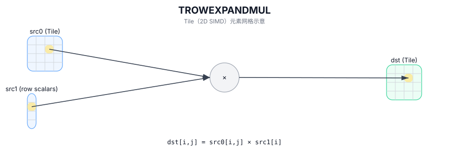

# TROWEXPANDMUL

## 简介

按行广播运算：对 `src0` 的每一行使用 `src1` 提供的行标量（每行一个值）进行广播，并对整行逐元素计算后写入 `dst`。

## 计算流程图



## 数学解释

对于有效区域中的每个元素 `(i, j)`：

$$ \mathrm{dst}_{i,j} = \mathrm{src0}_{i,j} \cdot \mathrm{src1}_{0,i} $$

## 汇编语法

PTO-AS 形式：参见 `docs/grammar/PTO-AS.md`。

同步形式：

```text
%dst = trowexpandmul %src0, %src1 : !pto.tile<...>, !pto.tile<...> -> !pto.tile<...>
```
## C++ Intrinsic（内建接口）

在 `include/pto/common/pto_instr.hpp` 中声明：

```cpp
template <typename TileDataDst, typename TileDataSrc1, typename... WaitEvents>
PTO_INST RecordEvent TROWEXPANDMUL(TileDataDst& dst, TileDataDst& src0, TileDataSrc1& src1, WaitEvents&... events);
```

## 约束

- **实现检查 (A2A3)**：
  - `TileDataDst::DType == TileDataSrc1::DType`（编译时）。
  - `TileDataDst::DType` 必须是以下之一：`half`、`float`。
  - Tile 形状/布局约束（编译时）：`TileDataDst::isRowMajor` 和 `!TileDataSrc1::isRowMajor` 和 `TileDataSrc1::Cols == 1`。
  - 运行时：`src1.GetValidRow() == 1` 和 `src1.GetValidCol() == dst.GetValidRow()`。

## 示例

### 自动（Auto）

```cpp
#include <pto/pto-inst.hpp>

using namespace pto;

void example_auto() {
  using TileT = Tile<TileType::Vec, half, 16, 16>;
  using RowVecT = Tile<TileType::Vec, half, 16, 1, BLayout::ColMajor, 1, DYNAMIC, SLayout::NoneBox>;

  TileT src0, dst;
  RowVecT src1(16);
  TROWEXPANDMUL(dst, src0, src1);
}
```

### 手动（Manual）

```cpp
#include <pto/pto-inst.hpp>

using namespace pto;

void example_manual() {
  using TileT = Tile<TileType::Vec, half, 16, 16>;
  using RowVecT = Tile<TileType::Vec, half, 16, 1, BLayout::ColMajor, 1, DYNAMIC, SLayout::NoneBox>;

  TileT src0, dst;
  RowVecT src1(16);
  TASSIGN(src0, 0x1000);
  TASSIGN(dst,  0x2000);
  TASSIGN(src1, 0x3000);
  TROWEXPANDMUL(dst, src0, src1);
}
```