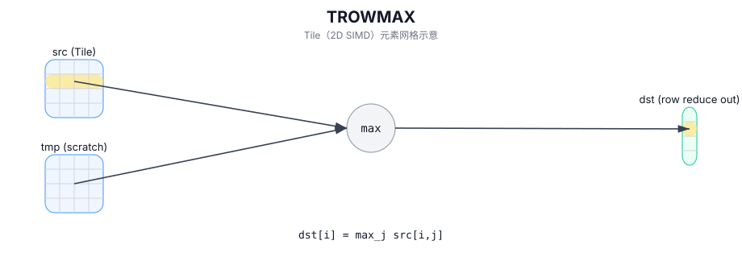

# TROWMAX

## 简介

按行归约（最大值）：沿列方向对每一行取最大值，输出为每行一个标量（C++ Intrinsic 需要额外的 `tmp` scratch Tile）。

## 计算流程图



## 数学解释

设 `R = src.GetValidRow()` 和 `C = src.GetValidCol()`。对于 `0 <= i < R`：

$$ \mathrm{dst}_{i,0} = \max_{0 \le j < C} \mathrm{src}_{i,j} $$

## 汇编语法

PTO-AS 形式：参见 `docs/grammar/PTO-AS.md`。

同步形式：

```text
%dst = trowmax %src : !pto.tile<...> -> !pto.tile<...>
```
Lowering（降级）过程中可能会引入内部 scratch Tile；C++ Intrinsic（内建接口）需要显式的 `tmp` 操作数。

## C++ Intrinsic（内建接口）

在 `include/pto/common/pto_instr.hpp` 中声明：

```cpp
template <typename TileDataOut, typename TileDataIn, typename TileDataTmp, typename... WaitEvents>
PTO_INST RecordEvent TROWMAX(TileDataOut& dst, TileDataIn& src, TileDataTmp& tmp, WaitEvents&... events);
```

## 约束

实现检查（NPU）：

- A2A3：
  - Tile 位置：`dst` 和 `src` 必须为 `TileType::Vec`。
  - `src` 的 Tile 布局：ND 分形（`isRowMajor` 和 `SLayout::NoneBox`）。
  - `dst` 的 Tile 布局：
    - **推荐**：一维的 DN 布局 Tile，例如 `Tile<TileType::Vec, T, ROWS, 1, BLayout::ColMajor, ValidRows, 1>`
    - **待删除**：2D ND 布局 Tile，例如 `Tile<TileType::Vec, T, ROWS, COLS, BLayout::RowMajor, ValidRows, 1>`
  - 数据类型：`half` 或 `float`。
  - DType 一致性：`dst.DType == src.DType`。
  - 运行时有效检查：
    - `srcValidCol != 0` 和 `srcValidRow != 0`。
    - `srcValidRow == dstValidRow`（输出有效行必须与输入有效行匹配）。
- A5：
  - 数据类型：`half` 或 `float`。
  - DType 一致性：`dst.DType == src.DType`。
  - 实现中没有对 `validRow/validCol` 进行显式运行时断言；循环使用 `src.GetValidRow()` 和 `src.GetValidCol()`。

## 示例

### 自动（Auto）

```cpp
#include <pto/pto-inst.hpp>

using namespace pto;

void example_auto() {
  using SrcT = Tile<TileType::Vec, float, 16, 16>;
  using DstT = Tile<TileType::Vec, float, 16, 1, BLayout::ColMajor>;
  using TmpT = Tile<TileType::Vec, float, 16, 16>;
  SrcT src;
  DstT dst;
  TmpT tmp;
  TROWMAX(dst, src, tmp);
}
```

### 手动（Manual）

```cpp
#include <pto/pto-inst.hpp>

using namespace pto;

void example_manual() {
  using SrcT = Tile<TileType::Vec, float, 16, 16>;
  using DstT = Tile<TileType::Vec, float, 16, 1, BLayout::ColMajor>;
  using TmpT = Tile<TileType::Vec, float, 16, 16>;
  SrcT src;
  DstT dst;
  TmpT tmp;
  TASSIGN(src, 0x1000);
  TASSIGN(dst, 0x2000);
  TASSIGN(tmp, 0x3000);
  TROWMAX(dst, src, tmp);
}
```