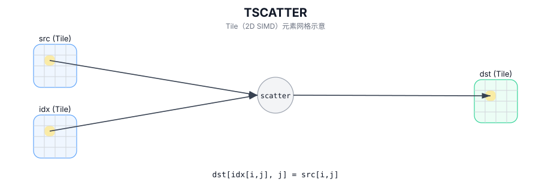

# TSCATTER

## 简介

使用逐元素行索引将 `src` 的元素写入 `dst[idx[i,j], j]`（冲突写入行为实现定义）。

## 计算流程图



## 数学解释

对于每个源元素 `(i, j)`，写入：

$$ \mathrm{dst}_{\mathrm{idx}_{i,j},\ j} = \mathrm{src}_{i,j} $$

如果多个元素映射到相同的目标位置，则最终值是实现定义的（最后一个写入者在当前实现中获胜）。

## 汇编语法

PTO-AS 形式：参见 `docs/grammar/PTO-AS.md`。

同步形式：

```text
%dst = tscatter %src, %idx : !pto.tile<...>, !pto.tile<...> -> !pto.tile<...>
```
## C++ Intrinsic（内建接口）

在 `include/pto/common/pto_instr.hpp` 中声明：

```cpp
template <typename TileDataD, typename TileDataS, typename TileDataI, typename... WaitEvents>
PTO_INST RecordEvent TSCATTER(TileDataD& dst, TileDataS& src, TileDataI& indexes, WaitEvents&... events);
```

## 约束

- **实现检查 (A2A3)**：
  - `TileDataD::Loc`、`TileDataS::Loc`、`TileDataI::Loc` 必须为 `TileType::Vec`。
  - `TileDataD::DType`、`TileDataS::DType` 必须是以下之一：`int32_t`、`int16_t`、`int8_t`、`half`、`float32_t`、 `uint32_t`、`uint16_t`、`uint8_t`、`bfloat16_t`。
  - `TileDataI::DType` 必须是以下之一：`int16_t`、`int32_t`、`uint16_t` 或 `uint32_t`。
  - 不对 `indexes` 值强制执行边界检查。
  - 静态有效范围：`TileDataD::ValidRow <= TileDataD::Rows`、`TileDataD::ValidCol <= TileDataD::Cols`、`TileDataS::ValidRow <= TileDataS::Rows`、`TileDataS::ValidCol <= TileDataS::Cols`、`TileDataI::ValidRow <= TileDataI::Rows`、`TileDataI::ValidCol <= TileDataI::Cols`。
  - `TileDataD::DType` 和 `TileDataS::DType` 必须相同。
  - 当 `TileDataD::DType` 的大小为4字节时，`TileDataI::DType` 的大小必须为4字节。
  - 当 `TileDataD::DType` 的大小为2字节时，`TileDataI::DType` 的大小必须为2字节。
  - 当 `TileDataD::DType` 的大小为1字节时，`TileDataI::DType` 的大小必须为2字节。
- **实现检查 (A5)**：
  - `TileDataD::Loc`、`TileDataS::Loc`、`TileDataI::Loc` 必须为 `TileType::Vec`。
  - `TileDataD::DType`、`TileDataS::DType` 必须是以下之一：`int32_t`、`int16_t`、`int8_t`、`half`、`float32_t`、 `uint32_t`、`uint16_t`、`uint8_t`、`bfloat16_t`。
  - `TileDataI::DType` 必须是以下之一：`int16_t`、`int32_t`、`uint16_t` 或 `uint32_t`。
  - 不对 `indexes` 值强制执行边界检查。
  - 静态有效范围：`TileDataD::ValidRow <= TileDataD::Rows`、`TileDataD::ValidCol <= TileDataD::Cols`、`TileDataS::ValidRow <= TileDataS::Rows`、`TileDataS::ValidCol <= TileDataS::Cols`、`TileDataI::ValidRow <= TileDataI::Rows`、`TileDataI::ValidCol <= TileDataI::Cols`。
  - `TileDataD::DType` 和 `TileDataS::DType` 必须相同。
  - 当 `TileDataD::DType` 的大小为4字节时，`TileDataI::DType` 的大小必须为4字节。
  - 当 `TileDataD::DType` 的大小为2字节时，`TileDataI::DType` 的大小必须为2字节。
  - 当 `TileDataD::DType` 的大小为1字节时，`TileDataI::DType` 的大小必须为2字节。

## 示例

### 自动（Auto）

```cpp
#include <pto/pto-inst.hpp>

using namespace pto;

void example_auto() {
  using TileT = Tile<TileType::Vec, float, 16, 16>;
  using IdxT = Tile<TileType::Vec, uint16_t, 16, 16>;
  TileT src, dst;
  IdxT idx;
  TSCATTER(dst, src, idx);
}
```

### 手动（Manual）

```cpp
#include <pto/pto-inst.hpp>

using namespace pto;

void example_manual() {
  using TileT = Tile<TileType::Vec, float, 16, 16>;
  using IdxT = Tile<TileType::Vec, uint16_t, 16, 16>;
  TileT src, dst;
  IdxT idx;
  TASSIGN(src, 0x1000);
  TASSIGN(dst, 0x2000);
  TASSIGN(idx, 0x3000);
  TSCATTER(dst, src, idx);
}
```