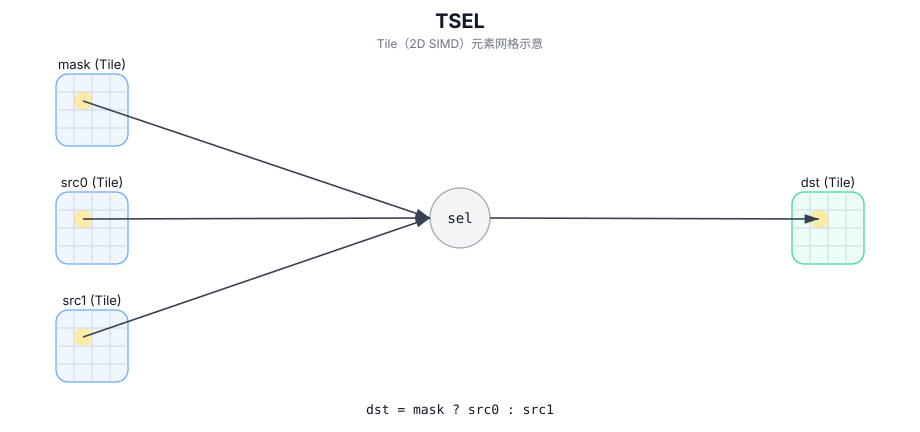

# TSEL

## 简介

使用掩码 Tile 在 `src0` 与 `src1` 间逐元素选择并写入 `dst`。

## 计算流程图



## 数学解释

对于有效区域中的每个元素 `(i, j)`：

$$
\mathrm{dst}_{i,j} =
\begin{cases}
\mathrm{src0}_{i,j} & \text{if } \mathrm{mask}_{i,j}\ \text{is true} \\
\mathrm{src1}_{i,j} & \text{otherwise}
\end{cases}
$$

## 汇编语法

PTO-AS 形式：参见 `docs/grammar/PTO-AS.md`。

同步形式：

```text
%dst = tsel %mask, %src0, %src1 : !pto.tile<...>
```
## C++ Intrinsic（内建接口）

在 `include/pto/common/pto_instr.hpp` 中声明：

```cpp
template <typename TileData, typename MaskTile, typename... WaitEvents>
PTO_INST RecordEvent TSEL(TileData& dst, MaskTile& selMask, TileData& src0, TileData& src1, WaitEvents&... events);
```

## 约束

- **实现检查 (A2A3)**：
  - `sizeof(TileData::DType)` 必须是 `2` 或 `4` 字节。
  - `TileData::DType` 必须是 `int16_t` 或 `uint16_t` 或 `int32_t` 或 `uint32_t` 或 `half` 或 `bfloat16_t` 或 `float`。
  - 对掩码 Tile 类型/形状不强制执行显式断言；掩码编码是目标定义的。
  - 该实现使用 `dst.GetValidRow()` / `dst.GetValidCol()` 作为选择域。
- **实现检查 (A5)**：
  - `sizeof(TileData::DType)` 必须为 `2` 或 `4` 字节。
  - `TileData::DType` 必须是 `int16_t` 或 `uint16_t` 或 `int32_t` 或 `uint32_t` 或 `half` 或 `bfloat16_t` 或 `float`。
  - `TSEL_IMPL` 不强制执行显式 `static_assert`/`PTO_ASSERT` 检查。
  - 该实现使用 `dst.GetValidRow()` / `dst.GetValidCol()` 作为选择域。
- **掩码编码**：
  - 掩码 Tile 被解释为目标定义布局中的打包谓词位。

## 示例

### 自动（Auto）

```cpp
#include <pto/pto-inst.hpp>

using namespace pto;

void example_auto() {
  using TileT = Tile<TileType::Vec, float, 16, 16>;
  using MaskT = Tile<TileType::Vec, uint8_t, 16, 16>;
  TileT src0, src1, dst;
  MaskT mask;
  TSEL(dst, mask, src0, src1);
}
```

### 手动（Manual）

```cpp
#include <pto/pto-inst.hpp>

using namespace pto;

void example_manual() {
  using TileT = Tile<TileType::Vec, float, 16, 16>;
  using MaskT = Tile<TileType::Vec, uint8_t, 16, 16>;
  TileT src0, src1, dst;
  MaskT mask;
  TASSIGN(src0, 0x1000);
  TASSIGN(src1, 0x2000);
  TASSIGN(dst,  0x3000);
  TASSIGN(mask, 0x4000);
  TSEL(dst, mask, src0, src1);
}
```