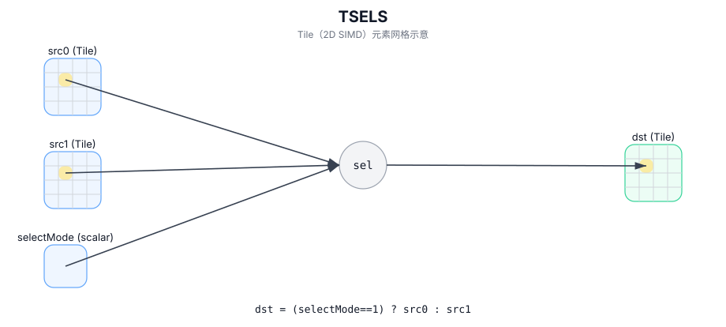

# TSELS

## 简介

使用标量 `selectMode` 在 `src0` 与 `src1` 间做全局选择（每个元素一致），并写入 `dst`。

## 计算流程图



## 数学解释

对于有效区域中的每个元素 `(i, j)`：

$$
\mathrm{dst}_{i,j} =
\begin{cases}
\mathrm{src0}_{i,j} & \text{if } \mathrm{selectMode} = 1 \\
\mathrm{src1}_{i,j} & \text{otherwise}
\end{cases}
$$

## 汇编语法

PTO-AS 形式：参见 `docs/grammar/PTO-AS.md`。

同步形式：

```text
%dst = tsels %src0, %src1, %selectMode : !pto.tile<...>
```
## C++ Intrinsic（内建接口）

在 `include/pto/common/pto_instr.hpp` 中声明：

```cpp
template <typename TileData, typename... WaitEvents>
PTO_INST RecordEvent TSELS(TileData& dst, TileData& src0, TileData& src1, uint8_t selectMode, WaitEvents&... events);
```

## 约束

- **实现检查 (A2A3)**：
  - `TileData::DType` 必须是以下之一：`half`、`float16_t`、`float`、`float32_t`。
  - Tile 位置必须是向量 (`TileData::Loc == TileType::Vec`)。
  - 静态有效范围：`TileData::ValidRow <= TileData::Rows` 和 `TileData::ValidCol <= TileData::Cols`。
  - 运行时：实现期望 `src0/src1/dst` 具有匹配的有效行/列。
- **实现检查 (A5)**：
  - `sizeof(TileData::DType)` 必须为 `1`、`2` 或 `4` 字节。
  - Tile 位置必须是向量 (`TileData::Loc == TileType::Vec`)。
  - 静态有效范围：`TileData::ValidRow <= TileData::Rows` 和 `TileData::ValidCol <= TileData::Cols`。
  - 运行时：实现期望 `src0/src1/dst` 具有匹配的有效行/列。
  - 填充行为取决于 `TileData::PadVal`（`Null`/`Zero` 与 `-INF/+INF` 模式）。
- **有效区域**：
  - 该实现使用 `dst.GetValidRow()` / `dst.GetValidCol()` 作为选择域。

## 示例

### 自动（Auto）

```cpp
#include <pto/pto-inst.hpp>

using namespace pto;

void example_auto() {
  using TileT = Tile<TileType::Vec, float, 16, 16>;
  TileT src0, src1, dst;
  TSELS(dst, src0, src1, /*selectMode=*/1);
}
```

### 手动（Manual）

```cpp
#include <pto/pto-inst.hpp>

using namespace pto;

void example_manual() {
  using TileT = Tile<TileType::Vec, float, 16, 16>;
  TileT src0, src1, dst;
  TASSIGN(src0, 0x1000);
  TASSIGN(src1, 0x2000);
  TASSIGN(dst,  0x3000);
  TSELS(dst, src0, src1, /*selectMode=*/1);
}
```