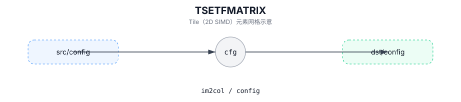

# TSETFMATRIX

## 简介

配置 `TIMG2COL` 使用的 FMATRIX 参数（实现定义）。

## 计算流程图



## See also

- IMG2COL 指令：`docs/isa/TIMG2COL.md`。

## C++ Intrinsic（内建接口）

在 `include/pto/common/pto_instr.hpp` 中声明：

```cpp
template <SetFmatrixMode FmatrixMode = SetFmatrixMode::FMATRIX_A_MANUAL, typename T = uint64_t, typename... WaitEvents>
PTO_INST RecordEvent TSETFMATRIX(const Img2colTileConfig<T> &cfg = Img2colTileConfig<T>{}, WaitEvents&... events);
```