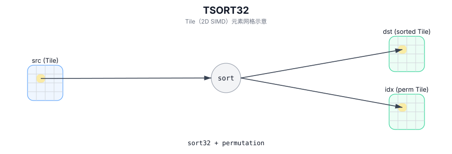

# TSORT32

## 简介

对固定大小的 32 元素块排序，并输出排序后的值与索引映射。

## 计算流程图



## 数学解释

将 `src` 中的值排序到 `dst` 中，并在 `idx` 中生成索引映射。从概念上讲，对于每一行 `i`：

$$ \mathrm{dst}_{i,k} = \mathrm{src}_{i,\pi_i(k)} $$

其中 $\pi_i$ 是行中索引的排列。排序顺序和稳定性是目标定义的。

## 汇编语法

PTO-AS 形式：参见 `docs/grammar/PTO-AS.md`。

同步形式：

```text
%dst, %idx = tsort32 %src : !pto.tile<...> -> (!pto.tile<...>, !pto.tile<...>)
```
## C++ Intrinsic（内建接口）

在 `include/pto/common/pto_instr.hpp` 中声明：

```cpp
template <typename DstTileData, typename SrcTileData, typename IdxTileData>
PTO_INST RecordEvent TSORT32(DstTileData& dst, SrcTileData& src, IdxTileData& idx);

template <typename DstTileData, typename SrcTileData, typename IdxTileData, typename TmpTileData>
PTO_INST RecordEvent TSORT32(DstTileData& dst, SrcTileData& src, IdxTileData& idx, TmpTileData& tmp);
```

## 约束

- `TSORT32` 不采用 `WaitEvents&...` 且不会在内部调用 `TSYNC(...)`；如果需要的话显式同步。
- **实现检查（A2A3/A5）**：
  - `DstTileData::DType` 必须是 `half` 或 `float`。
  - `SrcTileData::DType` 必须匹配 `DstTileData::DType`。
  - `IdxTileData::DType` 必须为 `uint32_t`。
  - `dst/src/idx` Tile 位置必须为 `TileType::Vec`，并且所有内容都必须为行主序 (`isRowMajor`)。
- **有效区域**：
  - 该实现使用 `dst.GetValidRow()` 作为行数，并使用 `src.GetValidCol()` 来确定每行要对多少个 32 元素块进行排序。

## 示例

### 自动（Auto）

```cpp
#include <pto/pto-inst.hpp>

using namespace pto;

void example_auto() {
  using SrcT = Tile<TileType::Vec, float, 1, 32>;
  using DstT = Tile<TileType::Vec, float, 1, 32>;
  using IdxT = Tile<TileType::Vec, uint32_t, 1, 32>;
  SrcT src;
  DstT dst;
  IdxT idx;
  TSORT32(dst, src, idx);
}
```

### 手动（Manual）

```cpp
#include <pto/pto-inst.hpp>

using namespace pto;

void example_manual() {
  using SrcT = Tile<TileType::Vec, float, 1, 32>;
  using DstT = Tile<TileType::Vec, float, 1, 32>;
  using IdxT = Tile<TileType::Vec, uint32_t, 1, 32>;
  SrcT src;
  DstT dst;
  IdxT idx;
  TASSIGN(src, 0x1000);
  TASSIGN(dst, 0x2000);
  TASSIGN(idx, 0x3000);
  TSORT32(dst, src, idx);
}
```