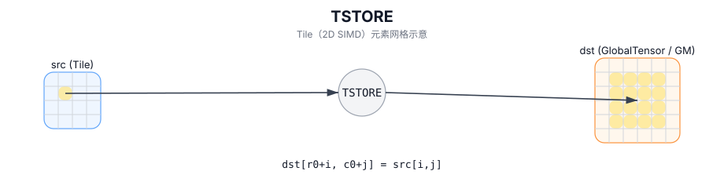

# TSTORE

## 简介

将片上 Tile 按有效区域写回 GlobalTensor（GM）。

## 计算流程图



## 数学解释

表示法取决于 `GlobalTensor` 形状/步幅和 `Tile` 布局。从概念上讲（2D 视图，具有基本偏移）：

$$ \mathrm{dst}_{r_0 + i,\; c_0 + j} = \mathrm{src}_{i,j} $$

## 汇编语法

PTO-AS 形式：参见 `docs/grammar/PTO-AS.md`。

同步形式：

```text
tstore %t1, %sv_out[%c0, %c0]
```
## C++ Intrinsic（内建接口）

在 `include/pto/common/pto_instr.hpp` 和 `include/pto/common/constants.hpp` 中声明：

```cpp
template <typename TileData, typename GlobalData, AtomicType atomicType = AtomicType::AtomicNone,
          typename... WaitEvents>
PTO_INST RecordEvent TSTORE(GlobalData& dst, TileData& src, WaitEvents&... events);

template <typename TileData, typename GlobalData, AtomicType atomicType = AtomicType::AtomicNone,
          typename... WaitEvents>
PTO_INST RecordEvent TSTORE(GlobalData& dst, TileData& src, uint64_t preQuantScalar, WaitEvents&... events);

template <typename TileData, typename GlobalData, typename FpTileData, AtomicType atomicType = AtomicType::AtomicNone,
          typename... WaitEvents>
PTO_INST RecordEvent TSTORE_FP(GlobalData& dst, TileData& src, FpTileData& fp, WaitEvents&... events);
```

## 约束

- **实现检查 (A2A3)**：
  - 源 Tile 位置必须是以下之一：`TileType::Vec`、`TileType::Mat`、`TileType::Acc`。
  - 运行时：所有 `dst.GetShape(dim)` 值和 `src.GetValidRow()/GetValidCol()` 必须为 `> 0`。
  - 对于 `TileType::Vec` / `TileType::Mat`：
    - `TileData::DType` 必须是以下之一：`int8_t`、`uint8_t`、`int16_t`、`uint16_t`、`int32_t`、`uint32_t`、 `int64_t`、`uint64_t`、`half`、`bfloat16_t`、`float`。
    - `sizeof(TileData::DType) == sizeof(GlobalData::DType)`。
    - 布局必须匹配 ND/DN/NZ（或 `TileData::Rows == 1` 或 `TileData::Cols == 1` 的特殊情况）。
    - 对于 `int64_t/uint64_t`，仅支持 ND->ND 或 DN->DN。
  - 对于 `TileType::Acc`（包括量化/原子变体）：
    - 目的地布局必须为 ND 或 NZ。
    - 源数据类型必须为 `int32_t` 或 `float`。
    - 不使用量化时，目标 dtype 必须为 `__gm__ int32_t/float/half/bfloat16_t`。
    - 静态形状约束：`1 <= TileData::Cols <= 4095`；如果 ND 则 `1 <= TileData::Rows <= 8192`；如果是 NZ，则 `1 <= TileData::Rows <= 65535` 和 `TileData::Cols % 16 == 0`。
    - 运行时：`1 <= src.GetValidCol() <= 4095`。
- **实现检查 (A5)**：
  - 源 Tile 位置必须是 `TileType::Vec` 或 `TileType::Acc`（此目标上没有 `Mat` 存储）。
  - 对于 `TileType::Vec`：
    - `sizeof(TileData::DType) == sizeof(GlobalData::DType)`。
    - `TileData::DType` 必须是以下之一：`int8_t`、`uint8_t`、`int16_t`、`uint16_t`、`int32_t`、`uint32_t`、 `int64_t`、`uint64_t`、`half`、`bfloat16_t`、`float`、`float8_e4m3_t`、`float8_e5m2_t`、 `hifloat8_t`、`float4_e1m2x2_t`、`float4_e2m1x2_t`。
    - 布局必须匹配 ND/DN/NZ（或 `TileData::Rows == 1` 或 `TileData::Cols == 1` 的特殊情况）。
    - 强制执行附加对齐约束（例如，对于 ND，行主宽度（以字节为单位）必须是 32 的倍数；对于 DN，列主高度（以字节为单位）必须是 32 的倍数，特殊情况除外）。
  - 对于 `TileType::Acc`：
    - 目的地布局必须为ND或NZ；源数据类型必须为 `int32_t` 或 `float`。
    - 不使用量化时，目标 dtype 必须为 `__gm__ int32_t/float/half/bfloat16_t`。
    - 静态形状约束与 A2A3 的行/列匹配； `AtomicAdd` 另外将目标数据类型限制为支持的原子类型。
- **有效区域**：
  - 该实现使用 `src.GetValidRow()` / `src.GetValidCol()` 作为传输大小。

## 示例

### 自动（Auto）

```cpp
#include <pto/pto-inst.hpp>

using namespace pto;

template <typename T>
void example_auto(__gm__ T* out) {
  using TileT = Tile<TileType::Vec, T, 16, 16>;
  using GShape = Shape<1, 1, 1, 16, 16>;
  using GStride = BaseShape2D<T, 16, 16, Layout::ND>;
  using GTensor = GlobalTensor<T, GShape, GStride, Layout::ND>;

  GTensor gout(out);
  TileT t;
  TSTORE(gout, t);
}
```

### 手动（Manual）

```cpp
#include <pto/pto-inst.hpp>

using namespace pto;

template <typename T>
void example_manual(__gm__ T* out) {
  using TileT = Tile<TileType::Vec, T, 16, 16>;
  using GShape = Shape<1, 1, 1, 16, 16>;
  using GStride = BaseShape2D<T, 16, 16, Layout::ND>;
  using GTensor = GlobalTensor<T, GShape, GStride, Layout::ND>;

  GTensor gout(out);
  TileT t;
  TASSIGN(t, 0x1000);
  TSTORE<TileT, GTensor, AtomicType::AtomicAdd>(gout, t);
}
```