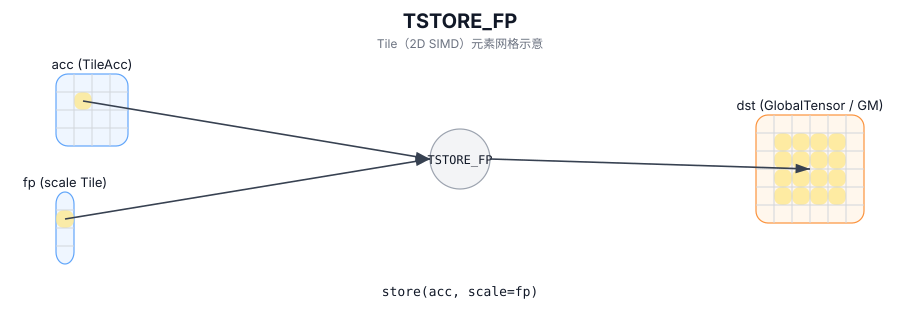

# TSTORE_FP

## 简介

将 accumulator Tile 写回 GM，并使用 `fp`（scale）Tile 作为向量量化/缩放参数（实现定义）。

## 计算流程图



## 数学解释

设 `R = src.GetValidRow()` 和 `C = src.GetValidCol()`。从概念上讲（2D 视图，具有基本偏移），对于 `0 <= i < R` 和 `0 <= j < C`：

$$ \mathrm{dst}_{r_0 + i,\; c_0 + j} = \mathrm{Convert}\!\left(\mathrm{src}_{i,j};\ \mathrm{fp}\right) $$

## 汇编语法

PTO-AS 形式：参见 `docs/grammar/PTO-AS.md`。

同步形式：

```text
tstore.fp %src, %fp, %sv_out[%c0, %c0]
```
## C++ Intrinsic（内建接口）

在 `include/pto/common/pto_instr.hpp` 和 `include/pto/common/constants.hpp` 中声明：

```cpp
template <typename TileData, typename GlobalData, typename FpTileData,
          AtomicType atomicType = AtomicType::AtomicNone, typename... WaitEvents>
PTO_INST RecordEvent TSTORE_FP(GlobalData& dst, TileData& src, FpTileData& fp, WaitEvents&... events);
```

## 约束

- **实现检查 (A2A3)**：
  - fp 存储路径通过 `TSTORE_IMPL(dst, src, fp)` 实现，并使用与量化累加器存储相同的累加器到 GM 合法性检查：
    - 目的地布局必须为 ND 或 NZ。
    - 源数据类型必须为 `int32_t` 或 `float`。
    - 静态形状约束：`1 <= TileData::Cols <= 4095`；如果 ND 则 `1 <= TileData::Rows <= 8192`；如果是 NZ，则 `1 <= TileData::Rows <= 65535` 和 `TileData::Cols % 16 == 0`。
    - 运行时：`1 <= src.GetValidCol() <= 4095`。
  - 在 `FpTileData` 上不强制执行显式 `static_assert`（实现使用 `fp` 设置 FPC 状态）。
- **实现检查 (A5)**：
  - 通过 `TSTORE_IMPL(dst, src, fp)` 实现，并由 `CheckStaticAcc<..., true>()` 验证累加器路径（仅限 ND/NZ、`int32_t/float` 源数据类型、行/列范围）。
  - 在 `FpTileData` 上不强制执行显式 `static_assert`（实现使用 `fp` 设置 FPC 状态）。

## 示例

### 自动（Auto）

```cpp
#include <pto/pto-inst.hpp>

using namespace pto;

void example_auto(__gm__ int8_t* out) {
  using AccT = TileAcc<float, 16, 16>;
  using FpT = Tile<TileType::Scaling, uint64_t, 1, 16, BLayout::RowMajor, 1, DYNAMIC, SLayout::NoneBox>;
  using GShape = Shape<1, 1, 1, 16, 16>;
  using GStride = BaseShape2D<int8_t, 16, 16, Layout::ND>;
  using GT = GlobalTensor<int8_t, GShape, GStride, Layout::ND>;

  GT gout(out);
  AccT acc;
  FpT fp(16);
  TSTORE_FP(gout, acc, fp);
}
```

### 手动（Manual）

```cpp
#include <pto/pto-inst.hpp>

using namespace pto;

void example_manual(__gm__ int8_t* out) {
  using AccT = TileAcc<float, 16, 16>;
  using FpT = Tile<TileType::Scaling, uint64_t, 1, 16, BLayout::RowMajor, 1, DYNAMIC, SLayout::NoneBox>;
  using GShape = Shape<1, 1, 1, 16, 16>;
  using GStride = BaseShape2D<int8_t, 16, 16, Layout::ND>;
  using GT = GlobalTensor<int8_t, GShape, GStride, Layout::ND>;

  GT gout(out);
  AccT acc;
  FpT fp(16);
  TASSIGN(acc, 0x1000);
  TASSIGN(fp,  0x2000);
  TSTORE_FP(gout, acc, fp);
}
```