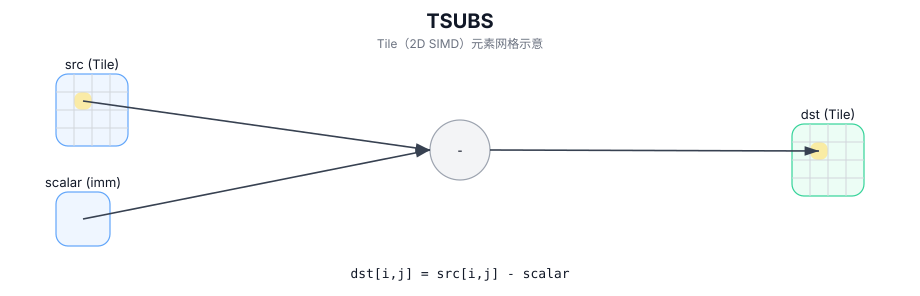

# TSUBS

## 简介

在 `dst` 的有效区域内，对 `src` 的每个元素与标量 `scalar` 执行逐元素减，结果写入 `dst`。

## 计算流程图



## 数学解释

对于有效区域中的每个元素 `(i, j)`：

$$ \mathrm{dst}_{i,j} = \mathrm{src}_{i,j} - \mathrm{scalar} $$

## 汇编语法

PTO-AS 形式：参见 `docs/grammar/PTO-AS.md`。

同步形式：

```text
%dst = tsubs %src, %scalar : !pto.tile<...>, f32
```
## C++ Intrinsic（内建接口）

在 `include/pto/common/pto_instr.hpp` 中声明：

```cpp
template <typename TileData, typename... WaitEvents>
PTO_INST RecordEvent TSUBS(TileData& dst, TileData& src0, typename TileData::DType scalar, WaitEvents&... events);
```

## 约束

- 操作迭代 `dst.GetValidRow()` / `dst.GetValidCol()`。

## 示例

```cpp
#include <pto/pto-inst.hpp>

using namespace pto;

void example() {
  using TileT = Tile<TileType::Vec, float, 16, 16>;
  TileT x, out;
  TSUBS(out, x, 1.0f);
}
```