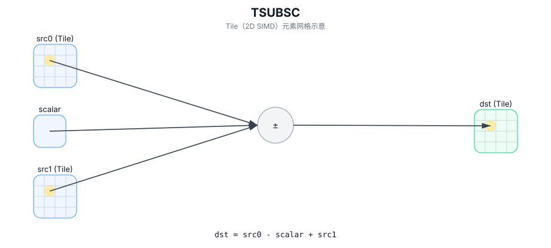

# TSUBSC

## 简介

在 `dst` 的有效区域内逐元素计算 `src0 - scalar + src1` 并写入 `dst`（融合标量与双输入）。

## 计算流程图



## 数学解释

对于有效区域中的每个元素 `(i, j)`：

$$ \mathrm{dst}_{i,j} = \mathrm{src0}_{i,j} - \mathrm{scalar} + \mathrm{src1}_{i,j} $$

## 汇编语法

PTO-AS 形式：参见 `docs/grammar/PTO-AS.md`。

同步形式：

```text
%dst = tsubsc %src0, %scalar, %src1 : !pto.tile<...>, f32, !pto.tile<...>
```
## C++ Intrinsic（内建接口）

在 `include/pto/common/pto_instr.hpp` 中声明：

```cpp
template <typename TileData, typename... WaitEvents>
PTO_INST RecordEvent TSUBSC(TileData& dst, TileData& src0, typename TileData::DType scalar, TileData& src1,
                            WaitEvents&... events);
```

## 约束

- 操作迭代 `dst.GetValidRow()` / `dst.GetValidCol()`。

## 示例

```cpp
#include <pto/pto-inst.hpp>

using namespace pto;

void example() {
  using TileT = Tile<TileType::Vec, float, 16, 16>;
  TileT a, b, out;
  TSUBSC(out, a, 2.0f, b);
}
```