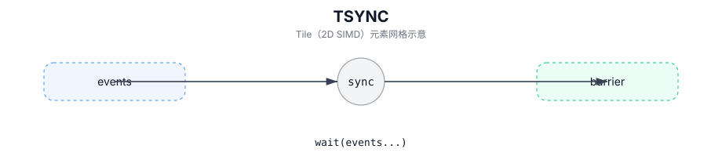

# TSYNC

## 简介

PTO 执行同步：

- `TSYNC(events...)`：等待一组显式事件令牌。
- `TSYNC<Op>()`：对单个向量 op 类插入 pipeline barrier。

许多 Intrinsic 会在发出指令前内部调用 `TSYNC(events...)`。

## 计算流程图



## 数学解释

不适用。

## 汇编语法

PTO-AS 形式：参见 `docs/grammar/PTO-AS.md`。

事件操作数形式：

```text
tsync %e0, %e1 : !pto.event<...>, !pto.event<...>
```

单操作屏障形式：

```text
tsync.op #pto.op<TADD>
```

## C++ Intrinsic（内建接口）

在 `include/pto/common/pto_instr.hpp` 中声明：

```cpp
template <Op OpCode>
PTO_INST void TSYNC();

template <typename... WaitEvents>
PTO_INST void TSYNC(WaitEvents&... events);
```

## 约束

- **实现检查 (`TSYNC<Op>()`)**：
  - `TSYNC_IMPL<Op>()` 仅支持向量管道操作（`static_assert(pipe == PIPE_V)` 中的 `include/pto/common/event.hpp`）。
- **`TSYNC(events...)` 语义**：
  - `TSYNC(events...)` 调用 `WaitAllEvents(events...)`，这会在每个事件令牌上调用 `events.Wait()`。

## 示例

### 自动（Auto）

```cpp
#include <pto/pto-inst.hpp>

using namespace pto;

void example_auto(__gm__ float* in) {
  using TileT = Tile<TileType::Vec, float, 16, 16>;
  using GShape = Shape<1, 1, 1, 16, 16>;
  using GStride = BaseShape2D<float, 16, 16, Layout::ND>;
  using GT = GlobalTensor<float, GShape, GStride, Layout::ND>;

  GT gin(in);
  TileT t;
  Event<Op::TLOAD, Op::TADD> e;
  e = TLOAD(t, gin);
  TSYNC(e);
}
```

### 手动（Manual）

```cpp
#include <pto/pto-inst.hpp>

using namespace pto;

void example_manual() {
  using TileT = Tile<TileType::Vec, float, 16, 16>;
  TileT a, b, c;
  Event<Op::TADD, Op::TSTORE_VEC> e;
  e = TADD(c, a, b);
  TSYNC<Op::TADD>();
  TSYNC(e);
}
```