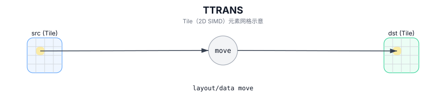

# TTRANS

## 简介

Tile 转置（lowering 过程中可能引入内部 scratch Tile）。

## 计算流程图



## 数学解释

对于 2D Tile，在有效转置域上：

$$ \mathrm{dst}_{i,j} = \mathrm{src}_{j,i} $$

确切的形状/布局和转置域取决于目标（请参阅约束）。

## 汇编语法

PTO-AS 形式：参见 `docs/grammar/PTO-AS.md`。

同步形式：

```text
%dst = ttrans %src : !pto.tile<...> -> !pto.tile<...>
```
Lowering（降级）过程中可能会引入内部 scratch Tile；C++ Intrinsic（内建接口）需要显式的 `tmp` 操作数。

## C++ Intrinsic（内建接口）

在 `include/pto/common/pto_instr.hpp` 中声明：

```cpp
template <typename TileDataDst, typename TileDataSrc, typename TileDataTmp, typename... WaitEvents>
PTO_INST RecordEvent TTRANS(TileDataDst& dst, TileDataSrc& src, TileDataTmp& tmp, WaitEvents&... events);
```

## 约束

- **实现检查 (A2A3)**：
  - `sizeof(TileDataSrc::DType) == sizeof(TileDataDst::DType)`。
  - 源布局必须是行主序 (`TileDataSrc::isRowMajor`)。
  - 元素大小必须为 `1`、`2` 或 `4` 字节。
  - 支持的元素类型受每个元素宽度的限制：
    - 4 个字节：`uint32_t`、`int32_t`、`float`
    - 2 个字节：`uint16_t`、`int16_t`、`half`、`bfloat16_t`
    - 1 个字节：`uint8_t`、`int8_t`
  - 转置大小取自 `src.GetValidRow()` / `src.GetValidCol()`。
- **实现检查 (A5)**：
  - `sizeof(TileDataSrc::DType) == sizeof(TileDataDst::DType)`。
  - 在输入和输出的主要维度上强制执行 32 字节对齐约束（行主要检查 `Cols * sizeof(T) % 32 == 0`、列主要检查 `Rows * sizeof(T) % 32 == 0`）。
  - 支持的元素类型受每个元素宽度的限制：
    - 4 个字节：`uint32_t`、`int32_t`、`float`
    - 2 个字节：`uint16_t`、`int16_t`、`half`、`bfloat16_t`
    - 1 个字节：`uint8_t`、`int8_t`
  - 该实现在静态 Tile 形状 (`TileDataSrc::Rows/Cols`) 上运行，并且不参考 `GetValidRow/GetValidCol`。
- **临时 Tile**：
  - C++ API 需要 `tmp`，但某些实现可能不使用它。

## 示例

### 自动（Auto）

```cpp
#include <pto/pto-inst.hpp>

using namespace pto;

void example_auto() {
  using SrcT = Tile<TileType::Vec, float, 16, 16>;
  using DstT = Tile<TileType::Vec, float, 16, 16>;
  using TmpT = Tile<TileType::Vec, float, 16, 16>;
  SrcT src;
  DstT dst;
  TmpT tmp;
  TTRANS(dst, src, tmp);
}
```

### 手动（Manual）

```cpp
#include <pto/pto-inst.hpp>

using namespace pto;

void example_manual() {
  using SrcT = Tile<TileType::Vec, float, 16, 16>;
  using DstT = Tile<TileType::Vec, float, 16, 16>;
  using TmpT = Tile<TileType::Vec, float, 16, 16>;
  SrcT src;
  DstT dst;
  TmpT tmp;
  TASSIGN(src, 0x1000);
  TASSIGN(dst, 0x2000);
  TASSIGN(tmp, 0x3000);
  TTRANS(dst, src, tmp);
}
```