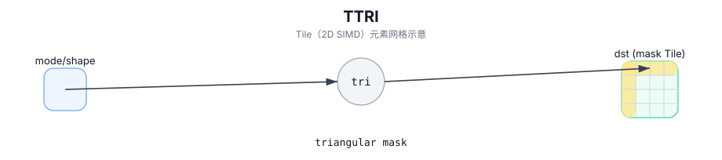

# TTRI

## 简介

生成上/下三角掩码 Tile（由编译期参数控制，常用于 attention / band mask）。

## 计算流程图



## 数学解释

设 `R = dst.GetValidRow()` 和 `C = dst.GetValidCol()`。让 `d = diagonal`。

下三角 (`isUpperOrLower=0`) 在概念上产生：

$$
\mathrm{dst}_{i,j} = egin{cases}1 & j \le i + d \ 0 & 	ext{otherwise}\end{cases}
$$

上三角 (`isUpperOrLower=1`) 在概念上产生：

$$
\mathrm{dst}_{i,j} = egin{cases}0 & j < i + d \ 1 & 	ext{otherwise}\end{cases}
$$

## C++ Intrinsic（内建接口）

在 `include/pto/common/pto_instr.hpp` 中声明：

```cpp
template <typename TileData, int isUpperOrLower, typename... WaitEvents>
PTO_INST RecordEvent TTRI(TileData &dst, int diagonal, WaitEvents&... events);
```

## 约束

- `isUpperOrLower` 必须为 `0`（下）或 `1`（上）。
- 某些目标上的目标 Tile 必须是行主序（请参阅 `include/pto/npu/*/TTri.hpp`）。