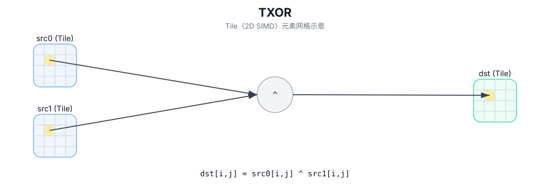

# TXOR

## 简介

在 `dst` 的有效区域内，对 `src0` 与 `src1` 执行逐元素按位异或，结果写入 `dst`（Tile 以 2D SIMD 方式并行计算）。

## 计算流程图



## 数学解释

对于有效区域中的每个元素 `(i, j)`：

$$ \mathrm{dst}_{i,j} = \mathrm{src0}_{i,j} \oplus \mathrm{src1}_{i,j} $$

## 汇编语法

PTO-AS 形式：参见 `docs/grammar/PTO-AS.md`。

同步形式：

```text
%dst = txor %src0, %src1 : !pto.tile<...>
```
## C++ Intrinsic（内建接口）

在 `include/pto/common/pto_instr.hpp` 中声明：

```cpp
template <typename TileDataDst, typename TileDataSrc0, typename TileDataSrc1, typename TileDataTmp, typename... WaitEvents>
PTO_INST RecordEvent TXOR(TileDataDst& dst, TileDataSrc0& src0, TileDataSrc1& src1, TileDataTmp& tmp, WaitEvents&... events);
```

## 约束

- 适用于整体元素类型。
- 操作迭代 `dst.GetValidRow()` / `dst.GetValidCol()`。
- A3需要临时空间进行计算，而A5则不需要。
- 对于A3，2个源 Tile、目标 Tile、临时空间必须位于不同的内存范围内且不能重叠。

## 示例

```cpp
#include <pto/pto-inst.hpp>

using namespace pto;

void example() {
  using TileDst = Tile<TileType::Vec, uint32_t, 16, 16>;
  using TileSrc0 = Tile<TileType::Vec, uint32_t, 16, 16>;
  using TileSrc1 = Tile<TileType::Vec, uint32_t, 16, 16>;
  using TileTmp = Tile<TileType::Vec, uint32_t, 16, 16>;
  TileDst dst;
  TileSrc0 src0;
  TileSrc1 src1;
  TileTmp tmp;
  TXOR(dst, src0, src1, tmp);
}
```