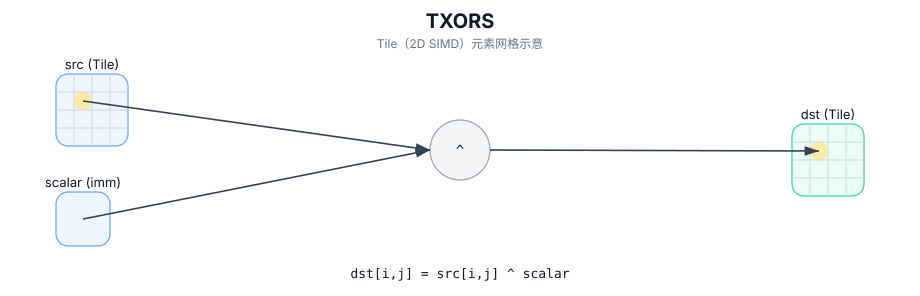

# TXORS

## 简介

在 `dst` 的有效区域内，对 `src` 的每个元素与标量 `scalar` 执行逐元素按位异或，结果写入 `dst`。

## 计算流程图



## 数学解释

对于有效区域中的每个元素 `(i, j)`：

$$ \mathrm{dst}_{i,j} = \mathrm{src}_{i,j} \oplus \mathrm{scalar} $$

## 汇编语法

PTO-AS 形式：参见 `docs/grammar/PTO-AS.md`。

同步形式：

```text
%dst = txors %src, %scalar : !pto.tile<...>, i32
```
## C++ Intrinsic（内建接口）

在 `include/pto/common/pto_instr.hpp` 中声明：

```cpp
template <typename TileDataDst, typename TileDataSrc, typename TileDataTmp, typename... WaitEvents>
PTO_INST RecordEvent TXORS(TileDataDst& dst, TileDataSrc& src0, typename TileDataSrc::DType scalar, typename TileDataTmp &tmp, WaitEvents&... events);
```

## 约束

- 适用于整体元素类型。
- 操作迭代 `dst.GetValidRow()` / `dst.GetValidCol()`。
- A3需要单独的临时空间进行计算，而A5则不需要。
- **不支持**将源 Tile 和目标 Tile 设置为同一内存。
- 对于 A3，不要将临时空间设置为与源 Tile 或目标 Tile 相同的内存。

## 示例

```cpp
#include <pto/pto-inst.hpp>

using namespace pto;

void example() {
  using TileDst = Tile<TileType::Vec, uint32_t, 16, 16>;
  using TileSrc = Tile<TileType::Vec, uint32_t, 16, 16>;
  using TileTmp = Tile<TileType::Vec, uint32_t, 16, 16>;
  TileDst dst;
  TileSrc src;
  TileTmp tmp;
  TXORS(dst, src, 0x1u, tmp);
}
```