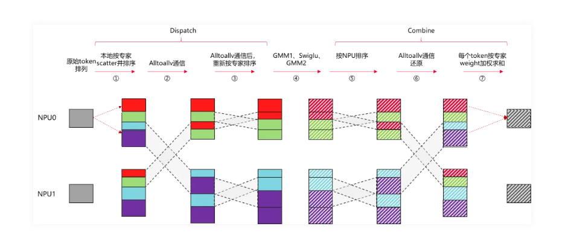
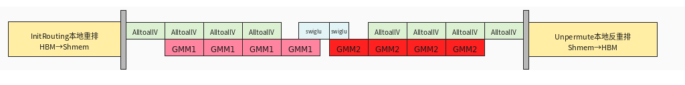

# pto-megamo代码解读

##  megamoe介绍
### 传统MOE的流程
  
  源卡内[token * topK,k]按expert排序[expert,token * topK]->all2allv发送到目标卡->目标卡将收到的token按照expert再做一次排序[expert,srcRank,token]->GMM1->Swiglu->GMM2
   ->目标卡将token按照[srcRank,expert,token]重新排序 ->目标卡将[expert,token] all2allv发回源卡 ->源卡按照topk结果累加，并还原原始token顺序[m，k]

### megamoe的流程
  传统MOE的流程里计算和数据搬运是串行流程，megamoe做了细粒度对的优化，根据硬件特征，将计算和数据搬运做了overlap，比如在ascend上可以改成如下模式：
     
  1. 开头：源卡内[token * topK,k]按expert排序[expert,token * topK]->all2all交换所有源卡的路由信息->目的卡all2allv直接拉取token按照[expert,srcRank,token]存放
  2. 中间：按照expert做AIC和AIV的overlap
  3. 结尾: 源卡按照topk结果累加，并还原原始token顺序[m，k]


 ### PTO megamoe 对比ascendc megamoe数据：
        --world-size 16 --m XX  --k 7168 --n 4096 --topk 8 --experts 16

| M    | PTO 实测  | ascendc实测 | ascendc文章(据图估算) | PTO vs ascendc文章 | PTO vs ascendc实测 |
| ---- | ------- | --------- | --------------- | ---------------- | ---------------- |
| 16   | 605.32  | 582.52    | 560             | 慢 8.09%          | 慢 3.91%          |
| 32   | 621.28  | 595.56    | 575             | 慢 8.05%          | 慢 4.32%          |
| 64   | 653.86  | 627.52    | 590             | 慢 10.82%         | 慢 4.20%          |
| 128  | 717.26  | 735.82    | 620             | 慢 15.69%         | 快 2.52%          |
| 512  | 1337.57 | 1924.12   | 1425            | 快 6.14%          | 快 30.48%         |
| 1024 | 2261.64 | 2774.86   | 2530            | 快 10.61%         | 快 18.50%         |
| 2048 | 4425.00 | 5352.52   | 5015            | 快 11.76%         | 快 17.33%         |
1.PTO在prefill场景比ascendc的算子快，原因是GMM效率高，在FP8 L1 tile (128,256,512) 的size下，PTO tile比catlass blockmmad计算实测快50%
2.在小case场景，稍微比ascendc慢一些，不太好界定哪里慢，各个阶段差距不大


## 2 megamoe详细流程
### 输入
   | 顺序  | 参数                | 形状 / 大小                                                                                  | 精度 / 物理类型                            | 说明                                                   |
| --- | ----------------- | ---------------------------------------------------------------------------------------- | ------------------------------------ | ---------------------------------------------------- |
| 1   | ffts              | 标量地址                                                                                     | void* / 控制地址                         | rtGetC2cCtrlAddr 返回的 C2C/FFTS 控制基址                   |
| 2   | x                 | [M, K]                                                                                   | BF16，物理 uint16_t                     | 输入 token，kernel 侧按 bfloat16_t 用                      |
| 3   | weight1           | 逻辑 [expertPerRank, K, N]；物理 packed 总元素 expertPerRank * alignUp(K,16) * alignUp(N,32)     | int8_t                               | ZN/NZ packed，实际内存近似 [E, N_align/32, K_align, 32]     |
| 4   | weight2           | 逻辑 [expertPerRank, N/2, K]；物理 packed 总元素 expertPerRank * alignUp(N/2,16) * alignUp(K,32) | int8_t                               | 第二个 GMM 权重，packed 布局同样按 pack_expert_weights_to_zn    |
| 5   | expert_idx        | [M, topK]                                                                                | int32_t                              | 全局 expert id，范围是 [0, worldSize * expertPerRank)      |
| 6   | scale1            | [expertPerRank, N]我                                                                      | 物理 uint64_t/文件 int64_t，逻辑 FP32 scale | GMM1 fixpipe scale，fp32 scale 打包到 64bit slot         |
| 7   | scale2            | [expertPerRank, K]                                                                       | 物理 uint64_t/文件 int64_t，逻辑 FP32 scale | GMM2 fixpipe scale                                   |
| 8   | probs             | [M, topK]                                                                                | float32                              | combine/unpermute 时按 topK 加权                         |
| 9   | out               | [M, K]                                                                                   | FP16，物理 uint16_t / kernel half       | 最终输出                                                 |
| 10  | expert_token_nums | [expertPerRank]                                                                          | int32_t                              | front reorder 写出的本 rank 每个 local expert token 数      |
| 11  | workspace         | build.workspace_bytes 字节                                                                 | byte buffer                          | 放 front/dispatch/GMM/swiglu/combine/unpermute 中间区    |
| 12  | tiling            | 1 * sizeof(MegaMoeTilingData)                                                 | struct bytes                         | 含 M/K/N/topK/expertPerRank/worldSize/maxOutputSize 等 |
| 13  | block_dim         | scalar                                                                                   | uint32_t                             | kernel launch block 数                                |
| 14  | start_sync        | scalar                                                                                   | uint32_t                             | 非 0 时在 kernel 入口执行跨 rank 同步                      |

### 各个阶段的数据形状变化
FrontReorder 输入：
```text
x[M, K] (bf16)
expert_idx[M, topK] (int32)
```

FrontReorder 输出到 source rank remote window / workspace：
```text
offsetA[dstRow, 0:K]        (int8)
offsetA[dstRow, K:K+4]      (fp32 perTokenScale1)
expandedRowIdx[M * topK]    (int32)
localTokenPerExpert         (int32)
```

Dispatch 输入：
```text
remoteWindow.offsetA[rows, K + 32]
preSumBeforeRank[rankSize, expertPerRank]
cumsumMM[rankSize, expertPerRank]
```

Dispatch 输出到本地 workspace：
```text
gmA[rows, K]              (int8)
perTokenScale1[rows]      (fp32)
```

GMM1：
```text
gmC[rows, N] {fp16} =
    TSTORE_FP_ACC(
        gmA[rows, K] {int8} @ weight1[expert, K, N] {int8},
        scale1[expert, N] {uint64物理 / fp32语义}
    )
```

SwiGLU：
```text
dequant1[rows, N] {fp32} =
    cast_fp32(gmC[rows, N] {fp16}) * perTokenScale1[rows] {fp32}

gmPermutedToken[rows, N/2] {int8}, perTokenScale2[rows] {fp32} =
    dynamic_quant(silu(dequant1[:, 0:N/2]) * dequant1[:, N/2:N])
```

GMM2：
```text
cvTile[actualM, actualN] {fp16} =
    TMOV_C2V(
        gmPermutedToken[rows, N/2] {int8} @ weight2[expert, N/2, K] {int8},
        scale2[expert, K] {uint64物理 / fp32语义}
    )

GMM2 结果通过 CV pipe 直接送到配对 AIV，不写 gmm2Output GM 中间区。
```

Combine：
```text
result[rows, K] {fp16} =
    cast_fp16(cast_fp32(TPOP(cvTile) {fp16}) * perTokenScale2[rows] {fp32})

sourceRank.remoteWindow.offsetD[dstRow, 0:K] = result[row, 0:K]
```

Unpermute：
```text
out[token, K] {fp16} =
    sum_topK(probs[token, topk] {fp32} * offsetD[expandedRowIdx[token, topk], K] {fp16})
```
