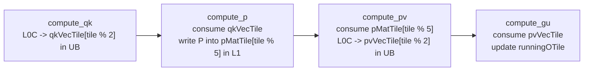

# QK Preload 4: qkVecTile Overwrite Analysis

This document analyzes whether the 2-slot `qkVecTile` ping-pong buffer in UB can be
overwritten when running with `--qk-preload=4` in A5 mode 1 (`FIFO_MODE=1`).

## Conclusion

**No, `qkVecTile` will NOT be overwritten.** The 2-slot ping-pong buffer is safe because
the credit-based sync mechanism (`qk2smSync`) ensures Cube waits for Vec to free each UB
slot before reusing it. The real race from `qk-preload=4` is in L1 P tile storage, not UB.




### Pipeline Timeline (qk-preload=4)

#### Preload Phase (tiles 0-3, PV/GU not started yet)

| Step | Cube (compute_qk) | Vec (compute_p) | qkVecTile[0] | qkVecTile[1] |
|------|-------------------|-----------------|--------------|--------------|
| preload 0 | write [0], no allocate (tile_id=0), record | wait, consume [0], free | QK0 (occupied then freed) | free |
| preload 1 | write [1], no allocate (tile_id=1), record | wait, consume [1], free | free | QK1 (occupied then freed) |
| preload 2 | allocate (tile_id>=2, wait for Vec free [0]), write [0], record | wait, consume [0], free | QK2 (write-after-free) | free |
| preload 3 | allocate (tile_id>=2, wait for Vec free [1]), write [1], record | wait, consume [1], free | free | QK3 (write-after-free) |

#### Steady-State Phase (tile_id=0..)

Each iteration processes one PV/GU tile (current `tile_id`) while producing one new QK/P tile
(`next_qk_tile = tile_id + qkPreloadNum`). Since `next_qk_tile >= qkPreloadNum >= 4`,
`should_wait_ub_reuse` (tile_id >= SRC_VEC_TN_BUFFERS = 2) is always true. Cube always
calls `allocate()` before writing, guaranteeing no overwrite.

#### Key Observations

1. **Tiles 0 and 1**: Both UB slots are initially free. Cube writes without waiting.
2. **Tiles 2+**: Cube calls `allocate()`, which blocks until Vec has `free()`-d the
   corresponding slot from an earlier tile. Vec always consumes and frees before Cube
   reuses the same slot.
3. The `tile_buf_idx = tile_id % 2` mapping naturally alternates slots, matching
   the ping-pong pattern.

## Buffer Configuration

| Parameter | Value | Source |
|-----------|-------|--------|
| `srcVecTNBuffers` | 2 | `fa_performance_dn_kernel.cpp:1005` |
| `qkPreloadNum` | 4 | `fa_performance_kernel.h:41` (`kFaQkPreload`) |
| `pMatTNBuffers` | `qkPreloadNum + 1` = 5 | `fa_performance_dn_kernel.cpp:1010` |
| `outOTileNBuffers` | 2 | `fa_performance_dn_kernel.cpp:1007` |

The `qkVecTile` array is declared with 2 slots:

```cpp
TileDataF_T qkVecTile[srcVecTNBuffers]; // srcVecTNBuffers = 2
```

(`fa_performance_dn_kernel.cpp:1085`)

## Sync Mechanism

The cross-core sync between Cube and Vec for qkVecTile reuse uses a credit semaphore
(`TSync_Custom`, `fa_performance_dn_kernel.cpp:1122`):

```
qk2smSync = TSync_Custom<TMOV_C2UB, TLOAD> at BUF0_QK_READY
```

The four operations:

| Operation | Caller | Meaning |
|-----------|--------|---------|
| `allocate()` | Cube (compute_qk) | Wait for Vec to free this UB slot |
| `record()` | Cube (compute_qk) | QK data ready in this UB slot |
| `wait()` | Vec (compute_p) | Wait for QK data to be ready |
| `free()` | Vec (compute_p) | Finished consuming this UB slot |

### allocate() Condition in compute_qk

(`fa_performance_dn_kernel.cpp:495-499`)

```cpp
const bool should_wait_ub_reuse =
    sub_tile_id == 0 && (tile_id < qkDrainCarryCount || tile_id >= SRC_VEC_TN_BUFFERS);
if (should_wait_ub_reuse) {
    qk2smSync.allocate(); // blocks until Vec frees this UB slot
}
```

For `SRC_VEC_TN_BUFFERS = 2` and `qkDrainCarryCount = 0` (first block):

- **tile_id = 0, 1**: `0 < 2` and `1 < 2` → no allocate (both slots initially free)
- **tile_id >= 2**: allocate required (Cube must wait for Vec to free the slot first)

### free() Condition in compute_p

(`fa_performance_dn_kernel.cpp:784-785`)

```cpp
if (row_slice == kTileFactor - 1)
    qk2smSync.free(); // notify Cube that this UB slot is freed
```

Vec frees the slot only after the entire softmax computation (all row_slices) is done.

## Why the Race Is in L1, Not UB

The `qk-preload=4` increases the distance between P production and PV consumption.
With 4 tiles precomputed before PV starts:

```
Preload:  P tile 0 → pMatTile[0],  P tile 1 → pMatTile[1],
          P tile 2 → pMatTile[2],  P tile 3 → pMatTile[3]

Steady:   produce P tile 4 → pMatTile[4],  consume P tile 0 → pMatTile[0]
          produce P tile 5 → pMatTile[0],  consume P tile 1 → pMatTile[1]
          ...
```

If only 2 L1 P buffers were used, P tile 4 would overwrite pMatTile[0] before PV
consumes P tile 0. The fix is `pMatTNBuffers = qkPreloadNum + 1 = 5`.

(`fa_performance_dn_kernel.cpp:1010`)

## UB Size Does Not Grow with qk-preload

The UB footprint is controlled by fixed-size ping-pong buffers, not by preload depth:

```
qkVecTile[2]       = 2 × Vec_S0 × Tile_S1 × fp32  (ping-pong, always 2 slots)
pvVecTile[2]       = 2 × VecGuRows × HEAD_SIZE × fp32 (ping-pong, always 2 slots)
x_expT[2]          = 2 × Tile_S1 × Vec_S0 × fp16
nzConvBuffer[2]    = 2 × (Cube_S1+1) × Vec_S0 × fp16
input_reduce_tmp   = 1 × Tile_S1 × Vec_S0 × fp32
runningOTile       = 1 × VecGuRows × HEAD_SIZE × fp32
reduce tiles       = (4 + CV_FIFO_SIZE) × SubblockRows × fp32
```

UB remains under the A5 256 KB limit regardless of `qkPreloadNum`.

## Summary

1. `qkVecTile` uses a 2-slot ping-pong buffer indexed by `tile_id % 2`.
2. The credit semaphore (`qk2smSync.allocate()`) prevents Cube from writing to a slot
   until Vec has consumed and freed it, starting from `tile_id >= SRC_VEC_TN_BUFFERS`.
3. The first 2 tiles (slots both initially free) proceed without waiting; subsequent
   tiles always wait for the corresponding free signal.
4. The `qk-preload=4` race is in **L1 P tile storage**, requiring `pMatTNBuffers = 5`,
   not in UB storage.
5. UB footprint is bounded by the fixed 2-slot ping-pong pattern and does not grow
   with preload depth.
