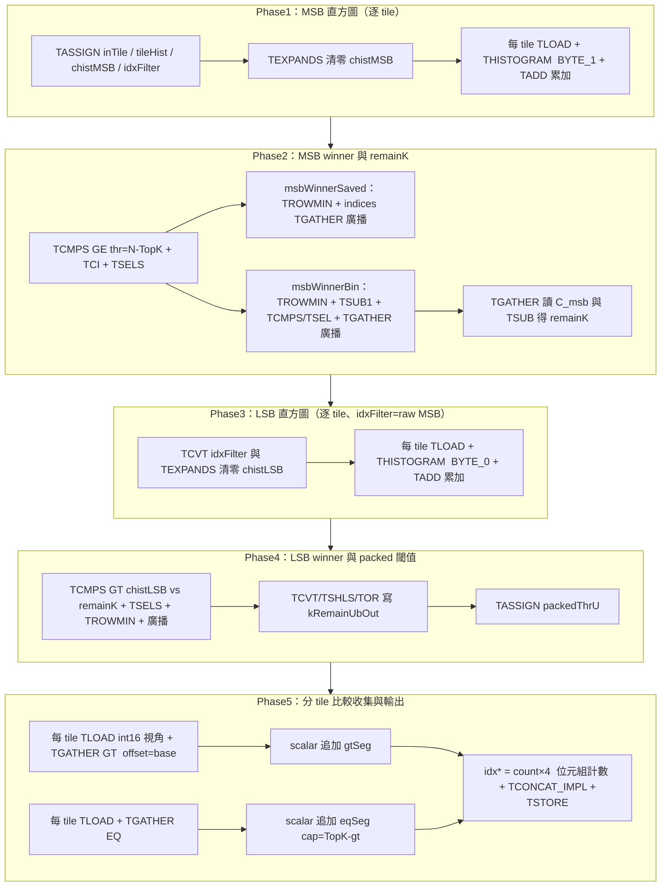

# `draft.cpp`：Radix-Select Top-K 核心說明

本文件說明 `kernels/manual/a5/topk/draft.cpp` 中 **`RunRadixTopKDraft`** 的設計：在 Ascend A5 上以 PTO 指令做 **2 位元組 key（`uint16`）** 的 **radix 風格 Top-K 索引選取**，最後把 **`TopK` 個下標** 寫入全域記憶體。

實作與 **`kernels/manual/a5/topk_ub/draft.cpp`** 對齊：**五個 `Phase*`** 函式，**所有會編成 T-指令的邏輯只出現在這五個 Phase 中**；本目錄版本為 **分 tile 從 GM `TLOAD`（N=2048、每塊 256 欄）**，`topk_ub` 為 **整段 key 置於 UB** 後再整段比較 `TGATHER`。

---

## 1. 目標與假設

| 項目 | 說明 |
|------|------|
| 輸入 | `src`：`N` 個 `uint16` key（範例 `N = 2048`） |
| 輸出 | `outIdx`：`TopK` 個 `uint32_t` **索引**（0 … `N-1`） |
| 排序 | 輸出順序**不要求**與 key 排序一致；與 threshold 相等的 key 在 EQ 段可出現多筆，整體以 **key 多重集合** 與 host golden 比對（見 `main.cpp` / `gen_data.py`） |
| 形狀 | 編譯期固定：`kTileCols = 256`，`kLoop = ceil(N / 256)`（例：8 tile） |

演算法把每個 key 拆成 **高 8 位元（MSB）** 與 **低 8 位元（LSB）**，用兩次 **256-bin 直方圖** + **winner 選桶** 定出 **k-th 對應的 packed `uint16` threshold**，再以 **比較路徑的 `TGATHER`（`CmpMode::GT` / `EQ`）** 分 tile 收集 GT/EQ 索引、scalar 寫入段緩衝，最後 **五參數 `TCONCAT_IMPL`（`TConcatIdx`）** 合併並 **TSTORE**。

---

## 2. 整體管線（鳥瞰）

---

## 3. 階段說明（與 `Phase1`…`Phase5` 一一對應）

### 3.1 Phase1：MSB 直方圖

- 對 `chistMSB` 先 **`TEXPANDS(0)`** 再對每個 tile **`THISTOGRAM<pto::HistByte::BYTE_1>`**，以 **`TADD(chistMSB, chistMSB, tileHist)`** 累加（等同舊版「先清零、首塊 TMOV、其餘 TADD」）。
- 每 tile：**`TLOAD`（`GlobalTensor` 指向 `src+base`）** → `THISTOGRAM`；**MTE2 / V** 以 `EVENT_ID0` / `EVENT_ID2` 與後續 **Phase3** 第一個 tile 的 `wait` 串接，避免在 V 未用完時覆寫 `inTile`。

### 3.2 Phase2：MSB winner 與 `remainK`

1. 在 `chistMSB` 上 **`TCMPS(GE, thr = N-TopK)`**、**`TCI`**、**`TSELS`** 得到各 bin lane 的候選，語意上對應 **最小滿足累積 ≥ (N-TopK) 的 MSB bin**。
2. **`msbWinnerSaved`**：對 `msbWinnerLanes` 做 **`TROWMIN`**，再以 **索引 `TGATHER`（全 0 idx）** 廣播到 32 lane — **不減 1**，供 **Phase3 的 `idxFilter`（只統計該 raw MSB）** 與 ** packed 欄位之 MSB 位元組**。
3. **`msbWinnerBin`（同一條 `msbWinnerLanes` 再算）**：`TROWMIN` 後以 **`TEXPANDS(1)` + `TSUB`** 在最低 bin 上減 1（**避免在部分 CANN 上對 u32 使用 `TADDS(-1)`**），`TCMPS` 與 256 比較、`TSEL` 後再 **`TGATHER` 廣播**，用於讀取 **`C_msb` 的「winner-1」格**（`TGATHER(cwT, chistMSB, msbWinnerBin, …)`）。
4. **`remainKTile`**：`**TEXPANDS(thr_msb)**` 與上一步取得的 **`C[w]`**，`**TSUB(remainKTile, thrMsb, cwT)**` → LSB 直方圖上與 `chistLSB` 比較用。

### 3.3 Phase3：LSB 直方圖（`idxFilter` = raw MSB）

- **`TCVT(idxFilter, msbWinnerSaved)`**：**必須是 raw MSB winner**，**不是** Phase2 中經 -1 後的 `msbWinnerBin`。
- 對 `chistLSB` 先 `TEXPANDS(0)`，再每 tile 與 Phase1 相同節奏 **`TLOAD` + `THISTOGRAM<BYTE_0>` + `TADD`**。仍用 **EVENT_ID2** 在 tile 之間與上階最後的 V 工完成度對齊。

### 3.4 Phase4：LSB winner 與 packed threshold

- 以 **`TCMPS(GT, chistLSB, remainKTile)`** + **`TSELS`** 等還原 LSB 方向 lanes，再 **`TROWMIN` + 廣播** 得 `lsbWinnerBin`。
- **`TCVT` / `TSHLS(<<8)` / `TOR`** 將 raw MSB 與 LSB 合成 **單一 `uint16` threshold** 寫在 **`kRemainUbOut`** 對應的 UB；再 **`TASSIGN(packedThrU, kRemainUbOut)`** 作為 **Phase5 比較 `TGATHER` 的 k 值 tile**（位元組模式與 key 的 `uint16` 全序一致）。

### 3.5 Phase5：分 tile 比較 `TGATHER`、scalar 串接、TCONCAT、TSTORE

- 每 tile：建立 **`int16` 視角** 的 key tile、dst、concat 計數、tmp，**`TLOAD`** 後呼叫  
  `TGATHER<…, PackedU16Tile, …, CmpMode::GT|EQ>(dst, src, **packedThrU**, concat, tmp, **(int)base**)`。  
  **第 6 個實參為執行期 `offset`** = 該 tile 在陣列上的起始下標 **base**；**已廢除** 舊版以「template 常數 `tileIndex*ValidCols` + `switch(0…7)`」帶入 offset 的寫法。
- **回傳長度**：concat scratch 的計數用於 **scalar 迴圈** 把本 tile 的 `dst` lane 內容追加到 **`gtSeg` / `eqSeg`**，GT 總量上限 `TopK`，EQ 補額度 `TopK - gtCount`。
- **`TCONCAT` 的 idx tile**：`idxGtCnt[0] = gtCount * sizeof(uint32_t)`（**位元組數**），`idxEqCnt` 同理；與 `include/pto/npu/a5/TConcat.hpp` 的 **`TConcatIdx`（`* / sizeof(idxType)`）** 一致。

---

## 4. UB 記憶體佈局（摘要）

| 區域（約） | 用途 |
|------------|------|
| `0x00000` | `inTile` |
| `0x10000` / `0x14000` / `0x18000` | tile 直方圖工作區、`chistMSB`、`chistLSB` |
| `0x1C000` | `idxFilter`（`THISTOGRAM` 索引欄位） |
| `0x20000` 起 | Phase5 每 tile 比較 gather 的 src/dst/concat/tmp 等暫存（見原始碼 `kGatherUbSrc` / `kChunkGtDst` 等） |
| `0x23000–0x25000` | winner / remainK 路徑（含 `kMsbWinnerSavedUb`、**`kWinnerUbU32One`（減 1 用）** 等） |
| `0x28000` 起 | `gtSeg`、`eqSeg`、`mergedIdx`、`idxGtCnt` / `idxEqCnt`（**TCONCAT**） |

細部以原始碼 `constexpr uint64_t` 為準；**CMake** 使用 **`BEFORE` 本倉庫 `include/pto`**, 讓倉內之 **`HistByte` `THISTOGRAM`、比較路徑 `TGATHER`、五參數 `TCONCAT`** 等與隨 CANN 附帶的舊header分離。詳見同目錄 `README.md` / `README_zh.md`。

---

## 5. 對外入口

- **`LaunchRadixTopKDraft<TopK>(src, outIdx, stream)`**：啟動 `RunRadixTopKDraft` kernel；`draft.cpp` 內有 **`template void LaunchRadixTopKDraft<512>(…)`** 實體化。

---

## 6. 除錯與驗證建議

- Host 以 **key 多重集合** 比對 golden 時，需與本管線的 **packed threshold、GT/EQ 長度、TCONCAT 位元組計數** 同一套語意；`scripts/radix_topk_golden_stats.py` 可協助列印理論 **MSB/LSB winner、remain_k、GT|EQ 數量**。
- 若 multiset 不符，常見點：**raw MSB 寫入 `idxFilter`、remain_k 定義、LSB 使用 `TCMPS(GT, …, remainKTile)` 與腳本是否一致**。
- 仿真器 UB / 向量 dump（如 `core0.*.dump`）可對照指令序與資料。

---

## 7. 相關檔案

| 檔案 | 角色 |
|------|------|
| `main.cpp` | 載入 `keys.bin`、launch kernel、與 golden 比對 |
| `scripts/gen_data.py` | 產生輸入與參考 golden |
| `scripts/radix_topk_golden_stats.py` | 列印理論 winner / threshold / GT\|EQ 統計 |
| `run.sh` | `-r sim` / `-r npu` 等一鍵建置與執行 |
| `../topk_ub/draft.cpp` | 同演算法、UB 全寬、五 Phase 的對照實作 |

---

*本文件描述目前 `draft.cpp` 的結構；若 PTO 指令或裝置行為有版本差異，以實機/模擬器與 `include/pto/npu/a5/` 為準。*
