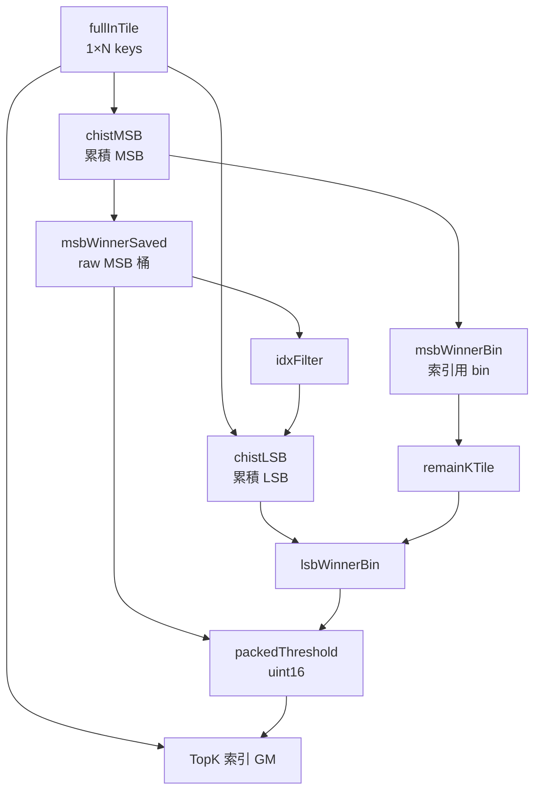

# Radix TopK（`topk_ub` / `draft.cpp`）實作與性能

本文對齊目前 **`kernels/manual/a5/topk_ub/draft.cpp`**：**所有 pto-isa 指令（含 `TASSIGN` / `TLOAD`）只出現在五個 `Phase*` 函數內**；**`RunRadixTopKDraft<TopK>`** 僅建立 tile 物件並依序呼叫 Phase1→5。  
下文整理資料流、UB 佈局、pto-isa 對應，以及依 **`npu_skills`** 慣例從 **CA 模擬器 build 目錄**讀性能與 VF 的方法。**表格中的 tick 數字為歷史採樣示例**，重新跑 sim 後請以 **`build/core0_summary_log`**、**`instr_log`** 最新結果為準。

---

## 1. 目標與形狀

| 項目 | 值 |
|------|-----|
| 輸入 | `N = 65536` 個 `uint16` key（64K），單次 GM→UB **`TLOAD`**（在 **Phase1**） |
| 輸出 | `TopK = 512` 個 `uint32` 索引（**`TSTORE`**，在 **Phase5**） |
| 演算法 | 8-bit radix：兩趟累積直方圖（MSB/LSB）+ winner / remainK + 全寬 **`TGATHER`（GT/EQ）** + **`TCONCAT_IMPL`** |

---

## 2. 五段 Phase 與 pto-isa 對應

呼叫順序與 **`RunRadixTopKDraft<TopK>`** 一致；**`include/pto/npu/a5/`** 為主要 API 頭檔。

| Phase | 函數 | 做什麼 | 主要 pto-isa |
|-------|------|--------|----------------|
| **1** | `Phase1_LoadAndHistogramMsb` | 對 keys / hist / idx 等 tile 做 **`TASSIGN`** 綁 UB → **`TLOAD`** → `PIPE_MTE2`→`PIPE_V` 同步 → `TEXPANDS` 清累積 → **`THISTOGRAM<BYTE_1>`** → **`TMOV`** 寫入 `chistMSB` | `pto-inst.hpp`、`THistogram.hpp` |
| **2** | `Phase2_WinnerMsbAndRemainK<TopK>` | MSB：`TCMPS`(GE, N−TopK)、`TCI`、`TSELS`；raw MSB winner 經 **`TROWMIN`** + 小 **`TGATHER`** 廣播到 `msbWinnerSaved`；`TROWMIN`/`TADDS`/`TCMPS`/`TSEL`/`TGATHER` 得到 `msbWinnerBin`；**`TEXPANDS`** / **`TGATHER`** / **`TSUB`** 算 remainK | `TCmps.hpp`、`Tci.hpp`、`TSels.hpp`、`TGather.hpp` |
| **3** | `Phase3_HistogramLsb` | **`TCVT`**（idx 濾波 = raw MSB byte）→ `TEXPANDS` → **`THISTOGRAM<BYTE_0>`** → **`TMOV`** → `chistLSB` | `THistogram.hpp`（`TCvt` 行為見 `TCvt.hpp`） |
| **4** | `Phase4_WinnerLsbRemainKAndPackedThresholdTor` | LSB：`TCMPS`(GT) vs `remainK`、`TCI`、`TSELS`；**`TROWMIN`** + **`TGATHER`** 得 `lsbWinnerBin`；**`TCVT`** / **`TSHLS`** / **`TOR`** 組 `(msb<<8)|lsb`，**`set_flag`/`wait_flag`（V→S）** 後讀回 `uint16` 閾值 | `TCmps.hpp`、`TGather.hpp`、`TCvt.hpp` 等 |
| **5** | `Phase5_TgatherGtEqTconcatAndStore<TopK>` | 兩次全寬 **`TGATHER`**（**GT** / **EQ**，`CmpMode`，`int16_t` 閾值與 key 同 bit 解釋）→ **`TCONCAT_IMPL`** → **`PIPE_V`→`PIPE_MTE3`** 同步 → **`TSTORE`** TopK 索引 | `TGather.hpp`、`TConcat.hpp`、`pto-inst.hpp` |

### 2.1 各 Tile 的角色與彼此關係（「做什麼」裡的資料流）

下面用 **`RunRadixTopKDraft` 傳入傳出的具名 tile** 為主；Phase 內還有 **`maskTile` / `indexTile` / `msbWinnerLanes`** 等 **綁在固定 UB scratch（`kWinnerUb*`）上的臨時 tile**，語意是輔助運算，不跨 Phase 保留狀態。

**一條總線：keys**

- **`fullInTile`**（`1×N`，`uint16`，UB `kUbFullKeys`）：**唯一完整 key 副本**。Phase1 **`TLOAD`** 寫入後，後續 **MSB/LSB 兩趟 `THISTOGRAM`** 都讀它；Phase5 全寬 **`TGATHER`** 的源 tile（`GatherSrcI16<kN>`）透過 **`TASSIGN` 同一基址**指向同一片 UB，只是把位型看成 **`int16_t`** 做比較 gather。

**直方圖管線：`tileHist` 只是暫存，累積結果落在 `chist*`**

- **`tileHist`**（`1×256`，`uint32`）：**`THISTOGRAM` 的輸出緩衝**；每次做完都用 **`TMOV`** 拷到 **`chistMSB`** 或 **`chistLSB`**，本身不表示「最終語義」，只是重用同一塊 UB 做兩趟直方圖。  
- **`chistMSB`**：MSB 的**累積直方圖** \(C[b]\)。**Phase2** 用來對閾值 `N−TopK` 找 MSB winner，並在 **remainK** 路徑上被 **`TGATHER`（以 `msbWinnerBin` 為索引）** 讀出某個前綴和。  
- **`chistLSB`**：在 **Phase3** 依 **idx 濾波** 對 **LSB** 再算一條累積；**Phase4** 與 **`remainKTile`** 一起做「**大於 remainK 的最小桶**」。

**idx 濾波：`idxFilter` 與 `msbWinnerSaved` 的關係**

- **`idxFilter`**（小塊 `uint8`）：**`THISTOGRAM` 的每 key 掩碼/索引**。Phase1 時尚未寫入有效 MSB byte（實現上依 THISTOGRAM 語義，通常等價於全量計數）；**Phase3** 前執行 **`TCVT(idxFilter, msbWinnerSaved)`**，把 **Phase2 存下的 raw MSB winner 桶**（見下）**截成 8 bit 寫進 idx**，因此 **第二趟直方圖只統計「MSB 與 winner 一致」的 key** 的 LSB。  
- **`msbWinnerSaved`**（`1×32`，`uint32`，UB `kMsbWinnerSavedUb`）：與 **`msbWinnerBin`** **不同**：  
  - **`msbWinnerSaved`**：來自 **`TROWMIN` + 小 `TGATHER` 廣播**，表示 **raw MSB 桶 id**（**未**做 `TADDS(-1)`），給 **Phase3 `TCVT`→`idxFilter`** 和 **Phase4 組 packed 高字節**用。  
  - **`msbWinnerBin`**：走 **WinnerBinU8** 路徑（`TADDS(-1)` 等），作為 **索引向量** 去 **`TGATHER` 讀 `chistMSB`**，給 **`remainKTile`** 用。

**remainK 與 LSB winner**

- **`remainKTile`**（`1×32`，`uint32`）：**Phase2** 末尾 **`TSUB(thr_msb, C[w−1])`** 的結果（語義上有效值在約定 lane，與 `TGATHER` 廣播形狀一致）。**Phase4** 把它與 **`chistLSB`** 做 **`TCMPS` GT**，得到 LSB 側的 **`lsbWinnerLanes` → `lsbWinnerBin`**。  
- **`lsbWinnerBin`**：與 **`msbWinnerSaved`** 一起，經 **`TCVT`/`TSHLS`/`TOR`** 得到 **Phase5** 用的 **`packedThreshold`**（單一 `uint16`）。

**Phase5：全寬緩衝與輸出**

- **`gtChunk` / `eqChunk`**（`1×N`，`uint32`）：全寬 compare-**`TGATHER`** 的目標緩衝；**`idxGtCnt` / `idxEqCnt`** 各記 **命中個數**，供 **`TCONCAT_IMPL`** 從兩段索引里**按序取前 TopK**。  
- **`mergedIdx`**：concat 後的前 **`2×TopK`**（再裁成 **`TopK`**）寫入 GM；**與 `fullInTile` 無直接運算元關係**，只與 **keys UB 上的比較 gather** 間接相連。

**依賴關係簡圖（語義，非指令序）**

**語意（與 golden 一致）**

- MSB winner：`thr_msb = N − TopK`，`min { b : C[b] ≥ thr_msb }`（`TCMPS` GE）。  
- `remainK` 使用 **Phase2** 中經 `TADDS(-1)` 等處理後的 bin 去 **`TGATHER`** 讀 `C[w−1]`，再 **`TSUB`**。  
- LSB：`min { b : C_lsb[b] > remain_k }`（對累積與 `remainK` 做 `TCMPS` GT）。  
- `packed_threshold = (msb<<8)|lsb`（uint16 bit pattern，供 Phase5 比較 gather）。

**模擬器命名**：pto 層為 **`TGATHER`**；底層 log 中常見 **`VGATHER` 類**實現，可與 **`RV_VCMP_*` / `RV_VSQZ`** 等對照。

---

## 3. UB 佈局（與 `draft.cpp` 常數一致）

單位：byte；位址十六進位。

| 區域 | 位址 / 說明 |
|------|-------------|
| **keys** | `kUbFullKeys = 0x0`，`kN×2` = **0x20000** |
| 直方圖 / idx | `kUbTileHist` 0x20000、`kUbChistMSB` 0x21000、`kUbChistLSB` 0x22000、`kUbIdxFilter` 0x23000 |
| Winner / remain 草稿 | `kWinnerUb*`、`kRemainUb*`、`kMsbWinnerSavedUb`（約 0x24000–0x26000） |
| Concat 計數 | `kChunkConcatGt` 0x28000、`kChunkConcatEq` 0x28040 |
| Gather 比較 tmp | **Phase5** 內 **`kGatherUbTmp = 0x29000`**（`N=65536` 時 `cmpVCol = 8192`） |
| GT 索引 | `kFullGatherGtDst = 0x30000`，`1×kN×4` |
| EQ 索引 | `kFullGatherEqDst = 0x38000` |
| merged | `kUbMerged = 0x0`（**`TCONCAT_IMPL` 輸出**；與 keys 同起址，**須以硬體/模擬器驗證是否安全或需改址**） |

**總量級**：約 **128KiB keys + 兩段 256KiB 級 index 緩衝 + scratch**，須符合 **A5 UB 上限**。

---

## 4. 性能分析（對齊 `npu_skills`）

### 4.1 總覽：先看 `core0_summary_log`

依 **`npu_skills`** / **`workflows/runner.md`** 慣例：

- **A5 以 `core0_summary_log` 為準**（勿誤用 core22–31 空 stub）。  
- 常用欄位：  
  - **`kernal total ticks`**（字樣即為 `kernal`）  
  - **`system total ticks`**  
  - **`rvec_veccore0_simd_busy_cycle`**：VEC SIMD 忙碌 cycle（本算子主體在 VEC，Cube MAC 多為 0）

**示例（單次 `build/core0_summary_log` 採樣，僅作數量級參考）**

| 指標 | 示例值 |
|------|--------|
| kernal total ticks | 25526 |
| system total ticks | 25734 |
| mte2 busy | 4832 |
| mte3 busy | 534 |
| rvec simd busy | 19191 |

粗算：**simd_busy / kernal_ticks ≈ 75%**（其餘為同步、標量、氣泡等）。

### 4.2 指令級：`instr_log` 與 `RV_*`

依 **`pto-isa/verification/pto-isa-throughput-st-measurement-SKILL.md`**（`npu_skills` 掛載路徑以本機為準）：

- **`core0.veccore0.instr_log.dump`**：`RVECEX` 行內 **`RV_*`**、**tick** `[NNNNNNNN]`，可 grep **`RV_CHIST`**、**`RV_VCMP_*`**、**`RV_VSQZ`** 等對照算子階段。  
- **`instr_popped_log.dump`**：若關心 **issue** 而非 retire，請全程二選一，勿混用口徑。

### 4.3 VF 時間：用 `PUSHQ … VF` 的 `vf_*`，勿用 CCU tick 差硬當 SIMD 耗時

在 **`instr_log`** 中，**`PUSHQ … VF`** 行可帶：

- **`vf_execute_time`**  
- **`vf_real_execute_time`**

**不要**用 **CCU Push/Retire 的 tick 差**當「VF 內 SIMD 耗時」；以 **`vf_execute_time` / `vf_real_execute_time`** 為主。

### 4.4 重疊流水線：把 `RVECEX` 歸到 VF

**`core0.veccore0.ccu.vec_issque.dump`** 給每個 VF 的 **Push / RETIRE tick**。多 VF 並飛時，可用 **「在飛集合中 retire 最早」** 等啟發式，把 **`RVECEX` / `RVECST`** 歸屬到 VF，再統計 **`RV_*` 直方圖**。

**與五段 Phase 的大致對應（示例 id 以當次 log 為準）**

| 觀察（示例） | 推測對應程式 / pto |
|--------------|-------------------|
| `vf_execute` 較大、**`RV_CHIST`** 密集 | **Phase1 / Phase3** → **`THISTOGRAM`** |
| `vf_execute` 最大段之一、**`RV_VCMP_GT`** / **`RV_VSQZ`** | **Phase5** 第一次 → **`TGATHER` GT** |
| 同左、**`RV_VCMP_EQ`** | **Phase5** 第二次 → **`TGATHER` EQ** |
| 較短、**`RV_VSCATTER`** 等 | **Phase5** → **`TCONCAT_IMPL`** |
| 較短、多種 **`RV_*`** 混排 | **Phase2 / Phase4**（winner / **`TROWMIN`** / 小 **`TGATHER`**） |

Phase2/4 的指令塊較碎、相對全寬 gather **通常不是** kernel 主導項，但會反映在 **`wait_scalar_sync_stall`**（若看 **`core0.veccore0_su_perf_summary_log`**）與多 **`set_flag`/`wait_flag`** 上。

### 4.5 除錯與對值（`workflows/debugger.md`）

| 檔案 | 用途 |
|------|------|
| `core0.veccore0.instr_log.dump` | 指令流、VF、`vf_execute_time` |
| `core0.veccore0.instr_popped_log.dump` | issue 視角 |
| `core0.veccore0.rvec_pv.dump` | 單條指令運算元 / predicate（檔案大） |
| `core0.mte_log.dump` | MTE2 大塊搬運（如 128KiB keys，`TLOAD`） |
| `core0.veccore0.ccu.vec_issque.dump` | VF Push/RETIRE、與同步關係 |

---

## 5. 結論（設計與性能）

1. **結構**：邏輯上仍為「兩趟 **`THISTOGRAM`** + 兩次全寬 **`TGATHER`** + **`TCONCAT`**」；**程式上**對應 **Phase1/3、Phase5**；**Phase2/4** 為 winner 與 packed 閾值，指令多但通常短於全寬 pass。  
2. **耗時主導（模擬器特徵）**：**`RV_CHIST`** 對應的直方圖段 + **`TGATHER` GT/EQ** 對應的 **`RV_VCMP_*` / `RV_VSQZ`** 段；**`TCONCAT`** 相對較短。  
3. **頻寬**：**MTE2** 負責 Phase1 輸入 **`TLOAD`**；**MTE3** 負責 Phase5 **`TSTORE`**；整體仍以 **VEC 內層**為主。  
4. **同步**：多處 **`set_flag`/`wait_flag`**（MTE2↔V、V↔S、V↔MTE3）；若 **`wait_scalar_sync_stall`** 偏高，與跨 pipe 握手一致。

---

## 6. 相關檔案

| 路徑 | 說明 |
|------|------|
| `kernels/manual/a5/topk_ub/draft.cpp` | 五 `Phase*` + `RunRadixTopKDraft` |
| `kernels/manual/a5/topk_ub/main.cpp` | Host、`kN` / `kTopK` |
| `kernels/manual/a5/topk_ub/scripts/gen_data.py` | `keys.bin`、golden |
| `kernels/manual/a5/topk/scripts/radix_topk_golden_stats.py` | 參考統計（`N` 由 `keys.bin` 長度決定） |

---

## 7. `npu_skills` 參考路徑（方法論）

實際目錄以本機 **`npu_skills`** 安裝為準，常見條目：

- **`workflows/runner.md`** — A5 **`core0_summary_log`** 指標  
- **`workflows/debugger.md`** — 各 **log** 用途  
- **`pto-isa/verification/pto-isa-throughput-st-measurement-SKILL.md`** — **`instr_log`**、**`RV_*`**、吞吐分析  

重新跑 build 後，請更新 **§4.1 示例表**與 **§4.4 VF 表**中的具體數字與 VF id。
