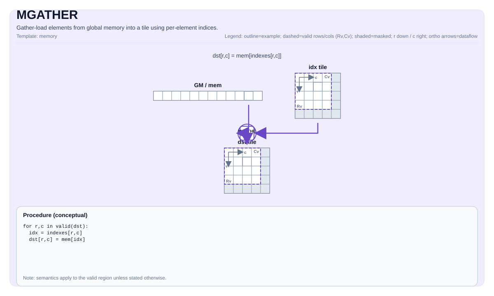

# MGATHER (A2/A3 Vec-Core)

## Tile Operation Diagram



## Introduction

Indexed gather from a GM `GlobalTensor` into a UB destination tile through a UB index tile, running on the A2/A3 AIV vector core. `MGATHER` dispatches a sequential MTE2-DMA loop driven from the scalar pipe and uses no async-launch / cross-core orchestration — the kernel is a single AIV function call. The operating mode is selected explicitly by the `Coalesce` template parameter:

- **`Coalesce::Row`** (default) — gather full rows from `table[idx[r], :]` into `dst[r, :]`. Index tile is 1-D (`[1, R]` row-major). For each row `r` the implementation reads `idx[r]` as a scalar (PIPE_V → PIPE_S handshake) and, for ND, issues a single `copy_gm_to_ubuf_align_b8/b16/b32` burst of `validCol * sizeof(T)` bytes from `table + idx[r] * tableRowStride` into the row slot of `dst`. For NZ, it issues one multi-burst MTE2 transfer per outer block-col group (`nBurst = number of column fractal blocks`) that walks all `C0`-wide fractals of the NZ row.
- **`Coalesce::Elem`** — element-wise gather from a linearized `table` using `idx[R, C]` into `dst[R, C]`. The destination tile may be 2-D (`[R, C]`) or degenerate 1-D (`[1, N]`); the index tile must have the same valid shape as the destination. The implementation walks every `(r, c)` position and issues **one MTE2 `copy_gm_to_ubuf_align_b8/b16/b32` burst per element** (`lenBurst = sizeof(T)`) from `table + offset(idx[r, c])` into the corresponding UB slot. The actual GM↔UB data movement runs entirely on PIPE_MTE2; the scalar pipe is used **only** for index dereference and DMA orchestration. The `(1, 1)` corner case takes a one-shot scalar fallback (`MGatherElemScalarImpl`) — the only path on which a scalar GM read is issued.

Both modes accept either an **ND** GM table (`Layout::ND`) paired with an **ND/RowMajor** UB tile, or an **NZ** GM table (`Layout::NZ`) paired with a **NZ/ColMajor-fractal** UB tile (see "NZ Layout Support" below).

Out-of-bounds index handling is selected via the `GatherOOB` template parameter. `MGATHER` has no atomic or conflict policy: every destination slot has exactly one defined source index, so collisions cannot occur.

## Math Interpretation

### Row Coalesce (`Coalesce::Row`)

Destination `dst[R, C]`, index `idx[1, R]`, table `table[TableRows, C]`:

$$ \mathrm{dst}_{r, j} = \mathrm{table}_{\mathrm{idx}_{r},\; j} \quad\text{for } 0 \le r < R,\; 0 \le j < C $$

The kernel issues one GM→UB DMA burst per row through `copy_gm_to_ubuf_align_b*`, with the burst length equal to `validCol * sizeof(T)` bytes (the **valid** width, not the padded `Tile::Cols`). UB destination addressing uses `Tile::RowStride` so partial-valid tiles padded for 32-byte burst alignment are supported transparently.

### Element Coalesce (`Coalesce::Elem`)

Destination `dst[R, C]`, index `idx[R, C]` (same valid shape as `dst`), flat table of length `TableSize`:

$$ \mathrm{dst}_{r, c} = \mathrm{table}[\mathrm{idx}_{r, c}] \quad\text{for } 0 \le r < R,\; 0 \le c < C $$

`TableSize = Shape[0] * Shape[1] * Shape[2] * Shape[3] * Shape[4]` of the `GlobalTensor` (5-D × any combination of static / dynamic dims). For ND tables this matches the linear element count directly; for NZ tables the same formula counts elements in the fractal-padded layout, and the kernel internally maps each scalar `idx` value through a row-major (`logicalRow = idx / nLogicalCols`, `logicalCol = idx % nLogicalCols`) → NZ block-stride translation.

The kernel walks the `validRow * validCol` flat positions in **column-block-major order** (outer block-col first, then row, then column-within-block). This keeps consecutive UB destinations inside the same 32 B fractal block when writing NZ tiles and avoids the long inter-block address jumps that would otherwise disturb tightly-issued single-element MTE2 bursts; ND elem mode keeps the same outer walk because for ND tiles `kC0 == validCol` and the inner block-col loop simply reduces to the original row-major walk. For each `(r, c)` the implementation reads the index from UB on the scalar pipe, then issues an MTE2 burst — `copy_gm_to_ubuf_align_b8/b16/b32(dstPtr + dstOff, tablePtr + offset(idx), 0, 1, sizeof(T), 0, 0, 0, 0)` — that drives the actual `T`-byte transfer from GM to UB through the DMA engine on PIPE_MTE2. The whole loop is wrapped by a `set_flag(PIPE_V, PIPE_S) / wait_flag(PIPE_V, PIPE_S)` pre-amble; on completion the kernel emits `set_flag(PIPE_MTE2, PIPE_V) / wait_flag(PIPE_MTE2, PIPE_V)` and `set_flag(PIPE_S, PIPE_V) / wait_flag(PIPE_S, PIPE_V)` so downstream vector / store consumers see the gathered data.

### Out-of-Bounds Behaviour

```cpp
enum class GatherOOB : uint8_t {
    Undefined = 0,
    Clamp     = 1,
    Wrap      = 2,
    Zero      = 3
};
```

`capacity` is `TableRows` (Row mode) or `TableSize` (Elem mode):

- `Undefined`: caller guarantees `idx < capacity`; no remap is applied.
- `Clamp`: `idx = min(idx, capacity - 1)` before access.
- `Wrap`: `idx = idx % capacity` before access.
- `Zero`: out-of-bounds destinations receive `static_cast<T>(0)`.
  - **Row mode (ND and NZ)** runs a one-shot `vector_dup` over `Tile::Numel` UB before the DMA loop and simply skips DMAs for OOB rows. OOB rows therefore retain the vec-core pre-zero value — purely vec-core + MTE2, no scalar in the data path.
  - **Elem mode (ND and NZ)** uses a two-stage **vec-core + MTE2** strategy that keeps the entire data path off the scalar pipe (only `(1, 1)` shapes use the dedicated scalar fallback):
    1. **Stage 1 — forced MTE2 burst.** The kernel remaps every OOB index to a safe in-bounds index (`safeIdx = 0`) and issues an MTE2 DMA on every lane, so the destination tile is **fully** written by the DMA pipe. This avoids the `copy_gm_to_ubuf_align_b8/b16/b32` sub-block read-modify-write spillover that would otherwise corrupt pre-zeroed OOB lanes when `sizeof(T) ∈ {1, 2}` (per-element bursts smaller than 32 B share the same 32 B sub-block in the simulator's MTE pipeline).
    2. **Stage 2 — vec-core OOB zero (`MGatherZeroSlice`).** After the MTE2 wave drains (`set_flag(PIPE_MTE2, PIPE_V) / wait_flag(PIPE_MTE2, PIPE_V)`), the kernel transforms the index tile **in place** into a per-lane *valid mask* of type `T` and multiplies it into `dst` — so OOB lanes get zeroed by `dst *= 0` and in-bounds lanes are preserved by `dst *= 1`. The full chain runs entirely on the vector pipe and uses only standard a2a3 vec-core intrinsics:
       - `vmuls(idx, idx, -1)` → negate (signed int32 lanes).
       - `vadds(idx, idx, tableSize)` → in-bounds lanes become `tableSize - idx ≥ 1`, OOB lanes become `≤ 0`.
       - `vrelu(idx, idx)` → clamp to `max(0, x)`: in-bounds positive, OOB zero.
       - `vmins(idx, idx, 1)` → clamp to `min(., 1)`: 1 for in-bounds, 0 for OOB — the *valid mask* in signed int32.
       - For `T ∈ {int32, uint32}` the int32 mask is applied directly via `vmul(int32)`. For `T == float` it is converted in place with `vconv_s322f32` and applied via `vmul(float)`. For `T == half` it is converted with `vconv_s322f32` then `vconv_f322f16` and applied via `vmul(half)`. For `T ∈ {int16, uint16}` it is converted with `vconv_s322f32` then `vconv_f322s16r` and applied via `vmul(int16)`.

       **Why this chain (and not `vcmpvs_lt + set_cmpmask + vsel`)?** The "cmpmask + vsel" pattern (used by e.g. `TRem`) needs (a) a separate UB scratch buffer for the cmpmask and (b) a UB scratch tile holding the zero source for `vsel`'s false branch. `MGATHER`'s public signature **does not** include a `tmp` tile parameter, so adding one would break every call site. The arithmetic chain instead computes the 0/1 valid mask **in place** in the index tile (which is unused after the DMAs complete) using only `vmuls/vadds/vrelu/vmins`, then casts it to `T` and applies it with `vmul`. All instructions are first-class a2a3 vec-core ops issued on `PIPE_V`; no scratch tile is required, no scalar GM↔UB read happens on the data path, and the index-tile lanes outside `count` are left untouched because the chain runs under `set_mask_count` / `set_vector_mask(0, count)`.

    For NZ destinations the same `MGatherZeroSlice` runs once per fractal `(bcol, r)` slice (length `kInBlock ≤ kC0 = 32 / sizeof(T)`), so the valid-mask multiply lands on the correct NZ-fractal lanes without any scalar UB indexing.

    **Type restriction.** `Elem + GatherOOB::Zero` is `static_assert`-restricted to `{int16, uint16, int32, uint32, half, float}` (the dtypes for which CCE provides a native `vmul` instruction). `int8`, `uint8`, and `bfloat16` cannot use `OOB::Zero` in elem mode and a compile error fires from `MGatherCheck`. `Oob ∈ {Undefined, Clamp, Wrap}` keeps full dtype coverage. `OOB::Zero + Elem` also `static_assert`s `TIdx == int32_t` (the int32 valid-mask chain assumes signed int32 lanes).

## Assembly Syntax

PTO-AS form: see [docs/assembly/PTO-AS.md](/docs/assembly/PTO-AS.md).

```text
mgather.row %dst, %table, %idx : (!pto.tile<RxCxT>, !pto.memref<...>, !pto.tile<1xRxi32>)
mgather.elem %dst, %table, %idx : (!pto.tile<RxCxT>, !pto.memref<...>, !pto.tile<RxCxi32>)
```

OOB-aware variants append the mode suffix (`mgather.row.clamp`, `mgather.elem.zero`, etc.).

## C++ Intrinsic

Declared in `include/pto/common/pto_instr.hpp` and `include/pto/npu/a2a3/MGather.hpp`:

```cpp
template <Coalesce  CMode = Coalesce::Row,
          GatherOOB Oob   = GatherOOB::Undefined,
          typename TileDst, typename GlobalTable, typename TileIdx,
          typename... WaitEvents>
PTO_INST RecordEvent MGATHER(TileDst& dst, GlobalTable& table, TileIdx& idx,
                             WaitEvents&... events);
```

The kernel iterates over `TileDst::ValidRow * TileDst::ValidCol` logical positions; physical UB strides come from the `Tile` types' `RowStride` (which equals padded `Cols` for `BLayout::RowMajor`).

For `Coalesce::Elem` with `TileDst::ValidRow == 1 && TileDst::ValidCol == 1` the implementation **bypasses the per-element MTE2 DMA loop** and runs a real **scalar fallback** (`MGatherElemScalarImpl`) — single `set_flag(PIPE_V, PIPE_S)` / `wait_flag(PIPE_V, PIPE_S)` handshake, single scalar GM read, single UB write, then `set_flag(PIPE_S, PIPE_V)` / `wait_flag(PIPE_S, PIPE_V)` to release the vector pipe. This is the **only** path on which `MGATHER` issues a scalar GM dereference — every other Elem shape (including `[1, 2]` and larger) routes through the MTE2 DMA pipeline. The pattern mirrors `TInsertVecToVecNDScalar` in `TInsert.hpp`.

**Parameters:**

- `dst`     : UB destination tile (`TileType::Vec`); shape `[R, C]`. **`BLayout::RowMajor`** for ND tables, **`BLayout::ColMajor` + `SLayout::RowMajor` + `SFractalSize=512`** for NZ tables.
- `table`   : Source GM `GlobalTensor` with `Layout::ND` (linear contiguous) or `Layout::NZ` (fractal `[B, BlockCols, BlockRows, 16, 32/sizeof(T)]`). The `GlobalTensor::DType` must be `__gm__ T` matching the destination element type.
- `idx`     : UB index tile (`TileType::Vec`). For `Coalesce::Row`: 1-D `[1, R]` row-major. For `Coalesce::Elem`: same valid shape as `dst`, row-major.
- `CMode`   : `Coalesce` — `Row` (default) or `Elem`. **First** template parameter so the operating mode is always explicit at the call site.
- `Oob`     : `GatherOOB` — out-of-bounds index handling.

## Coalesce Mode

```cpp
enum class Coalesce : uint8_t {
    Row  = 0,
    Elem = 1
};
```

## Constraints

### Data Types

`TileDst::DType` must be one of: `int8_t`, `uint8_t`, `int16_t`, `uint16_t`, `int32_t`, `uint32_t`, `half`, `bfloat16_t`, `float`. (No `float8_e4m3_t` / `float8_e5m2_t` / `hifloat8_t` on A2/A3 vec-core.)

### Index Types

`TileIdx::DType` must be `int32_t` or `uint32_t`.

### Tile Constraints

- `TileDst::Loc == TileType::Vec` (UB).
- `TileIdx::Loc == TileType::Vec` (UB). The index tile is **always** `BLayout::RowMajor + SLayout::NoneBox` (ND) regardless of the table layout.
- Source and table must share the same element type `T` (`GlobalTable::DType == __gm__ T`).
- The destination tile's bulk + sub layout must be paired with the table layout exactly:
  - `GlobalTable::layout == Layout::ND` ⇒ `TileDst` is `BLayout::RowMajor + SLayout::NoneBox`.
  - `GlobalTable::layout == Layout::NZ` ⇒ `TileDst` is `BLayout::ColMajor + SLayout::RowMajor + SFractalSize == TileConfig::fractalABSize` (= 512 B). Additionally:
    - `GlobalTable::staticShape[3] == FRACTAL_NZ_ROW` (= 16),
    - `GlobalTable::staticShape[4] == C0_SIZE_BYTE / sizeof(T)` (= 32 B / element width),
    - `TileDst::Cols % (C0_SIZE_BYTE / sizeof(T)) == 0` (whole `C0` columns per fractal block-col),
    - `TileDst::Rows % FRACTAL_NZ_ROW == 0` (whole `16`-row fractal blocks).
- Padded `TileDst::Cols * sizeof(T)` must be 32-byte aligned in **both** layouts (the same DMA-burst rule that `TLOAD` / `TSTORE` enforce). `ValidCol`/`ValidRow` are not constrained by this rule — they only set the kernel's iteration bounds.
- For `Coalesce::Row`: `TileIdx::ValidRow == 1`, `TileIdx::ValidCol == TileDst::ValidRow` (a 1-D row of `R` indices).
- For `Coalesce::Elem`: `TileIdx::ValidRow == TileDst::ValidRow` and `TileIdx::ValidCol == TileDst::ValidCol`.
- Both row and elem modes require `TileDst::ValidRow >= 1` and `TileDst::ValidCol >= 1`.

### Dynamic Runtime Shapes

`MGATHER` supports both compile-time fixed shapes and **runtime-dynamic** shapes for the source `GlobalTensor` and the destination / index `Tile`s. Any dimension declared as `DYNAMIC` (`-1`) at template-instantiation time is resolved at runtime through the standard PTO accessors:

- `Tile<…, RowMask, ColMask>` with `RowMask == -1` and/or `ColMask == -1` stores the runtime valid extents in the tile object; `MGATHER_IMPL` reads them via `dst.GetValidRow()` / `dst.GetValidCol()` and uses them to drive the row / element loop bounds.
- `Shape<S0, S1, S2, S3, S4>` / `Stride<…>` with one or more `-1` entries are constructed with the runtime sizes; `MGATHER_IMPL` reads them via `table.GetShape(GlobalTensorDim::DIM_*)` and folds them into `tableRows` (Row mode) or `tableSize = ∏ shape[0..4]` (Elem mode).

Static-asserts in `MGatherCheck` are gated on `if constexpr (DIM > 0)` so they fire only for compile-time-known dimensions; mixed static/dynamic combinations check exactly the static dims and defer the dynamic ones to runtime arithmetic. Padded `Tile::Rows` / `Tile::Cols` are always compile-time (they govern the UB DMA-burst alignment); only the **valid** sub-region and the GM table extents may be dynamic.

Example:

```cpp
constexpr auto kPadCols = 16;
using DstTileT = Tile<TileType::Vec, float,    1, kPadCols, BLayout::RowMajor, -1, -1>;
using IdxTileT = Tile<TileType::Vec, int32_t,  1, kPadCols, BLayout::RowMajor, -1, -1>;
using TableShape  = Shape<1, 1, 1, -1, -1>;
using TableStride = Stride<1, 1, 1, -1, -1>;

int64_t validCols = 9, d3 = 3, d4 = 10, srcStride3 = 10;
TableShape  tableShape(d3, d4);
TableStride tableStride(srcStride3, (int64_t)1);
GlobalTensor<float, TableShape, TableStride> tableGM(srcGm, tableShape, tableStride);

DstTileT dstTile(1, validCols);
IdxTileT idxTile(1, validCols);
TASSIGN(dstTile, dstUbOffsetBytes);
TASSIGN(idxTile, idxUbOffsetBytes);

MGATHER<Coalesce::Elem, GatherOOB::Undefined>(dstTile, tableGM, idxTile);
```

At dispatch time `MGATHER_IMPL` resolves `validRows = 1`, `validCols = 9`, and `tableSize = 1·1·1·3·10 = 30`. The padded UB `Tile::Cols = 16` is purely a `TLOAD` burst-alignment artifact — the elem loop only walks the valid 9 elements.

### Layout Support

The kernel handles **two paired layouts**: ND-GM with ND-UB, and NZ-GM with NZ-UB. UB addressing is computed from the tile's `Rows` / `Cols` plus an optional fractal block-col stride; GM addressing is driven from the `GlobalTensor::GetStride(DIM_*)` accessors.

| Tile / Tensor | Supported layouts | Notes |
|---------------|-------------------|-------|
| `TileDst` (UB) — ND path | `BLayout::RowMajor` + `SLayout::NoneBox` | Row writes use `dstPtr + r * Tile::RowStride`. Elem writes use `dstPtr + r * Tile::RowStride + c`. |
| `TileDst` (UB) — NZ path | `BLayout::ColMajor` + `SLayout::RowMajor` + `SFractalSize == 512` | Block-col stride is `Tile::Rows * C0`; per-element offset is `(c / C0) * (Tile::Rows * C0) + r * C0 + (c % C0)`. |
| `TileIdx` (UB) — Row mode | `[1, R]` `BLayout::RowMajor` + `SLayout::NoneBox` | Linear `R`-element layout in UB; the kernel reads `idxPtr[row]` directly. **Always ND**, regardless of the table layout. |
| `TileIdx` (UB) — Elem mode | `[R, C]` `BLayout::RowMajor` + `SLayout::NoneBox` | Reads `idxPtr[r * Tile::RowStride + c]` per element. **Always ND**, regardless of the table layout. |
| `GlobalTable` (GM) — ND | `Layout::ND` (linear contiguous addressing); 5-D `Shape<…, R, C>` | Row mode addresses `table + idx[r] * tableRowStride`; Elem mode addresses `table + idx`. `tableRowStride = GetStride(DIM_3)` so non-trivial row strides (e.g. zero-padded ND tables) are honoured. |
| `GlobalTable` (GM) — NZ | `Layout::NZ`; 5-D `Shape<B, BCols, BRows, 16, C0>` with `B == 1`, `staticShape[3] == 16`, `staticShape[4] == 32 / sizeof(T)` | Row mode walks fractal block-cols via a multi-burst MTE2 (`nBurst = BCols`, `lenBurst = C0 * sizeof(T)`, `gmGap = stride1 - C0`); Elem mode resolves each `idx` to a NZ block-stride offset (`blockColCombined / blockColOuter1 / blockRow / rowInBlock / colInBlock`) and fires one per-element burst. |

### NZ Layout Support

When `GlobalTable::layout == Layout::NZ` and `TileDst` is the matching `BLayout::ColMajor + SLayout::RowMajor + SFractalSize=512` tile, `MGATHER` runs the dedicated NZ paths (`MGatherRowNzImpl`, `MGatherElemNzImpl`).

- **Constants.** `kC0 = C0_SIZE_BYTE / sizeof(T) = 32 / sizeof(T)`; `kFRow = FRACTAL_NZ_ROW = 16`. Each fractal block is `kFRow × kC0` elements (= 32 B × 16 = 512 B).
- **Logical shape.** Logical rows = `gShape2 * kFRow` (number of NZ row-blocks × 16). Logical cols = `gShape0 * gShape1 * kC0` (batch × col-blocks × C0). For Row mode `mgather_remap` clamps/wraps against the *logical row count*; for Elem mode it clamps/wraps against the total element count `(gShape2 * kFRow) * (gShape0 * gShape1 * kC0)`.
- **Row mode.** For each logical row `r`, the kernel maps `idx[r]` to `(srcBlockRow, srcRowInBlock) = (idx / kFRow, idx % kFRow)` and `(dstBlockRow, dstRowInBlock) = (r / kFRow, r % kFRow)`, then issues **one multi-burst MTE2 transfer per outer batch** (`nBurst = gShape1`, `lenBurst = kC0 * sizeof(T) = 32 B`, `gmGap = (gStride1 - kC0) * sizeof(T)`, `ubGap = TileDst::Rows - 1` blocks). Every column-fractal in the source row-of-blocks is gathered with a single instruction; the GM gap honours `gStride1` (i.e. the actual stride between block-cols, not the implicit `BlockRows * 16 * C0`).
- **Elem mode.** For each `(r, c)` the kernel maps `idx` to `(logicalRow, logicalCol) = (idx / nLogicalCols, idx % nLogicalCols)`, then to NZ physical offsets via `MGatherNZGmOffset` (which folds `gShape0/1` and `gStride0..4`, supporting both packed and stride-padded NZ tensors). The destination offset is `MGatherNZUbOffset(r, c) = (c / kC0) * (TileDst::Rows * kC0) + r * kC0 + (c % kC0)`. The walk order is **block-col → row → col-in-block** so consecutive DMAs always target consecutive 32 B UB blocks; row-major iteration would alternate writes between the first and the second column-fractal block of each row, and that pattern triggered visible MTE2 pipelining mis-orders during testing.
- **Stride vs. valid-shape.** `MGather*NzImpl` reads strides from the `GlobalTensor` runtime (`GetStride(DIM_*)`), so packed NZ tensors (`gStride1 == gShape2 * gShape3 * gShape4`) and stride-padded NZ tensors (`gStride1 > gShape2 * gShape3 * gShape4`) both work without any caller-side touch-up — Row mode propagates `gStride1` into the multi-burst `gmGap`, and Elem mode threads every stride term into `MGatherNZGmOffset`.
- **`GatherOOB::Zero` (Elem).** Same two-stage strategy as ND Elem: (1) `safeIdx = 0` remap → forced MTE2 burst on every lane, (2) per-fractal-slice **vec-core valid-mask multiply** (`MGatherZeroSlice`). The vec-core stage is invoked once per `(bcol, r)` slice with `count = kInBlock ≤ kC0`, so the valid-mask multiply naturally lands on the correct NZ-fractal lanes without any scalar UB indexing or transposition. The dtype restriction (`{int16, uint16, int32, uint32, half, float}` and `TIdx == int32_t`) is identical to ND.

### Aligned vs Unaligned Tile Shapes

The kernel does **not** care whether the tile's logical shape is "aligned" — it walks all `ValidRow * ValidCol` positions:

- Row mode (ND): per-row DMA `lenBurst = validCol * sizeof(T)` (any byte length supported by `copy_gm_to_ubuf_align_b*`); `Tile::RowStride * sizeof(T)` is forced 32-byte aligned by the upstream `Tile` system, so subsequent rows always start on a 32-byte burst boundary.
- Row mode (NZ): one multi-burst transfer per logical row × outer-batch; `lenBurst = kC0 * sizeof(T) = 32 B` is fixed by the fractal layout, so per-row alignment is automatic. `validRow` does not have to be a multiple of `kFRow` — the kernel only walks the valid logical rows and writes their fractal-mapped UB slots, leaving fractal-padding rows untouched (caller-zeroed).
- Elem mode: per-element MTE2 burst `lenBurst = sizeof(T)`. The DMA engine handles the address arithmetic; padded `Tile::Cols * sizeof(T)` must remain 32-byte aligned (enforced by the same upstream rule) so the destination row layout is well-defined for the DMA target addresses.

Callers handle "unaligned valid region" by:

1. Padding the tile up to the nearest 32-byte alignment (e.g. valid `[3, 3]` int32 → tile `[3, 8]`), and
2. Either zero-initializing the padding (`TASSIGN`-then-clear) or only inspecting the valid region post-gather.

### Minimum Tile Shape

`MGatherCheck` accepts any `(ValidRow, ValidCol)` with `ValidRow, ValidCol >= 1` (including the degenerate `(1, 1)` for both Row and Elem modes — the scalar fallback handles `(1, 1)` Elem transparently; Row mode with `R = 1` is just a single-row gather).

The actual lower bound on the **padded** `Tile<…, Rows, Cols, BLayout, ValidRow, ValidCol>` shape is enforced upstream by the `Tile` system because every `TLOAD` / `TSTORE` that brings data in/out of UB issues 32-byte GM↔UB **DMA bursts**. The contiguous-in-memory dim of the tile must therefore be a whole number of bursts:

- `BLayout::RowMajor` ⇒ `Cols * sizeof(T) % 32 == 0` (one row = N×32 B).

`ValidRow` / `ValidCol` are not constrained by this rule. So a logical `(1, 1)` int32 tile is expressed as `Tile<int32, 1, 8, RowMajor, 1, 1>` (one padded burst, one valid element); `(3, 3)` int32 as `Tile<int32, 3, 8, RowMajor, 3, 3>`; etc. Smallest padded `Cols` per dtype for a row-major tile:

| `T` | Min `Cols` (`BLayout::RowMajor`) |
|-----|---------------------------------|
| `int8` / `uint8` | 32 |
| `int16` / `uint16` / `half` / `bfloat16` | 16 |
| `int32` / `uint32` / `float` | 8 |

The padded dimension is purely a **TLOAD/TSTORE alignment artifact** — `MGATHER` itself walks `ValidRow * ValidCol` positions and addresses through `Tile::RowStride`.

### Mode Resolution

Mode is **explicit**, not auto-detected. The static-asserts in `MGatherCheck` validate that the supplied tile shapes match the chosen `Coalesce` value:

```text
Coalesce::Row  : Idx.ValidRow == 1 && Idx.ValidCol == Dst.ValidRow
Coalesce::Elem : Idx.ValidRow == Dst.ValidRow && Idx.ValidCol == Dst.ValidCol
```

## Pipe / Synchronisation Model

The implementation centralises every PIPE handshake the kernel needs. **Callers do not need to insert any extra barriers** beyond the standard `TLOAD` post-load `set_flag(PIPE_MTE2, PIPE_V)` / `wait_flag(PIPE_MTE2, PIPE_V)` pair that brings the index tile (and any pre-existing dst data) into a clean state on the vector pipe.

| Phase | Pipe transition | What it guards |
|-------|-----------------|----------------|
| Pre-amble (Row + Elem) | `set_flag(PIPE_V, PIPE_S)` / `wait_flag(PIPE_V, PIPE_S)` | Wait for the vector pipe to publish the index tile (and the optional `vector_dup` for `GatherOOB::Zero` in Row mode) before scalar reads start. |
| Body (Row mode, ND) | `copy_gm_to_ubuf_align_b*` per row | One DMA per row, `lenBurst = validCol * sizeof(T)`; trip count = `validRow`. |
| Body (Row mode, NZ) | `copy_gm_to_ubuf_align_b*` multi-burst per logical row × batch | `nBurst = gShape1`, `lenBurst = C0 * sizeof(T) = 32 B`, `gmGap = (gStride1 - C0) * sizeof(T)`, `ubGap = Tile::Rows - 1` blocks; trip count = `validRow * gShape0`. |
| Body (Elem mode, ND + NZ) | `copy_gm_to_ubuf_align_b*` per element | Per-element MTE2 bursts (`lenBurst = sizeof(T)`); trip count = `validRow * validCol`. Indices are read from UB via scalar pipe; the data movement itself is fully on PIPE_MTE2. NZ Elem walks block-col-major to keep each 32 B UB block written contiguously in time. |
| OOB::Zero post-pass (Elem mode, ND and NZ) | `set_flag(PIPE_S, PIPE_V)` / `wait_flag(PIPE_S, PIPE_V)` and `set_flag(PIPE_MTE2, PIPE_V)` / `wait_flag(PIPE_MTE2, PIPE_V)` before the vec-core stage; `set_flag(PIPE_V, PIPE_S)` / `wait_flag(PIPE_V, PIPE_S)` after | The MTE2 wave (which wrote `safeIdx = 0` data into OOB lanes) and the scalar wave (which fed the per-element addresses) both drain before the vector pipe runs `MGatherZeroSlice` to multiply the in-place valid mask into `dst`. After the vec-core stage completes, the kernel hands the index tile back to the scalar pipe so any caller code that reads `idx` after the gather sees a consistent view. The compute itself is `vmuls → vadds → vrelu → vmins` (valid-mask) followed by `vconv_*` (type bridge) and `vmul` (zero OOB lanes) — entirely on `PIPE_V`. |
| Post-amble (Row + Elem) | `set_flag(PIPE_MTE2, PIPE_V)` / `wait_flag(PIPE_MTE2, PIPE_V)` and `set_flag(PIPE_S, PIPE_V)` / `wait_flag(PIPE_S, PIPE_V)` | Release the destination tile to the vector pipe so downstream `TSTORE` / arithmetic sees the gathered data. |
| Scalar fallback `(1, 1)` (Elem mode only) | `set_flag(PIPE_V, PIPE_S)` / `wait_flag(PIPE_V, PIPE_S)`, single scalar GM dereference, `set_flag(PIPE_S, PIPE_V)` / `wait_flag(PIPE_S, PIPE_V)` | Only path that issues a scalar GM access in `MGATHER`. Same code path for ND and NZ tables — the `(1, 1)` corner uses linear `tablePtr[idx]` since both layouts coincide for a single-element read. |

## Examples

### Row Coalesce — Embedding Lookup

```cpp
#include <pto/pto-inst.hpp>
#include <pto/common/constants.hpp>

using namespace pto;

template <typename T, int R, int C, int TableRows>
__global__ AICORE void example_embedding_lookup(__gm__ T *outPtr, __gm__ T *tablePtr, __gm__ int32_t *idxPtr)
{
    using DstTile = Tile<TileType::Vec, T,        R, C, BLayout::RowMajor, R, C>;
    using IdxTile = Tile<TileType::Vec, int32_t,  1, R, BLayout::RowMajor, 1, R>;

    using TableShape  = Shape<1, 1, 1, TableRows, C>;
    using TableStride = Stride<1, 1, 1, C, 1>;
    using TableTensor = GlobalTensor<T, TableShape, TableStride>;

    using IdxShape  = Shape<1, 1, 1, 1, R>;
    using IdxStride = Stride<1, 1, 1, R, 1>;
    using IdxTensor = GlobalTensor<int32_t, IdxShape, IdxStride>;

    using OutShape  = Shape<1, 1, 1, R, C>;
    using OutStride = Stride<1, 1, 1, C, 1>;
    using OutTensor = GlobalTensor<T, OutShape, OutStride>;

    TableTensor tableGM(tablePtr);
    IdxTensor   idxGM(idxPtr);
    OutTensor   outGM(outPtr);
    DstTile dst; TASSIGN(dst, 0x0000);
    IdxTile idx; TASSIGN(idx, 0x1000);

    TLOAD(idx, idxGM);
    set_flag(PIPE_MTE2, PIPE_V, EVENT_ID0);
    wait_flag(PIPE_MTE2, PIPE_V, EVENT_ID0);
    MGATHER<Coalesce::Row, GatherOOB::Clamp>(dst, tableGM, idx);
    set_flag(PIPE_V, PIPE_MTE3, EVENT_ID0);
    wait_flag(PIPE_V, PIPE_MTE3, EVENT_ID0);
    TSTORE(outGM, dst);
}
```

### Element Coalesce — 2-D Random Access

```cpp
#include <pto/pto-inst.hpp>

using namespace pto;

__global__ AICORE void example_elem_2d(__gm__ float *outPtr, __gm__ float *tablePtr, __gm__ int32_t *idxPtr)
{
    constexpr int R = 8, C = 32, TableSize = 256;

    using DstTile = Tile<TileType::Vec, float,   R, C, BLayout::RowMajor, R, C>;
    using IdxTile = Tile<TileType::Vec, int32_t, R, C, BLayout::RowMajor, R, C>;

    using TableShape  = Shape<1, 1, 1, 1, TableSize>;
    using TableStride = Stride<1, 1, 1, TableSize, 1>;
    using TableTensor = GlobalTensor<float, TableShape, TableStride>;

    TableTensor tableGM(tablePtr);
    DstTile dst; TASSIGN(dst, 0x0000);
    IdxTile idx; TASSIGN(idx, 0x0800);

    MGATHER<Coalesce::Elem, GatherOOB::Wrap>(dst, tableGM, idx);
}
```

### Element Coalesce — Scalar `(1, 1)` Fallback

```cpp
#include <pto/pto-inst.hpp>

using namespace pto;

__global__ AICORE void example_scalar(__gm__ float *outPtr, __gm__ float *tablePtr, __gm__ int32_t *idxPtr)
{
    constexpr int TableSize = 32;

    using DstTile = Tile<TileType::Vec, float,   1, 8, BLayout::RowMajor, 1, 1>;
    using IdxTile = Tile<TileType::Vec, int32_t, 1, 8, BLayout::RowMajor, 1, 1>;

    using TableShape  = Shape<1, 1, 1, 1, TableSize>;
    using TableStride = Stride<1, 1, 1, TableSize, 1>;
    using TableTensor = GlobalTensor<float, TableShape, TableStride>;

    TableTensor tableGM(tablePtr);
    DstTile dst; TASSIGN(dst, 0x0000);
    IdxTile idx; TASSIGN(idx, 0x0080);

    MGATHER<Coalesce::Elem>(dst, tableGM, idx);
}
```

## Performance Considerations

1. **Row vs. Elem.** Row coalesce achieves the best aggregate bandwidth — one wide DMA per logical row (ND) or one multi-burst DMA per logical row × batch (NZ). Elem coalesce issues one MTE2 DMA burst per active lane (`lenBurst = sizeof(T)`) — coalescing happens at the DMA engine level rather than as a single wide burst, so per-element bursts pipeline well but never reach the per-burst efficiency of Row mode. Prefer Row whenever the indexing structure permits.
2. **Sequential MTE2 loop (Elem).** A2/A3 dispatches `MGATHER` as a single-thread sequential walk issuing one MTE2 burst per element. The scalar pipe drives the index dereferences and DMA argument computation; the actual GM↔UB transfer runs on PIPE_MTE2 and pipelines through the DMA engine. Loop trip counts of `ValidCol ≤ 32 / sizeof(T)` rows are the sweet spot; very large flat tiles are bounded by MTE2 issue rate / `MAX_OUTSTANDING_MTE2` back-pressure. The block-col-major walk used for NZ keeps tightly-issued bursts spatially-local in UB to avoid pipelining stalls.
3. **DMA cost (Row).**
   - ND: each row is one `copy_gm_to_ubuf_align_b*` call with `nBurst = 1`, `lenBurst = validCol * sizeof(T)`.
   - NZ: each (logical row, batch) pair is one `copy_gm_to_ubuf_align_b*` call with `nBurst = gShape1` (column block-cols), `lenBurst = C0 * sizeof(T) = 32 B`, `gmGap = (gStride1 - C0) * sizeof(T)`, `ubGap = Tile::Rows - 1` blocks. The kernel trip count is `validRow * gShape0`.
   A2/A3 pipelines the MTE2 DMA bursts through the DMA engine, but back-pressure is bounded by `MAX_OUTSTANDING_MTE2`; for very large row counts the kernel still issues all DMAs unconditionally — there is no row chunking.
4. **OOB policy cost.**
   - `Undefined`: zero overhead — caller guarantees valid indices.
   - `Clamp` / `Wrap`: a single arithmetic remap per lane (`min` / `mod`).
   - `Zero`: Row mode runs a one-shot `vector_dup` over `Tile::Numel` first, then issues DMAs only for in-bounds rows; Elem mode remaps every OOB lane to a safe in-bounds index (`safeIdx = 0`) so every UB slot is written by an MTE2 burst, and then scalar-writes `T(0)` to just the OOB UB lanes after the MTE2 wave drains. The scalar zero-pass is `O(OOB_count)` UB writes (no GM access), and is the only path on which Elem mode touches the scalar pipe for data writes.
5. **Scalar fallback `(1, 1)`.** A single scalar dereference of `tablePtr[idx]` and one UB scalar write — measured at ~ 6–8 cycles end-to-end on the simulator, dominated by the two `set_flag` / `wait_flag` round-trips. **Strictly limited to `ValidRow == 1 && ValidCol == 1`**: it is the only Elem-mode shape that issues a scalar GM read. Used identically for ND and NZ tables.
6. **Single-pass dispatch.** `MGATHER` is a regular AIV function call from the kernel (no async-launch / cross-core orchestration). The whole gather completes as a sequential MTE2/scalar pipeline within one AIV invocation; concurrency comes from the DMA engine pipelining bursts behind the scalar issue loop, not from multiple worker threads.

## Related Instructions

- [`TLOAD`](/docs/isa/TLOAD.md): Contiguous block transfer from GM to Tile.
- [`MSCATTER`](../mscatter/MSCATTER.md): Indexed scatter from Tile to GM (inverse operation).
- [`TGATHER`](/docs/isa/TGATHER.md): Index-based gather within tiles (UB-to-UB on the same vec-core).

## Test Cases

The A2/A3 ST suite covers 63 cases distributed across data types, modes, OOB handling, alignment patterns, dynamic shapes, and the ND ↔ NZ layout pair (including a dedicated NZ + Elem + `OOB::Zero` case that exercises the new vec-core post-pass). Each case follows the standard A2/A3 ST pattern: `gen_data.py` produces `table.bin`, `indices.bin`, and `golden.bin`; `mgather_kernel.cpp` instantiates the kernel template and `<<<1, nullptr, stream>>>`-launches it; `main.cpp` (`MGATHERTest`) reads inputs, copies them to GM, runs the kernel, fetches the output, and compares against golden with `eps = 0.0f` (max-diff = 0).

### Row Coalesce — `[1, R]` index form

| Case | Data Type | Dst Size | TableRows | OOB Mode |
|------|-----------|----------|-----------|----------|
| `case_row_float_8x32_64rows`               | float    | 8×32  | 64 | Undefined |
| `case_row_half_16x64_64rows`               | half     | 16×64 | 64 | Undefined |
| `case_row_bfloat16_16x16_64rows`           | bf16     | 16×16 | 64 | Undefined |
| `case_row_int32_8x16_32rows`               | int32    | 8×16  | 32 | Undefined |
| `case_row_uint32_8x16_32rows`              | uint32   | 8×16  | 32 | Undefined |
| `case_row_int16_8x16_32rows`               | int16    | 8×16  | 32 | Undefined |
| `case_row_uint16_8x16_32rows`              | uint16   | 8×16  | 32 | Undefined |
| `case_row_int8_8x32_32rows`                | int8     | 8×32  | 32 | Undefined |
| `case_row_uint8_8x32_32rows`               | uint8    | 8×32  | 32 | Undefined |
| `case_row_float_clamp_8x32_8rows`          | float    | 8×32  | 8  | Clamp     |
| `case_row_int32_wrap_8x16_8rows`           | int32    | 8×16  | 8  | Wrap      |
| `case_row_half_zero_8x32_8rows`            | half     | 8×32  | 8  | Zero      |

### Row Coalesce — Unaligned / Odd Valid Rows / Padded

| Case | Data Type | Valid Dst | Padded Dst | OOB Mode |
|------|-----------|-----------|------------|----------|
| `case_row_int32_unaligned_3x8_8rows`       | int32 | 3×8  | 3×8   | Undefined |
| `case_row_float_partial_4x16_in_8x16`      | float | 4×16 | 8×16  | Undefined |
| `case_row_half_partial_5x32_in_8x32`       | half  | 5×32 | 8×32  | Undefined |
| `case_row_uint8_unaligned_3x32_32rows`     | uint8 | 3×32 | 3×32  | Undefined |
| `case_row_int16_partial_3x16_in_4x16`      | int16 | 3×16 | 4×16  | Clamp     |

### Element Coalesce — 1-D destination `[1, N]`

| Case | Data Type | Valid N / TableSize | OOB Mode |
|------|-----------|---------------------|----------|
| `case_elem_float_64_128size`               | float  | 64 / 128 | Undefined |
| `case_elem_half_64_128size`                | half   | 64 / 128 | Undefined |
| `case_elem_bfloat16_64_128size`            | bf16   | 64 / 128 | Undefined |
| `case_elem_int32_32_64size`                | int32  | 32 / 64  | Undefined |
| `case_elem_uint32_32_64size`               | uint32 | 32 / 64  | Undefined |
| `case_elem_int16_32_64size`                | int16  | 32 / 64  | Undefined |
| `case_elem_uint16_32_64size`               | uint16 | 32 / 64  | Undefined |
| `case_elem_int8_64_128size`                | int8   | 64 / 128 | Undefined |
| `case_elem_uint8_64_128size`               | uint8  | 64 / 128 | Undefined |
| `case_elem_float_clamp_32_16size`          | float  | 32 / 16  | Clamp     |
| `case_elem_int32_wrap_32_16size`           | int32  | 32 / 16  | Wrap      |
| `case_elem_half_zero_32_16size`            | half   | 32 / 16  | Zero      |

### Element Coalesce — 2-D destination `[R, C]`

| Case | Data Type | Dst Size | TableSize | OOB Mode |
|------|-----------|----------|-----------|----------|
| `case_elem2d_float_8x32_256size`           | float | 8×32 | 256 | Undefined |
| `case_elem2d_int32_8x16_256size`           | int32 | 8×16 | 256 | Undefined |
| `case_elem2d_half_4x32_256size`            | half  | 4×32 | 256 | Undefined |
| `case_elem2d_bfloat16_4x32_256size`        | bf16  | 4×32 | 256 | Undefined |
| `case_elem2d_uint8_4x64_256size`           | uint8 | 4×64 | 256 | Undefined |
| `case_elem2d_int8_4x64_256size`            | int8  | 4×64 | 256 | Undefined |
| `case_elem2d_int16_4x32_256size`           | int16 | 4×32 | 256 | Undefined |
| `case_elem2d_uint16_4x32_256size`          | uint16 | 4×32 | 256 | Undefined |
| `case_elem2d_uint32_8x16_256size`          | uint32 | 8×16 | 256 | Undefined |
| `case_elem2d_float_wrap_4x16_64size`       | float | 4×16 | 64  | Wrap      |
| `case_elem2d_int32_clamp_4x8_32size`       | int32 | 4×8  | 32  | Clamp     |
| `case_elem2d_half_zero_4x32_64size`        | half  | 4×32 | 64  | Zero      |

### Element Coalesce — Unaligned / Padded / Scalar

| Case | Data Type | Valid Dst | Padded Dst | TableSize | OOB Mode |
|------|-----------|-----------|------------|-----------|----------|
| `case_elem2d_int32_unaligned_3x3_in_3x8_64size` | int32 | 3×3  | 3×8  | 64  | Undefined |
| `case_elem2d_float_unaligned_5x5_in_5x8_64size` | float | 5×5  | 5×8  | 64  | Undefined |
| `case_elem2d_half_unaligned_3x9_in_3x16_64size` | half  | 3×9  | 3×16 | 64  | Undefined |
| `case_elem2d_int8_unaligned_3x17_in_3x32_64size`| int8  | 3×17 | 3×32 | 64  | Undefined |
| `case_elem_scalar_float_1x1_in_1x8_8size`       | float | 1×1  | 1×8  | 8   | Undefined |
| `case_elem_scalar_int32_1x1_in_1x8_8size`       | int32 | 1×1  | 1×8  | 8   | Undefined |
| `case_elem_scalar_half_1x1_in_1x16_16size`      | half  | 1×1  | 1×16 | 16  | Undefined |

### Dynamic Runtime Shapes

`Tile<…, -1, -1>` (runtime valid extents) paired with `GlobalTensor<…, Shape<1,1,1,-1,-1>, Stride<1,1,1,-1,-1>>` (runtime table shape/stride). The kernel resolves all extents at dispatch via `Tile::GetValidRow/Col()` and `GlobalTensor::GetShape(DIM_*)`; padded `Tile::Rows / Cols` remain compile-time so the UB layout / DMA bursts stay statically known.

| Case | Mode | Data Type | Runtime Valid Dst | Padded Dst | Runtime Table | OOB Mode |
|------|------|-----------|-------------------|------------|----------------|----------|
| `case_elem2d_dyn_float_4x8_64size`         | Elem | float  | 4×8  | 4×8  | 1×64 | Undefined |
| `case_elem2d_dyn_int32_3x3_in_3x8_64size`  | Elem | int32  | 3×3  | 3×8  | 1×64 | Undefined |
| `case_row_dyn_int32_3x16_8rows`            | Row  | int32  | 3×16 | 3×16 | 8 rows × 16 | Undefined |
| `case_row_dyn_half_4x32_16rows`            | Row  | half   | 4×32 | 4×32 | 16 rows × 32 | Undefined |

### NZ Layout — Row Coalesce

GM table is `Layout::NZ` with shape `(1, BlockCols, BlockRows, 16, C0)`; UB destination is the matching `BLayout::ColMajor + SLayout::RowMajor + SFractalSize=512` fractal tile. Each row gather walks all `BlockCols` column-fractals in one multi-burst MTE2 transfer.

| Case | Data Type | Dst Size (logical) | Block Layout (BR × BC × C0) | OOB Mode |
|------|-----------|---------------------|------------------------------|----------|
| `case_row_nz_float_16x16_2blk`             | float  | 16×16 | 2 × 2 × 8  | Undefined |
| `case_row_nz_half_32x16_2blk`              | half   | 32×16 | 2 × 1 × 16 | Undefined |
| `case_row_nz_int32_16x16_2blk`             | int32  | 16×16 | 2 × 2 × 8  | Undefined |
| `case_row_nz_int16_32x16_1blk`             | int16  | 32×16 | 2 × 1 × 16 | Undefined |
| `case_row_nz_int8_16x32_1blk`              | int8   | 16×32 | 2 × 1 × 32 | Undefined |
| `case_row_nz_float_clamp_16x8_1blk`        | float  | 16×8  | 2 × 1 × 8  | Clamp     |
| `case_row_nz_half_zero_16x16_2blk`         | half   | 16×16 | 2 × 1 × 16 | Zero      |

### NZ Layout — Element Coalesce

GM table is `Layout::NZ`; UB destination is the matching NZ fractal tile. The kernel walks block-col-major, mapping each `idx` through the row-major (`logicalRow`, `logicalCol`) representation to a NZ block-stride GM offset.

| Case | Data Type | Dst Size (logical) | Block Layout (BR × BC × C0) | OOB Mode |
|------|-----------|---------------------|------------------------------|----------|
| `case_elem2d_nz_float_16x16_2blk`          | float  | 16×16 | 2 × 2 × 8  | Undefined |
| `case_elem2d_nz_half_16x16_1blk`           | half   | 16×16 | 2 × 1 × 16 | Undefined |
| `case_elem2d_nz_int32_16x8_1blk`           | int32  | 16×8  | 2 × 1 × 8  | Undefined |
| `case_elem2d_nz_half_zero_16x16_1blk`      | half   | 16×16 | 2 × 1 × 16 | Zero (vec-core post-pass) |
