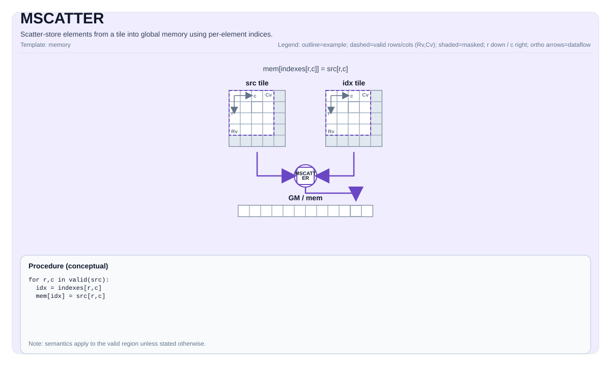

# MSCATTER (A2/A3 Vec-Core)

## Tile Operation Diagram



## Introduction

Indexed scatter from a UB source tile to a GM `GlobalTensor` through a UB index tile, running on the A2/A3 AIV vector core. `MSCATTER` dispatches a sequential MTE3-DMA loop driven from the scalar pipe and uses no async-launch / cross-core orchestration — the kernel is a single AIV function call. The operating mode is selected explicitly by the `Coalesce` template parameter:

- **`Coalesce::Row`** (default) — write full rows from `src[r, :]` to `table[idx[r], :]`. Index tile is 1-D (`[1, R]` row-major). For each row `r` the implementation reads `idx[r]` as a scalar (PIPE_V → PIPE_S handshake) and, for ND, issues a single `copy_ubuf_to_gm_align_b8/b16/b32` burst of `validCol * sizeof(T)` bytes from the UB row slot to `table + idx[r] * tableRowStride`. For NZ, it issues one multi-burst MTE3 transfer per outer block-col group (`nBurst = number of column fractal blocks`) that walks all `C0`-wide fractals of the NZ row.
- **`Coalesce::Elem`** — element-wise scatter from `src[R, C]` to a linearized `table` using `idx[R, C]`. The source tile may be 2-D (`[R, C]`) or degenerate 1-D (`[1, N]`); the index tile must have the same valid shape as the source. The implementation walks every `(r, c)` position and issues **one MTE3 `copy_ubuf_to_gm_align_b8/b16/b32` burst per element** (`lenBurst = sizeof(T)`) from `src[r, c]` to `table + offset(idx[r, c])`. The actual UB↔GM data movement runs entirely on PIPE_MTE3; the scalar pipe is used **only** for index dereference and DMA orchestration. The `(1, 1)` corner case takes a one-shot scalar fallback (`MScatterElemScalarImpl`) — the only path on which a scalar GM store is issued.

Both modes accept either an **ND** GM table (`Layout::ND`) paired with an **ND/RowMajor** UB tile, or an **NZ** GM table (`Layout::NZ`) paired with a **NZ/ColMajor-fractal** UB tile (see "NZ Layout Support" below).

Out-of-bounds index handling is selected via the `ScatterOOB` template parameter; multi-source-to-same-destination collisions are resolved by the `ScatterAtomicOp` template parameter.

The kernel is **inherently sequential** on A2/A3 (single-threaded MTE3 walk) so the conflict-resolution rule is **always "Last write wins"**. There is no `ScatterConflict` template parameter on A2/A3 because no other ordering is possible.

## Math Interpretation

### Row Coalesce (`Coalesce::Row`)

Source `src[R, C]`, index `idx[1, R]`, table `table[TableRows, C]`. For each row `r` (sequentially, in increasing `r` order):

$$ \mathrm{table}_{\mathrm{idx}_{r},\; j} \;\leftarrow\; \mathrm{atom}\!\left(\mathrm{table}_{\mathrm{idx}_{r},\; j},\; \mathrm{src}_{r, j}\right) \quad\text{for } 0 \le j < C $$

where `atom` is the identity (replace) for `ScatterAtomicOp::None` or the standard atomic accumulation for `ScatterAtomicOp::Add` (selected via `set_atomic_add()` / `set_atomic_none()` around the DMA burst).

The kernel issues one UB→GM DMA burst per row through `copy_ubuf_to_gm_align_b*`, with the burst length equal to `validCol * sizeof(T)` bytes (the **valid** width, not the padded `Tile::Cols`). UB source addressing uses `Tile::RowStride` so partial-valid tiles padded for 32-byte burst alignment are supported transparently.

### Element Coalesce (`Coalesce::Elem`)

Source `src[R, C]`, index `idx[R, C]` (same valid shape as `src`), flat table of length `TableSize`. The kernel walks the `validRow * validCol` flat positions in **column-block-major order** (outer block-col first, then row, then column-within-block) so consecutive UB sources are read out of consecutive 32 B fractal blocks when the source tile is NZ; for ND the inner block-col loop trivially reduces to the original row-major walk. For each `(r, c)`:

$$ \mathrm{table}[\mathrm{idx}_{r, c}] \;\leftarrow\; \mathrm{atom}\!\left(\mathrm{table}[\mathrm{idx}_{r, c}],\; \mathrm{src}_{r, c}\right) $$

where `atom` is the identity (replace) for `ScatterAtomicOp::None` or the standard atomic accumulation for `ScatterAtomicOp::Add` (selected via `set_atomic_add()` / `set_atomic_none()` around the per-element DMA wave).

`TableSize = Shape[0] * Shape[1] * Shape[2] * Shape[3] * Shape[4]` of the `GlobalTensor`. For ND tables `idx` indexes the linear element count directly; for NZ tables the kernel maps each `idx` through a row-major (`logicalRow = idx / nLogicalCols`, `logicalCol = idx % nLogicalCols`) → NZ block-stride translation. Each `(r, c)` issues a single MTE3 burst — `copy_ubuf_to_gm_align_b8/b16/b32(tablePtr + offset(idx), srcPtr + srcOff, 0, 1, sizeof(T), 0, 0, 0, 0)` — that drives the actual `T`-byte transfer through the DMA engine on PIPE_MTE3. Because the data path goes through MTE3 (not the scalar pipe), `Coalesce::Elem` **inherits the atomic-add unit** in the same way as `Coalesce::Row`.

### Out-of-Bounds Behaviour

```cpp
enum class ScatterOOB : uint8_t {
    Undefined = 0,
    Skip      = 1,
    Clamp     = 2,
    Wrap      = 3
};
```

`capacity` is `TableRows` (Row mode) or `TableSize` (Elem mode):

- `Undefined`: caller guarantees `idx < capacity`; no remap is applied.
- `Skip`: out-of-bounds rows / elements are simply not written (no DMA issued / no scalar store performed).
- `Clamp`: `idx = min(idx, capacity - 1)` before access.
- `Wrap`: `idx = idx % capacity` before access.

### Atomic Operation

```cpp
enum class ScatterAtomicOp : uint8_t {
    None = 0,
    Add  = 1,
    Max  = 2,
    Min  = 3
};
```

A2/A3 vec-core supports the following:

| Mode | `ScatterAtomicOp::None` | `ScatterAtomicOp::Add` | `ScatterAtomicOp::Max` | `ScatterAtomicOp::Min` |
|------|-------------------------|------------------------|------------------------|------------------------|
| `Coalesce::Row`   | ✅ regular UB→GM DMA (per-row) | ✅ atomic-add via `set_atomic_add()` (per-row burst through MTE3) | ❌ unsupported | ❌ unsupported |
| `Coalesce::Elem`  | ✅ regular UB→GM DMA (per-element) | ✅ atomic-add via `set_atomic_add()` (per-element burst through MTE3) | ❌ unsupported | ❌ unsupported |

`Add` is implemented by setting the per-dtype atomic mode (`set_atomic_f32() / set_atomic_s32() / set_atomic_f16() / set_atomic_bf16() / set_atomic_s16() / set_atomic_s8()`) **once** before the DMA loop starts and resetting via `set_atomic_none()` **once** after the loop drains — the kernel guarantees the reset is reached on every control-flow path so subsequent operators see a clean atomic state. Both Row and Elem modes route their writes through the MTE3 atomic-add unit, so the per-dtype support set is identical (`int8 / int16 / int32 / half / bfloat16 / float`).

`Max` / `Min` would require a hardware atomic-max/min unit on the MTE3 path that A2/A3 does not provide; static-asserts in `MScatterCheck` reject them at compile time.

### Conflict Resolution

A2/A3 vec-core processes the row / element loop **strictly sequentially** in increasing `(r)` (Row) or `(r, c)` row-major (Elem) order. When two source positions write to the same destination index with `ScatterAtomicOp::None`, **the later write always wins** ("Last write wins" semantics).

For `ScatterAtomicOp::Add` every per-row (Row mode) / per-element (Elem mode) DMA enters the MTE3 atomic-add unit, so duplicate destination indices accumulate (each contributing source row / element gets added to the running table value); for `ScatterAtomicOp::None` they overwrite (last wins).

## Assembly Syntax

PTO-AS form: see [docs/assembly/PTO-AS.md](/docs/assembly/PTO-AS.md).

```text
mscatter.row %table, %src, %idx : (!pto.memref<...>, !pto.tile<RxCxT>, !pto.tile<1xRxi32>)
mscatter.elem %table, %src, %idx : (!pto.memref<...>, !pto.tile<RxCxT>, !pto.tile<RxCxi32>)
```

OOB and atomic variants append the mode suffix (`mscatter.row.clamp.add`, `mscatter.elem.skip`, etc.).

## C++ Intrinsic

Declared in `include/pto/common/pto_instr.hpp` and `include/pto/npu/a2a3/MScatter.hpp`:

```cpp
template <Coalesce        CMode   = Coalesce::Row,
          ScatterAtomicOp AtomOp  = ScatterAtomicOp::None,
          ScatterOOB      Oob     = ScatterOOB::Undefined,
          typename GlobalTable, typename TileSrc, typename TileIdx,
          typename... WaitEvents>
PTO_INST RecordEvent MSCATTER(GlobalTable& table, TileSrc& src, TileIdx& idx,
                              WaitEvents&... events);
```

The kernel iterates over `TileSrc::ValidRow * TileSrc::ValidCol` logical positions; physical UB strides come from the `Tile` types' `RowStride` (which equals padded `Cols` for `BLayout::RowMajor`).

For `Coalesce::Elem` with `TileSrc::ValidRow == 1 && TileSrc::ValidCol == 1` the implementation **bypasses the per-element MTE3 DMA loop** and runs a real **scalar fallback** (`MScatterElemScalarImpl`) — single `set_flag(PIPE_V, PIPE_S)` / `wait_flag(PIPE_V, PIPE_S)` handshake, single UB read, single scalar GM write, then `set_flag(PIPE_S, PIPE_V)` / `wait_flag(PIPE_S, PIPE_V)` to release the vector pipe. This is the **only** path on which `MSCATTER` issues a scalar GM dereference — every other Elem shape (including `[1, 2]` and larger) routes through the MTE3 DMA pipeline. The pattern mirrors `TInsertVecToVecNDScalar` in `TInsert.hpp`.

**Parameters:**

- `table`   : Destination GM `GlobalTensor` with `Layout::ND` (linear contiguous) or `Layout::NZ` (fractal `[B, BlockCols, BlockRows, 16, 32/sizeof(T)]`). The `GlobalTensor::DType` must be `__gm__ T` matching the source element type.
- `src`     : UB source tile (`TileType::Vec`); shape `[R, C]`. **`BLayout::RowMajor`** for ND tables, **`BLayout::ColMajor` + `SLayout::RowMajor` + `SFractalSize=512`** for NZ tables.
- `idx`     : UB index tile (`TileType::Vec`). For `Coalesce::Row`: 1-D `[1, R]` row-major. For `Coalesce::Elem`: same valid shape as `src`, row-major.
- `CMode`   : `Coalesce` — `Row` (default) or `Elem`. **First** template parameter so the operating mode is always explicit at the call site.
- `AtomOp`  : `ScatterAtomicOp` — `None`, `Add`, `Max`, `Min`. `None` and `Add` are supported on both Row and Elem modes; `Max` / `Min` are not supported on A2/A3.
- `Oob`     : `ScatterOOB` — out-of-bounds index handling.

## Coalesce Mode

```cpp
enum class Coalesce : uint8_t {
    Row  = 0,
    Elem = 1
};
```

## Constraints

### Data Types

`TileSrc::DType` must be one of: `int8_t`, `uint8_t`, `int16_t`, `uint16_t`, `int32_t`, `uint32_t`, `half`, `bfloat16_t`, `float`. (No `float8_e4m3_t` / `float8_e5m2_t` / `hifloat8_t` on A2/A3 vec-core.)

For `ScatterAtomicOp::Add`, only the dtypes with a hardware atomic-add unit on MTE3 are supported: `int8_t`, `int16_t`, `int32_t`, `half`, `bfloat16_t`, `float`. Unsigned integer atomic-add is not supported on A2/A3.

### Index Types

`TileIdx::DType` must be `int32_t` or `uint32_t`.

### Tile Constraints

- `TileSrc::Loc == TileType::Vec` (UB).
- `TileIdx::Loc == TileType::Vec` (UB). The index tile is **always** `BLayout::RowMajor + SLayout::NoneBox` (ND) regardless of the table layout.
- Source and table must share the same element type `T` (`GlobalTable::DType == __gm__ T`).
- The source tile's bulk + sub layout must be paired with the table layout exactly:
  - `GlobalTable::layout == Layout::ND` ⇒ `TileSrc` is `BLayout::RowMajor + SLayout::NoneBox`.
  - `GlobalTable::layout == Layout::NZ` ⇒ `TileSrc` is `BLayout::ColMajor + SLayout::RowMajor + SFractalSize == TileConfig::fractalABSize` (= 512 B). Additionally:
    - `GlobalTable::staticShape[3] == FRACTAL_NZ_ROW` (= 16),
    - `GlobalTable::staticShape[4] == C0_SIZE_BYTE / sizeof(T)` (= 32 B / element width),
    - `TileSrc::Cols % (C0_SIZE_BYTE / sizeof(T)) == 0` (whole `C0` columns per fractal block-col),
    - `TileSrc::Rows % FRACTAL_NZ_ROW == 0` (whole `16`-row fractal blocks).
- Padded `TileSrc::Cols * sizeof(T)` must be 32-byte aligned in **both** layouts (the same DMA-burst rule that `TLOAD` / `TSTORE` enforce).
- For `Coalesce::Row`: `TileIdx::ValidRow == 1`, `TileIdx::ValidCol == TileSrc::ValidRow`.
- For `Coalesce::Elem`: `TileIdx::ValidRow == TileSrc::ValidRow` and `TileIdx::ValidCol == TileSrc::ValidCol`.
- Both row and elem modes require `TileSrc::ValidRow >= 1` and `TileSrc::ValidCol >= 1`.

### Dynamic Runtime Shapes

`MSCATTER` supports both compile-time fixed shapes and **runtime-dynamic** shapes for the destination `GlobalTensor` and the source / index `Tile`s. Any dimension declared as `DYNAMIC` (`-1`) at template-instantiation time is resolved at runtime through the standard PTO accessors:

- `Tile<…, RowMask, ColMask>` with `RowMask == -1` and/or `ColMask == -1` stores the runtime valid extents in the tile object; `MSCATTER_IMPL` reads them via `src.GetValidRow()` / `src.GetValidCol()` and uses them to drive the row / element loop bounds.
- `Shape<S0, S1, S2, S3, S4>` / `Stride<…>` with one or more `-1` entries are constructed with the runtime sizes; `MSCATTER_IMPL` reads them via `table.GetShape(GlobalTensorDim::DIM_*)` and folds them into `tableRows` (Row mode) or `tableSize = ∏ shape[0..4]` (Elem mode).

Static-asserts in `MScatterCheck` are gated on `if constexpr (DIM > 0)` so they fire only for compile-time-known dimensions; mixed static/dynamic combinations check exactly the static dims and defer the dynamic ones to runtime arithmetic. Padded `Tile::Rows` / `Tile::Cols` are always compile-time (they govern the UB DMA-burst alignment); only the **valid** sub-region and the GM table extents may be dynamic.

### Layout Support

The kernel handles **two paired layouts**: ND-GM with ND-UB, and NZ-GM with NZ-UB. UB addressing is computed from the tile's `Rows` / `Cols` plus an optional fractal block-col stride; GM addressing is driven from the `GlobalTensor::GetStride(DIM_*)` accessors.

| Tile / Tensor | Supported layouts | Notes |
|---------------|-------------------|-------|
| `TileSrc` (UB) — ND path | `BLayout::RowMajor` + `SLayout::NoneBox` | Row reads use `srcPtr + r * Tile::RowStride`. Elem reads use `srcPtr + r * Tile::RowStride + c`. |
| `TileSrc` (UB) — NZ path | `BLayout::ColMajor` + `SLayout::RowMajor` + `SFractalSize == 512` | Block-col stride is `Tile::Rows * C0`; per-element offset is `(c / C0) * (Tile::Rows * C0) + r * C0 + (c % C0)`. |
| `TileIdx` (UB) — Row mode | `[1, R]` `BLayout::RowMajor` + `SLayout::NoneBox` | Linear `R`-element layout in UB; the kernel reads `idxPtr[row]` directly. **Always ND**, regardless of the table layout. |
| `TileIdx` (UB) — Elem mode | `[R, C]` `BLayout::RowMajor` + `SLayout::NoneBox` | Reads `idxPtr[r * Tile::RowStride + c]` per element. **Always ND**, regardless of the table layout. |
| `GlobalTable` (GM) — ND | `Layout::ND` (linear contiguous addressing); 5-D `Shape<…, R, C>` | Row mode addresses `table + idx[r] * tableRowStride`; Elem mode addresses `table + idx`. `tableRowStride = GetStride(DIM_3)` so non-trivial row strides (e.g. zero-padded ND tables) are honoured. |
| `GlobalTable` (GM) — NZ | `Layout::NZ`; 5-D `Shape<B, BCols, BRows, 16, C0>` with `B == 1`, `staticShape[3] == 16`, `staticShape[4] == 32 / sizeof(T)` | Row mode walks fractal block-cols via a multi-burst MTE3 (`nBurst = BCols`, `lenBurst = C0 * sizeof(T)`, `gmGap = stride1 - C0`); Elem mode resolves each `idx` to a NZ block-stride offset and fires one per-element burst. |

### NZ Layout Support

When `GlobalTable::layout == Layout::NZ` and `TileSrc` is the matching `BLayout::ColMajor + SLayout::RowMajor + SFractalSize=512` tile, `MSCATTER` runs the dedicated NZ paths (`MScatterRowNzImpl`, `MScatterElemNzImpl`).

- **Constants.** `kC0 = C0_SIZE_BYTE / sizeof(T) = 32 / sizeof(T)`; `kFRow = FRACTAL_NZ_ROW = 16`. Each fractal block is `kFRow × kC0` elements (= 32 B × 16 = 512 B).
- **Logical shape.** Logical rows = `gShape2 * kFRow`. Logical cols = `gShape0 * gShape1 * kC0`. Row-mode `mscatter_remap` clamps/wraps against the *logical row count*; Elem-mode against the total element count.
- **Row mode.** For each logical source row `r`, the kernel maps `idx[r]` to `(dstBlockRow, dstRowInBlock)` and `r` to `(srcBlockRow, srcRowInBlock)` (`srcBlockRow = r / kFRow`, etc.), then issues **one multi-burst MTE3 transfer per outer batch** (`nBurst = gShape1`, `lenBurst = kC0 * sizeof(T) = 32 B`, `ubGap = TileSrc::Rows - 1` blocks, `gmGap = (gStride1 - kC0) * sizeof(T)`). Atomic-add wraps the loop just like the ND path.
- **Elem mode.** For each `(r, c)` the kernel maps `idx` to `(logicalRow, logicalCol)` and through `MScatterNZGmOffset` to the NZ block-stride GM offset; the source UB offset is `MScatterNZUbOffset(r, c) = (c / kC0) * (TileSrc::Rows * kC0) + r * kC0 + (c % kC0)`. The walk order is **block-col → row → col-in-block** so consecutive DMAs always read consecutive 32 B UB blocks.
- **Stride vs. valid-shape.** `MScatter*NzImpl` reads strides from the `GlobalTensor` runtime, so packed and stride-padded NZ tensors both work without any caller-side adjustment.

### Aligned vs Unaligned Tile Shapes

The kernel does **not** care whether the tile's logical shape is "aligned" — it walks all `ValidRow * ValidCol` positions:

- Row mode (ND): per-row DMA `lenBurst = validCol * sizeof(T)` (any byte length supported by `copy_ubuf_to_gm_align_b*`); `Tile::RowStride * sizeof(T)` is forced 32-byte aligned by the upstream `Tile` system, so subsequent rows always start on a 32-byte burst boundary.
- Row mode (NZ): one multi-burst transfer per logical row × outer-batch; `lenBurst = kC0 * sizeof(T) = 32 B` is fixed by the fractal layout, so per-row alignment is automatic. `validRow` does not have to be a multiple of `kFRow`.
- Elem mode: per-element MTE3 burst `lenBurst = sizeof(T)`. The DMA engine handles the address arithmetic; padded `Tile::Cols * sizeof(T)` must remain 32-byte aligned (enforced by the same upstream rule) so the source row layout is well-defined for the DMA source addresses.

### Minimum Tile Shape

`MScatterCheck` accepts any `(ValidRow, ValidCol)` with `ValidRow, ValidCol >= 1` (including the degenerate `(1, 1)` for both Row and Elem modes — the scalar fallback handles `(1, 1)` Elem transparently; Row mode with `R = 1` is just a single-row scatter).

The actual lower bound on the **padded** `Tile<…, Rows, Cols, BLayout, ValidRow, ValidCol>` shape is enforced upstream by the `Tile` system (32-byte UB↔GM burst alignment).

| `T` | Min `Cols` (`BLayout::RowMajor`) |
|-----|---------------------------------|
| `int8` / `uint8` | 32 |
| `int16` / `uint16` / `half` / `bfloat16` | 16 |
| `int32` / `uint32` / `float` | 8 |

### Mode Resolution

Mode is **explicit**, not auto-detected. The static-asserts in `MScatterCheck` validate that the supplied tile shapes match the chosen `Coalesce` value:

```text
Coalesce::Row  : Idx.ValidRow == 1 && Idx.ValidCol == Src.ValidRow
Coalesce::Elem : Idx.ValidRow == Src.ValidRow && Idx.ValidCol == Src.ValidCol
```

## Pipe / Synchronisation Model

| Phase | Pipe transition | What it guards |
|-------|-----------------|----------------|
| Pre-amble (Row + Elem) | `set_flag(PIPE_V, PIPE_S)` / `wait_flag(PIPE_V, PIPE_S)` | Wait for the vector pipe to publish the source + index tiles before scalar reads start. |
| Body (Row mode, ND) | `copy_ubuf_to_gm_align_b*` per row | One DMA per row, `lenBurst = validCol * sizeof(T)`; trip count = `validRow`. |
| Body (Row mode, NZ) | `copy_ubuf_to_gm_align_b*` multi-burst per logical row × batch | `nBurst = gShape1`, `lenBurst = C0 * sizeof(T) = 32 B`, `ubGap = Tile::Rows - 1` blocks, `gmGap = (gStride1 - C0) * sizeof(T)`; trip count = `validRow * gShape0`. |
| Body (Elem mode, ND + NZ) | `copy_ubuf_to_gm_align_b*` per element | Per-element MTE3 bursts (`lenBurst = sizeof(T)`); trip count = `validRow * validCol`. Indices are read from UB via scalar pipe; the data movement itself is fully on PIPE_MTE3 — including atomic-add when enabled. NZ Elem walks block-col-major to keep each 32 B UB block read contiguously in time. |
| Atomic reset (Row + Elem, Add only) | `set_flag(PIPE_MTE3, PIPE_S)` / `wait_flag(PIPE_MTE3, PIPE_S)` then `set_atomic_none()` | After the MTE3 wave drains, the kernel restores normal store semantics for downstream operators. |
| Post-amble (Row + Elem) | `set_flag(PIPE_S, PIPE_MTE3)` / `wait_flag(PIPE_S, PIPE_MTE3)` and `set_flag(PIPE_MTE3, PIPE_V)` / `wait_flag(PIPE_MTE3, PIPE_V)` | Publish the GM writes downstream so they are visible to subsequent operators on the same core, and release the vector pipe. |
| Scalar fallback `(1, 1)` (Elem mode only) | `set_flag(PIPE_V, PIPE_S)` / `wait_flag(PIPE_V, PIPE_S)`, single scalar GM store, `set_flag(PIPE_S, PIPE_V)` / `wait_flag(PIPE_S, PIPE_V)` | Only path that issues a scalar GM access in `MSCATTER`. Same code path for ND and NZ tables — the `(1, 1)` corner uses linear `tablePtr[idx]` since both layouts coincide for a single-element write. |

For `ScatterAtomicOp::Add`, the kernel issues `set_atomic_add()` once before the DMA loop and `set_atomic_none()` once after the MTE3 wave drains; reset is **always** reached so subsequent operators see a clean atomic state.

## Examples

### Row Coalesce — Embedding Scatter

```cpp
#include <pto/pto-inst.hpp>
#include <pto/common/constants.hpp>

using namespace pto;

template <typename T, int R, int C, int TableRows>
__global__ AICORE void example_embedding_scatter(__gm__ T *tablePtr, __gm__ T *srcPtr, __gm__ int32_t *idxPtr)
{
    using SrcTile = Tile<TileType::Vec, T,        R, C, BLayout::RowMajor, R, C>;
    using IdxTile = Tile<TileType::Vec, int32_t,  1, R, BLayout::RowMajor, 1, R>;

    using TableShape  = Shape<1, 1, 1, TableRows, C>;
    using TableStride = Stride<1, 1, 1, C, 1>;
    using TableTensor = GlobalTensor<T, TableShape, TableStride>;

    using SrcShape  = Shape<1, 1, 1, R, C>;
    using SrcStride = Stride<1, 1, 1, C, 1>;
    using SrcTensor = GlobalTensor<T, SrcShape, SrcStride>;

    using IdxShape  = Shape<1, 1, 1, 1, R>;
    using IdxStride = Stride<1, 1, 1, R, 1>;
    using IdxTensor = GlobalTensor<int32_t, IdxShape, IdxStride>;

    TableTensor tableGM(tablePtr);
    SrcTensor   srcGM(srcPtr);
    IdxTensor   idxGM(idxPtr);
    SrcTile src; TASSIGN(src, 0x0000);
    IdxTile idx; TASSIGN(idx, 0x1000);

    TLOAD(src, srcGM); TLOAD(idx, idxGM);
    set_flag(PIPE_MTE2, PIPE_V, EVENT_ID0);
    wait_flag(PIPE_MTE2, PIPE_V, EVENT_ID0);
    MSCATTER<Coalesce::Row, ScatterAtomicOp::None, ScatterOOB::Clamp>(tableGM, src, idx);
}
```

### Row Coalesce — Atomic-Add Aggregation

```cpp
template <typename T, int R, int C, int TableRows>
__global__ AICORE void example_row_atomic_add(__gm__ T *tablePtr, __gm__ T *srcPtr, __gm__ int32_t *idxPtr)
{
    using SrcTile = Tile<TileType::Vec, T,        R, C, BLayout::RowMajor, R, C>;
    using IdxTile = Tile<TileType::Vec, int32_t,  1, R, BLayout::RowMajor, 1, R>;

    using TableShape  = Shape<1, 1, 1, TableRows, C>;
    using TableStride = Stride<1, 1, 1, C, 1>;
    using TableTensor = GlobalTensor<T, TableShape, TableStride>;

    TableTensor tableGM(tablePtr);
    SrcTile src; TASSIGN(src, 0x0000);
    IdxTile idx; TASSIGN(idx, 0x1000);

    MSCATTER<Coalesce::Row, ScatterAtomicOp::Add, ScatterOOB::Wrap>(tableGM, src, idx);
}
```

### Element Coalesce — Sparse Update

```cpp
__global__ AICORE void example_elem_sparse(__gm__ float *tablePtr, __gm__ float *srcPtr, __gm__ int32_t *idxPtr)
{
    constexpr int R = 8, C = 32, TableSize = 256;

    using SrcTile = Tile<TileType::Vec, float,   R, C, BLayout::RowMajor, R, C>;
    using IdxTile = Tile<TileType::Vec, int32_t, R, C, BLayout::RowMajor, R, C>;

    using TableShape  = Shape<1, 1, 1, 1, TableSize>;
    using TableStride = Stride<1, 1, 1, TableSize, 1>;
    using TableTensor = GlobalTensor<float, TableShape, TableStride>;

    TableTensor tableGM(tablePtr);
    SrcTile src; TASSIGN(src, 0x0000);
    IdxTile idx; TASSIGN(idx, 0x0800);

    MSCATTER<Coalesce::Elem, ScatterAtomicOp::None, ScatterOOB::Skip>(tableGM, src, idx);
}
```

### Element Coalesce — Scalar `(1, 1)` Fallback

```cpp
__global__ AICORE void example_scalar(__gm__ float *tablePtr, __gm__ float *srcPtr, __gm__ int32_t *idxPtr)
{
    constexpr int TableSize = 32;

    using SrcTile = Tile<TileType::Vec, float,   1, 8, BLayout::RowMajor, 1, 1>;
    using IdxTile = Tile<TileType::Vec, int32_t, 1, 8, BLayout::RowMajor, 1, 1>;

    using TableShape  = Shape<1, 1, 1, 1, TableSize>;
    using TableStride = Stride<1, 1, 1, TableSize, 1>;
    using TableTensor = GlobalTensor<float, TableShape, TableStride>;

    TableTensor tableGM(tablePtr);
    SrcTile src; TASSIGN(src, 0x0000);
    IdxTile idx; TASSIGN(idx, 0x0080);

    MSCATTER<Coalesce::Elem>(tableGM, src, idx);
}
```

## Performance Considerations

1. **Row vs. Elem.** Row coalesce achieves the best aggregate bandwidth — one wide DMA per logical row (ND) or one multi-burst DMA per logical row × batch (NZ). Elem coalesce issues one MTE3 DMA burst per active lane (`lenBurst = sizeof(T)`) — coalescing happens at the DMA engine level rather than as a single wide burst, so per-element bursts pipeline well but never reach the per-burst efficiency of Row mode. Prefer Row whenever the indexing structure permits.
2. **Sequential MTE3 loop (Elem).** A2/A3 dispatches `MSCATTER` as a single-thread sequential walk issuing one MTE3 burst per element. The scalar pipe drives the index dereferences and DMA argument computation; the actual UB↔GM transfer (and the atomic-add accumulation when enabled) runs on PIPE_MTE3 and pipelines through the DMA engine. Loop trip counts of `ValidCol ≤ 32 / sizeof(T)` rows are the sweet spot; very large flat tiles are bounded by MTE3 issue rate / `MAX_OUTSTANDING_MTE3` back-pressure. The block-col-major walk used for NZ keeps tightly-issued bursts spatially-local in UB to avoid pipelining stalls.
3. **DMA cost (Row).**
   - ND: each row is one `copy_ubuf_to_gm_align_b*` call with `nBurst = 1`, `lenBurst = validCol * sizeof(T)`.
   - NZ: each (logical row, batch) pair is one `copy_ubuf_to_gm_align_b*` call with `nBurst = gShape1` (column block-cols), `lenBurst = C0 * sizeof(T) = 32 B`, `ubGap = Tile::Rows - 1` blocks, `gmGap = (gStride1 - C0) * sizeof(T)`. The kernel trip count is `validRow * gShape0`.
   A2/A3 pipelines the MTE3 DMA bursts through the DMA engine, but back-pressure is bounded by `MAX_OUTSTANDING_MTE3`; for very large row counts the kernel still issues all DMAs unconditionally — there is no row chunking.
4. **OOB policy cost.**
   - `Undefined`: zero overhead — caller guarantees valid indices.
   - `Skip`: one extra branch per row / element; very cheap.
   - `Clamp` / `Wrap`: a single arithmetic remap per row / element (`min` / `mod`).
5. **Atomic-add cost.** One `set_atomic_add()` / `set_atomic_none()` pair per kernel invocation (~ 2 cycles each); the MTE3 atomic-add unit handles the accumulation on every burst. The atomic-add unit serialises same-address bursts across cores, so heavy hashing collisions degrade throughput predictably.
6. **Scalar fallback `(1, 1)`.** A single scalar dereference of `srcPtr` and one scalar GM store — measured at ~ 6–8 cycles end-to-end on the simulator, dominated by the two `set_flag` / `wait_flag` round-trips. **Strictly limited to `ValidRow == 1 && ValidCol == 1`**: it is the only Elem-mode shape that issues a scalar GM write. Used identically for ND and NZ tables.
7. **Single-pass dispatch.** `MSCATTER` is a regular AIV function call from the kernel (no async-launch / cross-core orchestration). The whole scatter completes as a sequential MTE3/scalar pipeline within one AIV invocation; concurrency comes from the DMA engine pipelining bursts behind the scalar issue loop, not from multiple worker threads.

## Related Instructions

- [`TSTORE`](/docs/isa/TSTORE.md): Contiguous block transfer from Tile to GM.
- [`MGATHER`](../mgather/MGATHER.md): Indexed gather from GM to Tile (inverse operation).
- [`TSCATTER`](/docs/isa/TSCATTER.md): Index-based scatter within tiles (UB-to-UB on the same vec-core).

## Test Cases

The A2/A3 ST suite covers 70 cases distributed across data types, modes, OOB handling, atomic operations (Row + Elem), alignment patterns, NZ layouts, and dynamic shapes. Each case follows the standard A2/A3 ST pattern: `gen_data.py` produces `src.bin`, `indices.bin`, and `golden.bin`; `mscatter_kernel.cpp` instantiates the kernel template; `main.cpp` (`MSCATTERTest`) reads inputs, copies them to GM (the destination GM table is zero-initialised in `aclrtMemset`), runs the kernel, fetches the table, and compares against golden with `eps = 0.0f` (max-diff = 0).

### Row Coalesce — `[1, R]` index form, `AtomOp = None`

| Case | Data Type | Src Size | TableRows | OOB Mode |
|------|-----------|----------|-----------|----------|
| `case_row_float_8x32_64rows`               | float    | 8×32  | 64 | Undefined |
| `case_row_half_16x64_64rows`               | half     | 16×64 | 64 | Undefined |
| `case_row_bfloat16_16x16_64rows`           | bf16     | 16×16 | 64 | Undefined |
| `case_row_int32_8x16_32rows`               | int32    | 8×16  | 32 | Undefined |
| `case_row_uint32_8x16_32rows`              | uint32   | 8×16  | 32 | Undefined |
| `case_row_int16_8x16_32rows`               | int16    | 8×16  | 32 | Undefined |
| `case_row_uint16_8x16_32rows`              | uint16   | 8×16  | 32 | Undefined |
| `case_row_int8_8x32_32rows`                | int8     | 8×32  | 32 | Undefined |
| `case_row_uint8_8x32_32rows`               | uint8    | 8×32  | 32 | Undefined |
| `case_row_float_clamp_8x32_8rows`          | float    | 8×32  | 8  | Clamp     |
| `case_row_int32_wrap_8x16_8rows`           | int32    | 8×16  | 8  | Wrap      |
| `case_row_half_skip_8x32_8rows`            | half     | 8×32  | 8  | Skip      |

### Row Coalesce — Unaligned / Odd Valid Rows / Padded

| Case | Data Type | Valid Src | Padded Src | OOB Mode |
|------|-----------|-----------|------------|----------|
| `case_row_int32_unaligned_3x8_8rows`       | int32 | 3×8  | 3×8   | Undefined |
| `case_row_float_partial_4x16_in_8x16`      | float | 4×16 | 8×16  | Undefined |
| `case_row_half_partial_5x32_in_8x32`       | half  | 5×32 | 8×32  | Undefined |
| `case_row_uint8_unaligned_3x32_32rows`     | uint8 | 3×32 | 3×32  | Undefined |
| `case_row_int16_partial_3x16_in_4x16`      | int16 | 3×16 | 4×16  | Clamp     |

### Row Coalesce — Atomic-Add

| Case | Data Type | Src Size | TableRows | OOB Mode |
|------|-----------|----------|-----------|----------|
| `case_row_float_atomic_add_8x32_8rows`     | float | 8×32 | 8 | Undefined |
| `case_row_int32_atomic_add_8x16_8rows`     | int32 | 8×16 | 8 | Undefined |
| `case_row_half_atomic_add_8x32_8rows`      | half  | 8×32 | 8 | Undefined |
| `case_row_int16_atomic_add_8x16_8rows`     | int16 | 8×16 | 8 | Undefined |

### Element Coalesce — 1-D destination `[1, N]`

| Case | Data Type | Valid N / TableSize | OOB Mode |
|------|-----------|---------------------|----------|
| `case_elem_float_64_128size`               | float  | 64 / 128 | Undefined |
| `case_elem_half_64_128size`                | half   | 64 / 128 | Undefined |
| `case_elem_bfloat16_64_128size`            | bf16   | 64 / 128 | Undefined |
| `case_elem_int32_32_64size`                | int32  | 32 / 64  | Undefined |
| `case_elem_uint32_32_64size`               | uint32 | 32 / 64  | Undefined |
| `case_elem_int16_32_64size`                | int16  | 32 / 64  | Undefined |
| `case_elem_uint16_32_64size`               | uint16 | 32 / 64  | Undefined |
| `case_elem_int8_64_128size`                | int8   | 64 / 128 | Undefined |
| `case_elem_uint8_64_128size`               | uint8  | 64 / 128 | Undefined |
| `case_elem_float_clamp_32_16size`          | float  | 32 / 16  | Clamp     |
| `case_elem_int32_wrap_32_16size`           | int32  | 32 / 16  | Wrap      |
| `case_elem_half_skip_32_16size`            | half   | 32 / 16  | Skip      |

### Element Coalesce — 2-D destination `[R, C]`

| Case | Data Type | Src Size | TableSize | OOB Mode |
|------|-----------|----------|-----------|----------|
| `case_elem2d_float_8x32_256size`           | float | 8×32 | 256 | Undefined |
| `case_elem2d_int32_8x16_256size`           | int32 | 8×16 | 256 | Undefined |
| `case_elem2d_half_4x32_256size`            | half  | 4×32 | 256 | Undefined |
| `case_elem2d_bfloat16_4x32_256size`        | bf16  | 4×32 | 256 | Undefined |
| `case_elem2d_uint8_4x64_256size`           | uint8 | 4×64 | 256 | Undefined |
| `case_elem2d_int8_4x64_256size`            | int8  | 4×64 | 256 | Undefined |
| `case_elem2d_int16_4x32_256size`           | int16 | 4×32 | 256 | Undefined |
| `case_elem2d_uint16_4x32_256size`          | uint16 | 4×32 | 256 | Undefined |
| `case_elem2d_uint32_8x16_256size`          | uint32 | 8×16 | 256 | Undefined |
| `case_elem2d_float_wrap_4x16_64size`       | float | 4×16 | 64  | Wrap      |
| `case_elem2d_int32_clamp_4x8_32size`       | int32 | 4×8  | 32  | Clamp     |
| `case_elem2d_half_skip_4x32_64size`        | half  | 4×32 | 64  | Skip      |

### Element Coalesce — Unaligned / Padded / Scalar

| Case | Data Type | Valid Src | Padded Src | TableSize | OOB Mode |
|------|-----------|-----------|------------|-----------|----------|
| `case_elem2d_int32_unaligned_3x3_in_3x8_64size` | int32 | 3×3  | 3×8  | 64  | Undefined |
| `case_elem2d_float_unaligned_5x5_in_5x8_64size` | float | 5×5  | 5×8  | 64  | Undefined |
| `case_elem2d_half_unaligned_3x9_in_3x16_64size` | half  | 3×9  | 3×16 | 64  | Undefined |
| `case_elem2d_int8_unaligned_3x17_in_3x32_64size`| int8  | 3×17 | 3×32 | 64  | Undefined |
| `case_elem_scalar_float_1x1_in_1x8_8size`       | float | 1×1  | 1×8  | 8   | Undefined |
| `case_elem_scalar_int32_1x1_in_1x8_8size`       | int32 | 1×1  | 1×8  | 8   | Undefined |
| `case_elem_scalar_half_1x1_in_1x16_16size`      | half  | 1×1  | 1×16 | 16  | Undefined |

### Element Coalesce — Atomic-Add

These cases exercise the per-element MTE3 DMA path through the atomic-add unit; indices are sampled with replacement so the same destination receives multiple sources.

| Case | Data Type | Src Size | TableSize | OOB Mode |
|------|-----------|----------|-----------|----------|
| `case_elem_int32_atomic_add_16_8size`         | int32 | 1×16 | 8 | Undefined |
| `case_elem2d_float_atomic_add_4x16_8size`     | float | 4×16 | 8 | Undefined |
| `case_elem2d_int32_atomic_add_4x8_8size`      | int32 | 4×8  | 8 | Undefined |
| `case_elem2d_half_atomic_add_4x16_8size`      | half  | 4×16 | 8 | Undefined |

### Dynamic Runtime Shapes

| Case | Mode | Data Type | Runtime Valid Src | Padded Src | Runtime Table | OOB Mode |
|------|------|-----------|-------------------|------------|----------------|----------|
| `case_elem2d_dyn_float_4x8_64size`         | Elem | float  | 4×8  | 4×8  | 1×64 | Undefined |
| `case_elem2d_dyn_int32_3x3_in_3x8_64size`  | Elem | int32  | 3×3  | 3×8  | 1×64 | Undefined |
| `case_row_dyn_int32_3x16_8rows`            | Row  | int32  | 3×16 | 3×16 | 8 rows × 16 | Undefined |
| `case_row_dyn_half_4x32_16rows`            | Row  | half   | 4×32 | 4×32 | 16 rows × 32 | Undefined |

### NZ Layout — Row Coalesce

GM table is `Layout::NZ` with shape `(1, BlockCols, BlockRows, 16, C0)`; UB source is the matching `BLayout::ColMajor + SLayout::RowMajor + SFractalSize=512` fractal tile. Each row scatter walks all `BlockCols` column-fractals in one multi-burst MTE3 transfer.

| Case | Data Type | Src Size (logical) | Block Layout (BR × BC × C0) | OOB Mode | Atomic |
|------|-----------|---------------------|------------------------------|----------|--------|
| `case_row_nz_float_16x16_2blk`             | float  | 16×16 | 2 × 2 × 8  | Undefined | None |
| `case_row_nz_half_32x16_2blk`              | half   | 32×16 | 2 × 1 × 16 | Undefined | None |
| `case_row_nz_int32_16x16_2blk`             | int32  | 16×16 | 2 × 2 × 8  | Undefined | None |
| `case_row_nz_int16_32x16_1blk`             | int16  | 32×16 | 2 × 1 × 16 | Undefined | None |
| `case_row_nz_int8_16x32_1blk`              | int8   | 16×32 | 2 × 1 × 32 | Undefined | None |
| `case_row_nz_float_clamp_16x8_1blk`        | float  | 16×8  | 2 × 1 × 8  | Clamp     | None |
| `case_row_nz_float_atomic_add_16x8_1blk`   | float  | 16×8  | 2 × 1 × 8  | Undefined | Add  |

### NZ Layout — Element Coalesce

GM table is `Layout::NZ`; UB source is the matching NZ fractal tile. The kernel walks block-col-major, mapping each `idx` through the row-major (`logicalRow`, `logicalCol`) representation to a NZ block-stride GM offset.

| Case | Data Type | Src Size (logical) | Block Layout (BR × BC × C0) | OOB Mode |
|------|-----------|---------------------|------------------------------|----------|
| `case_elem2d_nz_float_16x16_2blk`          | float  | 16×16 | 2 × 2 × 8  | Undefined |
| `case_elem2d_nz_half_16x16_1blk`           | half   | 16×16 | 2 × 1 × 16 | Undefined |
| `case_elem2d_nz_int32_16x8_1blk`           | int32  | 16×8  | 2 × 1 × 8  | Undefined |
