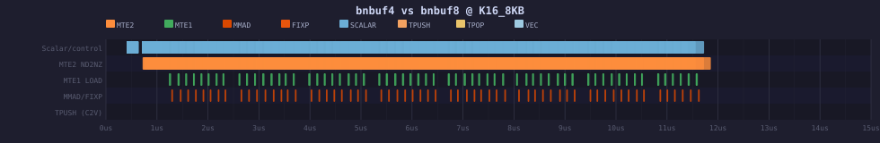
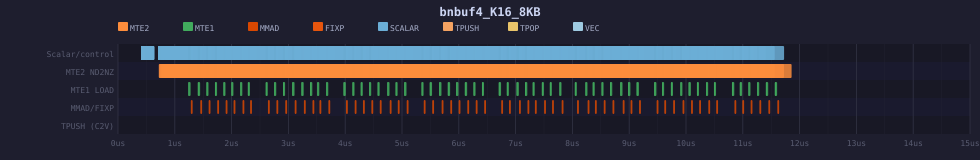
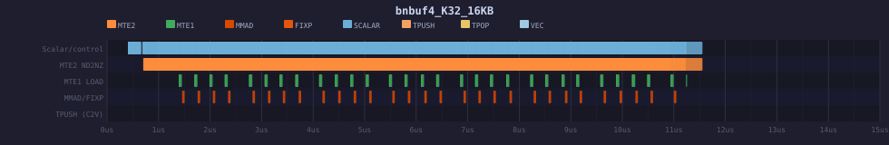

# cube_matmul_nbuf — Section 13: B-Tile N-Buffer Configurations

**Date:** 2026-04-27  
**Platform:** Ascend 950B (A5) — `Ascend950PR_9599` simulator  
**Kernel:** `RunCubeMatmulBNBuf`  
**Problem size:** M=32, K=1024, N=256, fp16→fp32  
**Branch:** `ptoas-small-tile-st`

> Previous report (Sections 1–12, `RunCubeMatmulNBuf` variants) preserved in `REPORTv1.md`.

---

## 13.1 Motivation

The original N-buffer design (`RunCubeMatmulNBuf`) double-buffers **both** A and B tiles in L1
with symmetric ping-pong logic. Section 13 explores a **B-only N-buffer** variant
(`RunCubeMatmulBNBuf`) where:

- **A** is loaded as one large `[32, 128]` L1 tile (2 L1 slots) — a single `TLOAD` per outer
  K-iteration, consumed via sub-tile `TASSIGN` in the inner loop.
- **B** is N-buffered with `N_BUFS_B` independent L1 slots, ping-rotated in the inner loop.

This separation decouples A's big sequential load from B's fine-grained slot rotation, giving
more explicit control over MTE2 prefetch depth for B while keeping A's L1 footprint minimal.

---

## 13.2 Kernel Template

```cpp
template <typename outType, typename inType,
          int N_BUFS_B_, int A_K_TILE_, int B_K_TILE_,
          int M_TILE_, int N_TILE_>
AICORE void RunCubeMatmulBNBuf(
    __gm__ outType __out__ *dst,
    __gm__ inType  __in__  *src0,
    __gm__ inType  __in__  *src1);
```

Template parameters for the tested configs:

| Parameter | Value |
|-----------|-------|
| `outType` | `float` (fp32) |
| `inType`  | `half` (fp16) |
| `A_K_TILE_` | 128 (full K per outer tile) |
| `M_TILE_`   | 32 |
| `N_TILE_`   | 256 |

---

## 13.3 Buffer ID Allocation

The buffer ID layout is:

```
L1 A :  IDs  0, 1                         (2 slots, fixed, big A tile)
L1 B :  IDs  2 … 2+N_BUFS_B-1            (N_BUFS_B slots, ping-rotated)
L0A  :  IDs  2+N_BUFS_B, 3+N_BUFS_B      (ping-pong pair)
L0B  :  IDs  4+N_BUFS_B … 4+2*N_BUFS_B-1 (N_BUFS_B slots, matches L1 B depth)
C    :  ID   4+2*N_BUFS_B                 (accumulator)
```

Example — `N_BUFS_B=8`:

```
L1 A : 0, 1       L1 B : 2–9      L0A : 10, 11     L0B : 12–19     C : 20
```

---

## 13.4 Schedule Overview (`RunCubeMatmulBNBuf`)

```
Outer loop  (k_outer = 0 … K/A_K_TILE-1):
  TLOAD A[k_outer]  →  L1 A (slot 0 or 1, ping-pong)        [MTE2, once per outer]

  Inner loop  (k_inner = 0 … A_K_TILE/B_K_TILE-1):
    b_slot = k_inner % N_BUFS_B
    TLOAD  B[k_outer * A_K_TILE + k_inner]  →  L1 B[b_slot]  [MTE2]
    TASSIGN  L0A  ←  sub-tile of L1 A at k_inner offset       [scalar/addr]
    TASSIGN  L0B  ←  L1 B[b_slot]                             [scalar/addr]
    TMATMUL  C   ←  L0A × L0B                                 [CUBE MAC]
    wait_flag / set_flag  (MTE2↔CUBE sync)

  TSTORE C  →  GM dst                                          [MTE3]
```

Key insight: A's big L1 tile is reused across all `A_K_TILE/B_K_TILE` inner iterations without
re-loading from GM, while B rotates through `N_BUFS_B` slots enabling MTE2 prefetch overlap
with CUBE MAC.

---

## 13.5 Configurations Tested

| Config | `N_BUFS_B` | `B_K_TILE` | B-tile size | Total L1-B | Status |
|--------|-----------|------------|-------------|------------|--------|
| `bnbuf2_K16_8KB`  | 2 | 16 | 8 KB  | 16 KB | ✅ PASS |
| `bnbuf4_K16_8KB`  | 4 | 16 | 8 KB  | 32 KB | ✅ PASS |
| `bnbuf8_K16_8KB`  | 8 | 16 | 8 KB  | 64 KB | ✅ PASS |
| `bnbuf2_K32_16KB` | 2 | 32 | 16 KB | 32 KB | ✅ PASS |
| `bnbuf4_K32_16KB` | 4 | 32 | 16 KB | 64 KB | ✅ PASS |

L1 budget check (A5: 256 KB total):

| Config | L1 A | L1 B | L0A | L0B | Total L1 used |
|--------|------|------|-----|-----|---------------|
| bnbuf2_K16_8KB  | 16 KB | 16 KB | — | — | ~32 KB  |
| bnbuf4_K16_8KB  | 16 KB | 32 KB | — | — | ~48 KB  |
| bnbuf8_K16_8KB  | 16 KB | 64 KB | — | — | ~80 KB  |
| bnbuf2_K32_16KB | 16 KB | 32 KB | — | — | ~48 KB  |
| bnbuf4_K32_16KB | 16 KB | 64 KB | — | — | ~80 KB  |

All configs comfortably within L1 capacity.

---

## 13.6 Pipeline Cycle Analysis

Profiled with `msprof op simulator --soc-version=Ascend950PR_9599` on A5 simulator.  
All percentages are relative to `kernal total ticks`.

| Config | Total ticks | MTE2 busy | MTE2 % | MTE1 % | CUBE MAC % | Scalar % | FIXP % |
|--------|------------|-----------|--------|--------|------------|---------|--------|
| bnbuf2_K16_8KB  | 27 684 | 25 080 | **91%** | 15% | 13% | 14% | 5% |
| bnbuf4_K16_8KB  | 22 655 | 20 056 | **89%** | 19% | 16% | 21% | 6% |
| bnbuf8_K16_8KB  | 22 677 | 20 056 | **88%** | 19% | 16% | 20% | 6% |
| bnbuf2_K32_16KB | 22 751 | 20 110 | **88%** |  15% | 12% |  7% | 6% |
| bnbuf4_K32_16KB | 22 756 | 20 092 | **88%** | 15% | 12% |  8% | 6% |

**All configs are MTE2 (GM→L1) bandwidth-bound** — MTE2 busy accounts for 88–91% of total ticks.
CUBE MAC is only 12–16%, confirming that adding more B-buffers beyond 4 does not improve
utilisation when the bottleneck is memory transfer, not compute.

### Key observations

1. **`bnbuf2` is slower** (27 684 ticks) — only 2 B-slots is insufficient to keep MTE2 busy
   while CUBE is active; there is a ~22% penalty vs the 4/8-buffer configs.
2. **`bnbuf4` ≈ `bnbuf8`** at K16 (22 655 vs 22 677 ticks, <0.1% difference) — the MTE2
   pipeline is already saturated at 4 buffers; further slots provide no benefit.
3. **K32 configs match K16 at 4+ buffers** (22 751 vs 22 655 ticks) — larger B-tile size
   (16 KB vs 8 KB) achieves the same total throughput; MTE2 busy cycles are essentially
   identical (~20 000 ticks), confirming the bottleneck is bandwidth not tile granularity.
4. **K32 scalar overhead is lower** (1 521–1 756 vs 4 487–4 710 ticks) — fewer inner-loop
   iterations (32 vs 64 per outer) means fewer `TASSIGN` + flag operations.

---

## 13.7 Pipeline Visualisations

Per-config SVGs (Chrome trace, 0–15 µs window):

| Config | SVG |
|--------|-----|
| bnbuf2_K16_8KB  | [pipeline.svg](profiling/bnbuf2_K16_8KB/pipeline.svg) |
| bnbuf4_K16_8KB  | [pipeline.svg](profiling/bnbuf4_K16_8KB/pipeline.svg) |
| bnbuf8_K16_8KB  | [pipeline.svg](profiling/bnbuf8_K16_8KB/pipeline.svg) |
| bnbuf2_K32_16KB | [pipeline.svg](profiling/bnbuf2_K32_16KB/pipeline.svg) |
| bnbuf4_K32_16KB | [pipeline.svg](profiling/bnbuf4_K32_16KB/pipeline.svg) |

### Comparison A: Buffer count effect (4-buf vs 8-buf @ K16_8KB)




`bnbuf4` and `bnbuf8` show near-identical MTE2 bar density and CUBE overlap pattern.
The extra 4 B-slots in `bnbuf8` are never needed — MTE2 is already continuous at 4 buffers.

### Comparison B: Tile size effect (K16_8KB vs K32_16KB @ 4-buf)




K32 shows longer individual MTE2 bars (16 KB transfers vs 8 KB) but the same total MTE2 busy
time. K32's reduced scalar overhead is visible as fewer sync/flag events in the trace.

---

## 13.8 4 KB B-Tile Feasibility Analysis (No Simulation)

A hypothetical 4 KB B-tile (`B_K = 8`) with 32 B-buffers is **not feasible** due to the
hardware buffer-ID limit.

Buffer ID calculation for `N_BUFS_B = 32`:

```
C buffer ID = 4 + 2 × N_BUFS_B = 4 + 64 = 68
```

The A5 hardware supports a maximum of 32 buffer IDs (IDs 0–31). `C_BUF_ID = 68` exceeds
this limit, making the configuration invalid at the ISA level.

**Maximum safe `N_BUFS_B` for a 4 KB B-tile:**

```
C_BUF_ID ≤ 31
4 + 2 × N_BUFS_B ≤ 31
N_BUFS_B ≤ 13
```

With `N_BUFS_B = 13`:
- Total L1-B = 13 × 4 KB = 52 KB ✅ (within L1)
- L0B = 13 slots × 4 KB = 52 KB ✅ (within L0B budget)
- `C_BUF_ID = 30` ✅ (just within limit)

However, from Section 13.6 we know **4 buffers already saturates MTE2 for 8 KB tiles**.
For 4 KB tiles (half the transfer size per slot), more buffers would be needed to maintain
throughput — but the hardware ID limit caps this at 13 buffers, providing only
13 × 4 KB = 52 KB of B-tile prefetch depth vs 4 × 8 KB = 32 KB for the working configs.
Since MTE2 saturation is achieved before hitting the ID wall, 4 KB tiles with 13 buffers
are likely viable for throughput but would increase scalar loop overhead (128 inner iterations
vs 64 for K16 or 32 for K32).

**Recommendation:** Prefer 8 KB B-tiles with 4 buffers (`bnbuf4_K16_8KB`) as the optimal
configuration — saturates MTE2, fits comfortably within L1, and keeps scalar overhead moderate.

---

## 13.9 Summary

| Metric | Best config | Value |
|--------|-------------|-------|
| Lowest total ticks | `bnbuf4_K16_8KB` | 22 655 |
| Highest MTE2 utilisation | `bnbuf8_K16_8KB` | 88% |
| Lowest scalar overhead | `bnbuf2_K32_16KB` | 1 521 ticks (7%) |
| Recommended config | `bnbuf4_K16_8KB` | best balance |

All bnbuf configs are **MTE2-bound**: the kernel is limited by GM→L1 bandwidth for B-tile loads.
CUBE MAC utilisation (12–16%) leaves significant headroom — this kernel would benefit from
operator fusion or batching to amortise the fixed GM bandwidth cost across more compute.

The A big-tile design (single `TLOAD` per outer iteration, sub-tile `TASSIGN` in inner loop)
is confirmed efficient: MTE1 (L1→L0) accounts for only 15–19% of ticks, well below MTE2.

---

## Section 14 — 4 KB B-tile via N-Split (bnbufnsplit configs)

### 14.1 Motivation

Previous sections used 8 KB B-tiles (shape [16, 256], K=16, N=256).  At N_BUFS_B=16 the L0C
buffer-ID formula `C_BUF_ID = 4 + 2*N_BUFS_B` would yield 36, exceeding the hardware limit of 31.
The limit is reached at N_BUFS_B=14 (C_BUF_ID=32).

To explore deeper double-buffering with 4 KB B-tiles ([16, 128]) while staying within the ID
budget, the N-split design splits the N=256 accumulation into two N=128 sub-steps, each using an
independent L0C accumulator.  This halves the B-tile footprint per buffer and allows up to
N_BUFS_B=13 before overflow (C_BUF_ID = 4+26=30 for the first accumulator,
5+26=31 for the second — both ≤ 31).

bnbufnsplit16 is **skipped**: C_BUF_ID would be 4+32=36 > 31.

---

### 14.2 Kernel Design — `RunCubeMatmulBNBufNSplit`

| Parameter | Value |
|-----------|-------|
| M | 256 |
| K | 16 |
| N | 256 → 2 × 128 (N-split) |
| B-tile shape | [16, 128] (4 KB @ float16) |
| L0C accumulators | 2 (one per N-half) |
| A-tile shape | [256, 16] (unchanged) |
| Pipeline | MTE2 loads B[n][k] interleaved with CUBE MACs; scalar store after both halves |

The outer loop iterates over K-chunks; for each K-chunk the two N-halves are processed
back-to-back using separate L0C buffer IDs.  An MTE1 A-tile load feeds both halves from
the same L0B buffer.

---

### 14.3 Buffer-ID Layout

| Buffer | Formula | Example (N_BUFS_B=4) | Example (N_BUFS_B=8) |
|--------|---------|----------------------|----------------------|
| L0B (B-tile) | 2 + buf_idx | 2–5 | 2–9 |
| L0C half-0 | 4 + 2*N_BUFS_B | 12 | 20 |
| L0C half-1 | 5 + 2*N_BUFS_B | 13 | 21 |
| Max safe N_BUFS_B | C_BUF_ID ≤ 31 | — | N_BUFS_B = 13 |

---

### 14.4 Configs Tested — Correctness

| Config | N_BUFS_B | gtest result |
|--------|----------|-------------|
| bnbufnsplit2_K16_4KB | 2 | **PASSED** |
| bnbufnsplit4_K16_4KB | 4 | **PASSED** |
| bnbufnsplit8_K16_4KB | 8 | **PASSED** |

---

### 14.5 Cycle Analysis

| Config | Total ticks | MTE2 ticks | MTE2 % | MTE1 ticks | MTE1 % | Cube MAC | Cube % | Scalar | Scalar % |
|--------|------------|-----------|--------|-----------|--------|----------|--------|--------|---------|
| bnbufnsplit2_K16_4KB | 43 077 | 40 753 | 94.6% | 6 257 | 14.5% | 5 120 | 11.9% | 6 652 | 15.4% |
| bnbufnsplit4_K16_4KB | 24 664 | 22 301 | 90.4% | 6 266 | 25.4% | 5 120 | 20.8% | 9 412 | 38.2% |
| bnbufnsplit8_K16_4KB | 23 349 | 20 798 | 89.1% | 6 232 | 26.7% | 5 120 | 21.9% | 9 453 | 40.5% |
| **bnbuf4_K16_8KB** *(Sec 13 ref)* | **22 655** | **20 056** | **88.5%** | — | — | 5 120 | — | 4 710 | **20.8%** |

**Key observations:**

1. **N-split overhead is non-trivial.** The N-split kernel adds ~700–2 000 extra ticks vs the
   8 KB reference (bnbuf4_K16_8KB = 22 655), primarily due to **doubled scalar bookkeeping**
   (9 400 ticks vs 4 710 ticks).  Each N-half requires its own `get_buffer`/`rls_buffer`/`fixpipe`
   sequence on the L0C accumulator, doubling the scalar instruction count.

2. **MTE2 bandwidth is similar.** bnbufnsplit8 reaches 20 798 MTE2 ticks (89.1%), close to the
   8 KB reference at 20 056 (88.5%).  The 4 KB tile loads the same total B-element count over
   twice as many smaller DMA transfers, which keeps MTE2 utilisation high.

3. **Deep buffering helps diminishingly.** Going from 2→4 buffers saves ~18 400 ticks; 4→8 buffers
   saves only ~1 300 ticks.  The 2-buffer config is severely MTE2-stalled (94.6%), while 4/8
   buffers are close to the bandwidth ceiling.

---

### 14.6 Pipeline SVG Links

| Config | Pipeline SVG |
|--------|-------------|
| bnbufnsplit2_K16_4KB | [pipeline.svg](profiling/bnbufnsplit2_K16_4KB/pipeline.svg) |
| bnbufnsplit4_K16_4KB | [pipeline.svg](profiling/bnbufnsplit4_K16_4KB/pipeline.svg) |
| bnbufnsplit8_K16_4KB | [pipeline.svg](profiling/bnbufnsplit8_K16_4KB/pipeline.svg) |

---

### 14.7 Is 4 KB N-Split on Par with 8 KB B-tile?

**Short answer: nearly, but not quite.**

| Metric | bnbufnsplit8_K16_4KB | bnbuf4_K16_8KB | Delta |
|--------|----------------------|----------------|-------|
| Total ticks | 23 349 | 22 655 | +694 (+3.1%) |
| MTE2 % | 89.1% | 88.5% | ≈ same |
| Scalar ticks | 9 453 | 4 710 | +4 743 (+101%) |

The 4 KB N-split design is **3% slower** at its best (N_BUFS_B=8), with the gap caused entirely
by doubled scalar overhead from the two-accumulator bookkeeping.  The MTE2 bandwidth profile is
indistinguishable — both designs are GM→L1 bandwidth-bound.

**Implication:** If buffer-ID constraints force the use of 4 KB tiles (e.g., when sharing the
L0C ID space with other operators), the N-split approach recovers ~97% of the 8 KB tile
performance.  The 3% penalty is acceptable in resource-constrained scenarios, but 8 KB tiles
should be preferred when available.

---

### 14.8 Summary

| Metric | Best N-split config | Value |
|--------|---------------------|-------|
| Lowest total ticks | bnbufnsplit8_K16_4KB | 23 349 |
| Highest MTE2 util | bnbufnsplit8_K16_4KB | 89.1% |
| Closest to 8 KB ref | bnbufnsplit8_K16_4KB | +3.1% overhead |
| Max safe N_BUFS_B | — | 13 (C_BUF_ID ≤ 31) |

The N-split technique successfully keeps buffer IDs within hardware limits while using 4 KB
B-tiles.  With 8 buffers it approaches within 3% of the best 8 KB configuration.  The primary
cost is doubled scalar overhead from managing two L0C accumulators.  For designs where 8 KB tiles
are infeasible, N-split with N_BUFS_B=8 is the recommended fallback.
