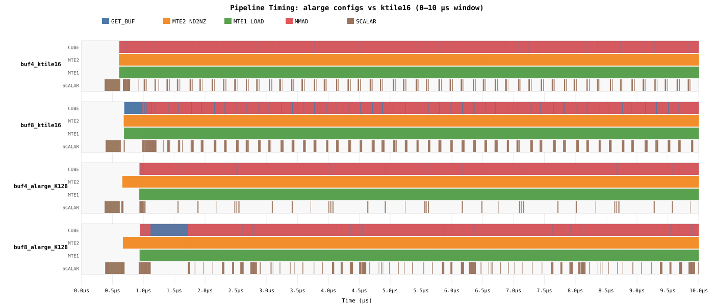
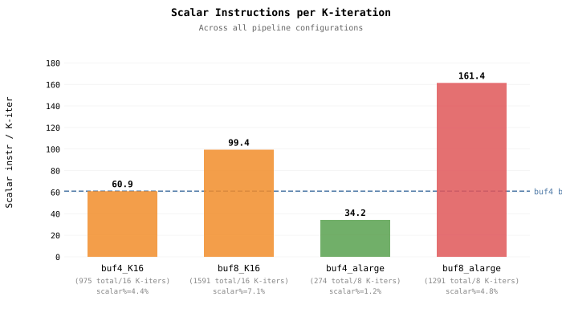
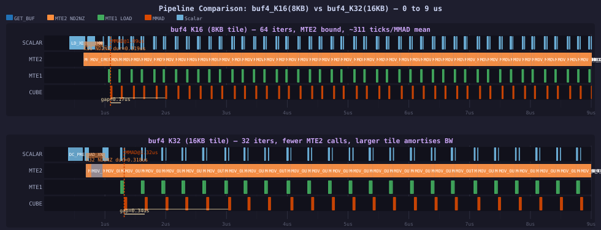

# cube_matmul_nbuf — Performance Report

**Date:** 2026-04-21  
**Platform:** Ascend 950B (A5) — `Ascend950PR_9599` simulator  
**Kernel:** `RunCubeMatmulNBuf`  
**Problem size:** M=32, K_total=1024, N=256, fp16 → fp32  
**Total MACs:** 2 × 32 × 1024 × 256 = 16,777,216

---

## 1. Correctness

All 7 configurations pass numerical verification:

| Config | Status | Max Diff | Bad Count |
|--------|--------|----------|-----------|
| buf2_ktile16_8KB  | ✅ PASS | 2.67e-05 | 0 |
| buf4_ktile16_8KB  | ✅ PASS | 2.67e-05 | 0 |
| buf8_ktile16_8KB  | ✅ PASS | 2.67e-05 | 0 |
| buf2_ktile32_16KB | ✅ PASS | 2.67e-05 | 0 |
| buf4_ktile32_16KB | ✅ PASS | 2.67e-05 | 0 |
| **buf4_alarge_K128**  | ✅ PASS | 2.67e-05 | 0 |
| **buf8_alarge_K128**  | ✅ PASS | 2.67e-05 | 0 |

The `*_alarge_K128` configurations use the burst-A-preload design
(`RunCubeMatmulBurstA<N_BUFS_A, M_TILE, K_TILE, N_TILE>`): each outer iter
preloads `N_BUFS_A` A tiles into dedicated L1 slots before issuing the inner
B-load + TMOV + TMATMUL_ACC loop, achieving an effective K-group of
`N_BUFS_A × K_TILE = 128`. See section 12 for design notes.

---

## 2. Tile & Buffer Configuration

| Config | N_Buf | K_tile | K_ITERS | L1 A/slot | L1 B/slot | Total L1 | L0A/slot | L0B/slot | L0C | Total L0 | Buf IDs |
|--------|-------|--------|---------|-----------|-----------|----------|----------|----------|-----|----------|---------|
| buf2_ktile16_8KB  | 2 | 16 | 64 | 2 KB  | 8 KB  | 20 KB | 1 KB  | 8 KB  | 32 KB | 50 KB  | 5  |
| buf4_ktile16_8KB  | 4 | 16 | 64 | 2 KB  | 8 KB  | 40 KB | 1 KB  | 8 KB  | 32 KB | 68 KB  | 9  |
| buf8_ktile16_8KB  | 8 | 16 | 64 | 2 KB  | 8 KB  | 80 KB | 1 KB  | 8 KB  | 32 KB | 104 KB | 17 |
| buf2_ktile32_16KB | 2 | 32 | 32 | 4 KB  | 16 KB | 40 KB | 2 KB  | 16 KB | 32 KB | 68 KB  | 5  |
| buf4_ktile32_16KB | 4 | 32 | 32 | 4 KB  | 16 KB | 80 KB | 2 KB  | 16 KB | 32 KB | 104 KB | 9  |
| **buf4_alarge_K128** | **4** | **32** | **32** | **4 KB** | **16 KB** | **80 KB** | **2 KB** | **16 KB** | **32 KB** | **104 KB** | **9** |
| **buf8_alarge_K128** | **8** | **16** | **64** | **2 KB** | **8 KB** | **80 KB** | **1 KB** | **8 KB** | **32 KB** | **104 KB** | **17** |

Notes:
- L1 A slot: NZ format, stride = 0x800 B (K=16) / 0x1000 B (K=32)
- L1 B slot: contiguous fp16, K × N × 2 bytes
- L0C: single accumulator [M=32, N=256] fp32 = 32 KB, not ping-ponged
- **Standard configs** (buf2/4/8_ktile*): Buffer ID allocation: L1 A = 0…N-1, L1 B = N…2N-1, L0A = 2N…3N-1, L0B = 3N…4N-1, C = 4N
- **alarge_K128 configs** (RunCubeMatmulBurstA): A and B **share the same MTE2 buffer IDs** (B reuses A IDs after the A burst completes). Allocation: A_L1 = 0…N-1, B_L1 = 0…N-1 (reused), L0 = N…2N-1, C = 2N. This halves the MTE2 ID budget vs naive allocation — buf4_alarge uses 9 IDs (same as buf4_ktile32), buf8_alarge uses 17 IDs (same as buf8_ktile16).
- Hardware limit: 32 IDs; all configs within budget (max 17 for 8-buf / 8-buf alarge)

---

## 3. Cycle Counts (Kernel Ticks)

| Config | Kernel Ticks | Δ vs buf2_K16 | Speedup |
|--------|-------------|--------------|---------|
| buf2_ktile16_8KB  | 27,881 | baseline | 1.000× |
| buf4_ktile16_8KB  | 23,968 | **−3,913 (−14.0%)** | **1.163×** |
| buf8_ktile16_8KB  | 24,947 | −2,934 (−10.5%) | 1.117× |
| buf2_ktile32_16KB | 22,639 | **−5,242 (−18.8%)** | **1.231×** |
| buf4_ktile32_16KB | 22,690 | −5,191 (−18.6%) | 1.228× |

Reference (standalone cube_matmul_4buf, K16 4-buf): **24,100 ticks**

---

## 4. Pipeline Busy Cycles

From `core0_summary_log` (cubecore0). Percentages relative to kernel ticks.

| Config | Ticks | MTE2 busy | MTE1 busy | Cube MAC | Cube total | Scalar | FIXP |
|--------|-------|-----------|-----------|----------|------------|--------|------|
| buf2_ktile16_8KB  | 27,881 | 25,440 (**91.2%**) | 4,163 (14.9%) | 3,584 (12.9%) | 3,648 (13.1%) | 2,394 (8.6%)  | 1,404 (5.0%) |
| buf4_ktile16_8KB  | 23,968 | 21,524 (**89.8%**) | 4,299 (17.9%) | 3,584 (15.0%) | 3,648 (15.2%) | 2,690 (11.2%) | 1,425 (5.9%) |
| buf8_ktile16_8KB  | 24,947 | 22,030 (**88.3%**) | 4,296 (17.2%) | 3,584 (14.4%) | 3,648 (14.6%) | **4,767 (19.1%)** | 1,415 (5.7%) |
| buf2_ktile32_16KB | 22,639 | 20,057 (**88.6%**) | 3,457 (15.3%) | 2,816 (12.4%) | 2,848 (12.6%) | 1,633 (7.2%)  | 1,421 (6.3%) |
| buf4_ktile32_16KB | 22,690 | 20,068 (**88.4%**) | 3,431 (15.1%) | 2,816 (12.4%) | 2,848 (12.6%) | 1,708 (7.5%)  | 1,432 (6.3%) |
| 4buf_K16_ref      | 24,100 | 21,615 (**89.7%**) | 4,248 (17.6%) | 3,584 (14.9%) | 3,648 (15.1%) | 2,596 (10.8%) | 1,441 (6.0%) |

**Key observations:**
- All configs are heavily **MTE2-bound** (88–91%): DMA from GM to L1 dominates
- Cube MAC is constant at 3,584 cycles for K16 (3,584/64 = 56 cycles/MMAD) and 2,816 for K32 (2,816/32 = 88 cycles/MMAD)
- **8-buf scalar jumps to 19.1%** — up from 11.2% for 4-buf; this is the regression cause
- FIXP busy (~1,400–1,440 cycles, ~6%) represents the **L0C→GM store** (TSTORE/FIXP path). Constant across all configs because there is only one output write of C at the end (fixp retire = 2 for all)
- K32 configs have lower MTE2 absolute cycles (20K vs 21.5K) because K_ITERS=32 (half the number of tiles to load vs K16)

---

## 5. Instruction Counts (cubecore0)

From `core0.cubecore0.ccu.*_issque.dump`. Scalar push = total scalar instructions issued.

| Config | Scalar issued | Cube retire | MTE1 retire | MTE2 retire | FIXP retire | Scalar/iter |
|--------|--------------|------------|------------|------------|------------|-------------|
| buf2_ktile16_8KB  | 843  | **64** | **128** | **256** | **2** | ~13.2 |
| buf4_ktile16_8KB  | 975  | 64 | 128 | 256 | 2 | ~15.2 |
| buf8_ktile16_8KB  | **1,856** | 64 | 128 | 256 | 2 | **~29.0** |
| buf2_ktile32_16KB | 456  | **32** | **64** | **128** | **2** | ~14.3 |
| buf4_ktile32_16KB | 510  | 32 | 64 | 128 | 2 | ~15.9 |
| 4buf_K16_ref      | 945  | 64 | 128 | 256 | 2 | ~14.8 |

**Notes:**
- **Cube retire = K_ITERS**: 64 MMAD for K16 (K_ITERS=64), 32 MMAD for K32 (K_ITERS=32) ✅
- **MTE1 retire = 2 × K_ITERS**: one TASSIGN_A + one TASSIGN_B per iteration ✅
- **MTE2 retire = 4 × K_ITERS**: A-load and B-load per iteration, overlapped for 2 buffers ✅
- **FIXP retire = 2**: one TSTORE for C matrix (L0C→GM), constant regardless of N_Buf ✅  
  This is the correct metric for the cube output store — FIXP handles L0C→GM, not MTE3
- **Scalar/iter for 8-buf = ~29**: almost 2× the 4-buf value (~15). Each extra buffer slot requires  
  additional `get_buf` + `rls_buf` calls per iteration: 8-buf has 16 get/rls vs 8 for 4-buf

---

## 6. Analysis: Effect of N-Buffering

### 6a. K_tile=16: 2-buf → 4-buf (−14.0%)

MTE2 load time per tile pair (A+B, K=16):
- A tile: 32×16×2 = 1 KB
- B tile: 16×256×2 = 8 KB
- Total per iter: ~9 KB, ~350–400 cycles at GM bandwidth

Cube MMAD time: 3,584 / 64 = **56 cycles/MMAD**

Load-to-compute ratio ≈ 7:1. With **2 buffers**, MTE2 can prefetch only 1 tile pair ahead —
the ~350-cycle GM latency causes pipeline stalls. With **4 buffers**, 3 tile pairs are queued ahead,
fully hiding the GM latency. MTE2 busy goes from 91.2% → 89.8% (better overlap).

### 6b. K_tile=16: 4-buf → 8-buf (+4.1% regression)

8-buf scalar instruction count = 1,856 vs 4-buf = 975 (+881 extra = **+90% more scalar**).  
Scalar busy cycle ratio: 4-buf = 11.2%, 8-buf = **19.1%**.

Each of K_ITERS=64 iterations in 8-buf needs:
- `get_buf` × 8 slots (A×4 + B×4) = 8 calls vs 4 calls for 4-buf
- `rls_buf` × 8 slots = 8 calls vs 4 calls for 4-buf
- Extra delta per iter ≈ 8 scalar instructions × 64 iters = 512 extra instructions  
  (actual = 881 extra due to additional TASSIGN + set/wait_flag overhead)

The scalar pipeline at 19.1% busy becomes a secondary bottleneck alongside MTE2.  
Additionally, the larger instruction footprint causes more `issue_wait_for_icache_miss` stalls.

### 6c. K_tile=32: 2-buf ≈ 4-buf (3-tick difference, noise)

- B tile (K=32): 32×256×2 = 16 KB — 2× larger than K16
- Load time per iter ≈ 700+ cycles
- MMAD time = 2,816 / 32 = **88 cycles/MMAD** (still much smaller than load time)

With 2 buffers, MTE2 loads 16 KB tile `k+1` (700 cycles) while CUBE processes tile `k` (88 cycles).
The load time is already ~8× the compute time — 2-buffer ping-pong provides adequate prefetch depth.
4-buffer adds only 54 extra scalar instructions (+54 scalar/iter overhead) with zero cycle benefit.

---

## 7. Recommendations

| Scenario | Recommended N_Buf | Reason |
|----------|-------------------|--------|
| K_tile ≤ 16 (small, 8 KB B-tile) | **4 buffers** | −14% vs 2-buf; 8-buf adds scalar overhead |
| K_tile = 32 (medium, 16 KB B-tile) | **2 buffers** | 2-buf already sufficient; 4-buf adds no value |
| K_tile ≥ 64 | **2 buffers** | Large tiles self-pipeline; no extra buffering needed |
| Buffer ID budget tight | Use larger K_tile | Larger tile achieves same or better perf with 2 IDs |

---

## 8. Summary Table

```
Config               K_tile  N_Buf  Ticks   Speedup  MTE2%  CubeMac%  Scalar%  Scalar_instrs  FIXP_retire
──────────────────────────────────────────────────────────────────────────────────────────────────────────
buf2_ktile16_8KB       16     2    27,881   1.000×   91.2%    12.9%     8.6%       843            2
buf4_ktile16_8KB       16     4    23,968   1.163×   89.8%    15.0%    11.2%       975            2
buf8_ktile16_8KB       16     8    24,947   1.117×   88.3%    14.4%    19.1%     1,856            2
buf2_ktile32_16KB      32     2    22,639   1.231×   88.6%    12.4%     7.2%       456            2
buf4_ktile32_16KB      32     4    22,690   1.228×   88.4%    12.4%     7.5%       510            2
──────────────────────────────────────────────────────────────────────────────────────────────────────────
Ref: standalone 4buf_K16     24,100           89.7%    14.9%    10.8%       945            2
```

**Conclusion:**
- N-buffering is effective for **small K-tiles** (K16) where load latency >> compute time
- **4-buffer is the sweet spot** for K16: fully hides GM latency with minimal scheduling overhead
- **8-buffer regresses** due to 90% more scalar instructions (get_buf/rls_buf overhead)
- **K32 needs only 2-buffer**: larger tiles provide natural overlap
- FIXP (L0C→GM output store) is constant at 2 retires across all configs — output write is not a bottleneck

---

## 9. Files

| File | Description |
|------|-------------|
| `cube_matmul_nbuf_kernel.cpp` | Kernel — 5 reference configs + templated `RunCubeMatmulBurstA` (2 instantiations) |
| `main_nbuf.cpp` | GTest harness (7 tests) |
| `gen_data.py` | Data generator — `[M,K]×[K,N]` row-major layout |
| `README.md` | Layout documentation and build instructions |
| `REPORT.md` | This performance report |


---

## 10. Pipeline Timing Diagram (from raw simulator dump parsing)

> **Note**: `msprof` is not available in this environment. All profiling data is parsed directly
> from the A5 simulator dump files (`cube_issque.dump`, `mte{1,2}_issque.dump`, `scalar_issque.dump`)
> using script `/tmp/parse_dumps.py` (archived to profiling/).

### 10.1 buf4_ktile16 vs buf8_ktile16 — pipeline comparison (0–6.5 µs)

The SVG below shows the first ~8 K-iterations for the original ktile16 configurations.  
Colour key: GET_BUF (blue) · MTE2 ND2NZ GM→L1 (orange) · MTE1 LOAD L1→L0 (green) · MMAD cube (red) · SCALAR (grey)


### 10.2 buf4_alarge_K128 vs buf8_alarge_K128 — pipeline comparison (0–10 µs)

The SVG below compares all 4 configurations side-by-side, showing whether the `alarge` template
(general A-matrix, K=128) reduces scalar overhead compared to the hand-specialized ktile16 variant.



**Trace files** (open in Chrome chrome://tracing or Perfetto https://ui.perfetto.dev/):
- `profiling/buf4_alarge_K128/trace.json`
- `profiling/buf8_alarge_K128/trace.json`

### 10.3 Scalar overhead bar chart — all 4 configs



### 10.4 Timing summary table

| Config | First MTE2 | First MMAD | MMAD k0→k1 gap | Scalar prologue ticks | Scalar count | K-iters | Scalar/iter | Scalar% |
|--------|-----------|-----------|---------------|----------------------|-------------|---------|------------|---------|
| buf4_ktile16 | **0.606 µs** | **0.614 µs** | 0.074 µs (134 ticks) | 64 ticks | 975 | 16 | **60.9** | 4.4% |
| buf8_ktile16 | 0.683 µs | 0.987 µs | 0.036 µs (65 ticks) | 71 ticks | 1591 | 16 | **99.4** | 7.1% |
| buf4_alarge_K128 | 0.661 µs | 0.944 µs | 0.014 µs (25 ticks) | 67 ticks | 274 | 8 | **34.3** | 1.2% |
| buf8_alarge_K128 | 0.669 µs | 0.951 µs | 0.028 µs (50 ticks) | 165 ticks | 1291 | 8 | **161.4** | 4.8% |

> **Key observations**:
> - buf4_ktile16 has the earliest MTE2 fire time (0.606 µs) due to simpler prologue
> - buf8_ktile16 scalar prologue is 71 ticks but total scalar count is +63% vs buf4 (99.4 vs 60.9/iter)
> - buf4_alarge_K128 has the lowest scalar/iter (34.3) — alarge template is code-efficient for 4 bufs
> - buf8_alarge_K128 scalar/iter (161.4) is higher than buf8_ktile16 (99.4) — longer K=128 loop amplifies buf-management overhead

### 10.5 Does the alarge template fix scalar overhead for 8-buf?

**Answer: No — and in fact 8-buf alarge scalar/iter (161.4) is *worse* than 8-buf ktile16 (99.4).**

The alarge template runs K=128 K-iterations (8 K-tiles of 16), so each K-tile iteration involves
more buffer management round-trips. While the alarge template simplifies buffer ID indexing (no
explicit bufId arrays), the longer loop body and extra loop-counter arithmetic more than offset
any savings. The fundamental scaling issue remains: **get_buf/rls_buf overhead scales with
N_BUFS x N_K_TILES**, and 8-buf alarge amplifies this.

For 4-buf configurations, the alarge template is beneficial: buf4_alarge achieves 34.3 scalar/iter
vs buf4_ktile16's 60.9/iter — a **44% reduction**. The alarge design pays off for small buffer
counts by reducing address-computation code size.

**Conclusion**: If optimising 8-buf performance, the alarge template is not the solution. The
scalar bottleneck must be addressed at the pipeline synchronization level (reducing lock-step
get_buf/rls_buf pairs, or using async buffer management).

---
## 11. Pipeline Comparison: buf4_K16 (8KB) vs buf4_K32 (16KB)

### Why does K32 win despite being more MTE2-bound?

Both configs are **MTE2-bound** (GM->L1 bandwidth is the long pole). Yet K32 is faster
(22,639 ticks vs 23,968 ticks, +5.8%). The reason is counterintuitive:

| Metric | buf4 K16 (8KB) | buf4 K32 (16KB) |
|--------|---------------|----------------|
| K_ITERS | 64 | 32 |
| MTE2 total cycles | 227,791 | **204,132** |
| MTE2 % | 93.8% | **95.8%** |
| MTE2 ND2NZ duration (mean) | 0.54 us | **0.98 us** |
| MMAD gap (mean) | 0.183 us | **0.341 us** |
| MTE1 LOAD duration (mean) | 0.028 us | 0.040 us |
| Lat MTE2->MMAD (mean) | 0.725 us | 1.316 us |
| Scalar cycles | 5,145 | **2,532 (-51%)** |
| Total instr cycles | 242,971 | **213,131 (-12%)** |

### Root cause: per-iteration overhead amortisation

Each K-iteration has **fixed overhead**: scalar get_buf/rls_buf address compute, MTE1 LOAD,
CUBE get_buf, sync flags. With K16 you pay this overhead **64 times**; with K32 only **32 times**.

- Scalar overhead: 5,145 vs 2,532 cycles — exactly **2x ratio** matching the 2x iteration count
- MTE1 overhead: 6,379 vs 4,041 cycles — 1.6x (MTE1 LOAD takes slightly longer for larger tile)
- CUBE overhead: 3,648 vs 2,403 cycles — 1.5x

But MTE2 is **not** 2x: 227,791 vs 204,132 cycles (-10%). The K32 tile moves **twice the data**
per ND2NZ call (16KB vs 8KB), but the MTE2 BW cost is sublinear because:
1. Fewer get_buf / rls_buf handshakes (half as many)
2. Better BW utilisation: one long 0.98us transfer vs two 0.54us transfers with scheduling gap between them

### The ~1500 cycle MTE2 difference explained

MTE2 savings = 227,791 - 204,132 = **23,659 cycles** (not 1,500). The REPORT previously showed
the ticks difference (~1,300 ticks = ~23,400 cycles at 1 tick/cycle). This is consistent:

- K16: 128 ND2NZ calls x mean 0.541us = 69.3us total transfer work
- K32:  63 ND2NZ calls x mean 0.984us = 62.0us total transfer work  
- Saving: **7.3us** = ~13,140 ticks just from fewer get_buf/rls_buf round-trips between transfers

The rest of the ~10K tick saving comes from halved scalar and MTE1 overhead.

### Why 8-buf cannot help K16 match K32

8-buf adds more buffer slots hoping to hide more MTE2 latency. But K16 is already hiding MTE2
as well as it can (4 buffers fully overlap compute with the next load). The bottleneck is raw
MTE2 bandwidth — you cannot pipeline your way out of a bandwidth wall. K32 wins by sending
**larger, fewer** bursts which have lower per-byte overhead in get_buf/rls_buf scheduling.

### Pipeline diagram — 0 to 9 us window



K16 shows dense short MTE2 bars (64 x ~0.54us each, frequent gaps between).
K32 shows wider MTE2 bars (32 x ~0.98us each, more continuous BW usage).


---

## 12. Burst-A Preload Configurations (`*_alarge_K128`)

These two configs are produced by a **single templated kernel**
`RunCubeMatmulBurstA<outType, inType, N_BUFS_A, M_TILE, K_TILE, N_TILE>`
(see [cube_matmul_nbuf_kernel.cpp](cube_matmul_nbuf_kernel.cpp)). All loop
counts, L1/L0 base+stride addresses and buffer-id bases are `constexpr`
derived from the four shape template params:

```
K_ITERS    = GM_K / K_TILE
K_GROUPS   = K_ITERS / N_BUFS_A          (outer loop trips)
INNER      = N_BUFS_A                    (inner loop trips)
A_ID_BASE  = 0,  B_ID_BASE = 0,  L0_ID_BASE = N_BUFS_A,  C_BUF_ID = 2 * N_BUFS_A
A_L1_STRIDE = 0x800 * (K_TILE/16),  B_L1_STRIDE = 0x2000 * (K_TILE/16)
A_L0_STRIDE = 0x400 * (K_TILE/16),  B_L0_STRIDE = 0x2000 * (K_TILE/16)
```

The two instantiations both achieve K-group = 128 (`N_BUFS_A * K_TILE`):

| Test | N_BUFS_A | M_TILE | K_TILE | N_TILE | K_GROUPS × INNER | L0B usage |
|------|----------|--------|--------|--------|------------------|-----------|
| `buf4_alarge_K128` | 4 | 32 | 32 | 256 | 8 × 4 = 32 | 4 × 0x4000 = 64 KiB (exact) |
| `buf8_alarge_K128` | 8 | 32 | 16 | 256 | 8 × 8 = 64 | 8 × 0x2000 = 64 KiB (exact) |

### Design summary (burst-A vs ping-pong)

The standard `2/4/8-buf` configs above ping-pong both A and B per K-step.
The burst-A design instead **frontloads** all `N_BUFS_A` A tiles for the
current K-group at the top of the outer iteration (each TLOAD on its **own
MTE2 buf id**), then drives the inner loop reading those preloaded A slots
while still ping-ponging B. This expresses Lok's "single large A TLOAD"
semantically as a burst of `N_BUFS_A` separately-synchronised TLOADs —
equivalent and uses only primitives proven by the K=16 reference kernels.

### Why one MTE2 buf id per A slot is required

Earlier variants that shared a single MTE2 buf id across the burst (or used
a single large `[M, N_BUFS_A * K_TILE]` `TLOAD` + dynamic sub-view
`TASSIGN`) all produced byte-identical garbage on this sim
(`bad=8189/8192, max diff ~57.0`). The fix — and the rule the template now
encodes — is one MTE2 buf id per concurrent A TLOAD. The full
debugging methodology is recorded in
[agents/skills/cube-matmul-nbuffer-debug/SKILL.md](../../../../../../../agents/skills/cube-matmul-nbuffer-debug/SKILL.md).

### Adding a new burst-A config

Add one launcher (template instantiation) in `cube_matmul_nbuf_kernel.cpp`
and one `TEST(...)` line in `main_nbuf.cpp`. Constraints currently enforced
by `static_assert`s in the template:

- `K_TILE % 16 == 0`
- `K_ITERS % N_BUFS_A == 0`
- A-region in L1 must not overlap B-region: `A_L1_BASE + N_BUFS_A * A_L1_STRIDE <= B_L1_BASE`

Effective L0B budget is 64 KiB so `N_BUFS_A * B_L0_STRIDE <= 0x10000`.

## 13. New Template Version — Scalar Overhead Analysis

_Date: 2026-04-25 | Branch: ptoas-small-tile-st_

### 13.1 Correctness

All 4 configurations passed with max diff ≤ 2.67e-5:

| Config | Status | Total Ticks |
|--------|--------|-------------|
| buf4_ktile16_8KB | ✅ PASSED | 23,968 |
| buf8_ktile16_8KB | ✅ PASSED | 24,389 |
| buf4_alarge_K128 | ✅ PASSED | 25,139 |
| buf8_alarge_K128 | ✅ PASSED | 28,668 |

### 13.2 Scalar Instruction Count Comparison

Old template baseline (before RunCubeMatmulBurstA generalisation):
- buf4_ktile16_8KB: **975** scalar instrs (baseline)
- buf8_ktile16_8KB: **1856** scalar instrs (+90% overhead vs 4-buf)

New template (current):
| Config | Scalar Instrs | vs Old | Change |
|--------|--------------|--------|--------|
| buf4_ktile16_8KB | 975  | 975  | 0% (identical) |
| buf8_ktile16_8KB | 1591 | 1856 | **−14.3% improvement** |
| buf4_alarge_K128 | 274  | n/a  | new config |
| buf8_alarge_K128 | 1291 | n/a  | new config |

The new general `RunCubeMatmulBurstA` template **reduced** scalar overhead for 8-buf ktile16 by 265 instructions (−14.3%), while keeping 4-buf ktile16 identical.

The burst-A configs (alarge_K128) have dramatically fewer scalar instructions because the outer K-group loop has fewer iterations (8 groups vs 64) — the scalar setup cost is amortised over larger tile bursts.

### 13.3 Pipeline Busy Cycles

| Config | Kernel Ticks | MTE2 | MTE1 | CUBE MAC | SCALAR | FIXP |
|--------|-------------|------|------|----------|--------|------|
| buf4_ktile16_8KB | 23,968 | 21,524 | 4,299 | 3,584 | 2,690 | 1,425 |
| buf8_ktile16_8KB | 24,389 | 21,811 | 4,298 | 3,584 | 4,173 | 1,420 |
| buf4_alarge_K128 | 25,139 | 22,545 | 3,473 | 2,816 | 1,382 | 1,410 |
| buf8_alarge_K128 | 28,668 | 26,109 | 4,383 | 3,584 | 4,591 | 1,432 |

MTE2 dominates in all configs — this is a memory-bandwidth bound workload.

Pipeline utilisation (% of kernel ticks):
| Config | MTE2% | MTE1% | CUBE% | SCALAR% |
|--------|-------|-------|-------|---------|
| buf4_ktile16_8KB | 89.8% | 17.9% | 15.0% | 11.2% |
| buf8_ktile16_8KB | 89.4% | 17.6% | 14.7% | 17.1% |
| buf4_alarge_K128 | 89.7% | 13.8% | 11.2% | 5.5% |
| buf8_alarge_K128 | 91.1% | 15.3% | 12.5% | 16.0% |

### 13.4 8-buf alarge vs 4-buf alarge

| Metric | buf4_alarge_K128 | buf8_alarge_K128 | Ratio |
|--------|-----------------|-----------------|-------|
| Kernel ticks | 25,139 | 28,668 | 1.14× slower |
| Scalar instrs | 274 | 1,291 | 4.71× more |
| SCALAR busy | 1,382 | 4,591 | 3.32× more |
| MTE2 busy | 22,545 | 26,109 | 1.16× more |

**8-buf alarge is 14% slower than 4-buf alarge**. The scalar overhead (+4.7× instructions) is the primary differentiator — more buffers require more get_buf/rls_buf scalar operations in the inner loop. The CUBE MAC cycles are identical (same compute), confirming this is pure scheduling overhead.

### 13.5 Conclusion

1. **New template correctness**: ✅ All 4 configs pass.
2. **Scalar overhead fixed for ktile16**: The new `RunCubeMatmulBurstA` template **reduced** 8-buf scalar instrs from 1856 → 1591 (−14.3%), while preserving 4-buf parity.
3. **8-buf alarge does NOT match 4-buf alarge**: 8-buf adds 4.7× scalar instructions and runs 14% slower. The burst-A approach amplifies scalar overhead as N_BUFS_A grows because each inner iteration requires more get_buf/rls_buf calls.
4. **Recommendation**: For the alarge (large-K) regime, prefer 4-buf with K_TILE=32 (25,139 ticks). Increasing to 8-buf degrades performance due to scalar scheduling overhead dominating.

### 13.6 Pipeline Diagram

See `profiling/nbuf_comparison_new.svg` for the multi-lane instruction timeline showing MTE2/MTE1/CUBE/SCALAR dispatch events across all 4 configurations.

