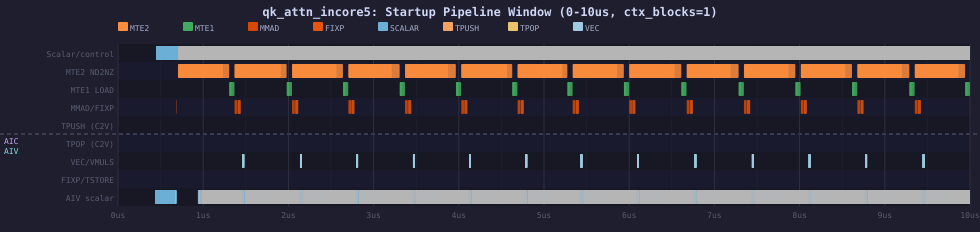
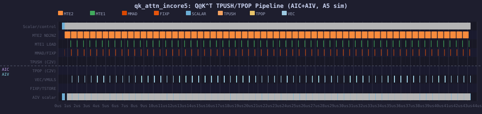

# qk_attn_incore5 — Q@K^T Attention with TPUSH/TPOP (A5 Sim ST Testcase)

**Platform:** Ascend 950B (A5) — `Ascend950PR_9599` simulator  
**Source kernel:** PyPTO-generated `incore_5` (Qwen3-32B decode, `split=UP_DOWN` mode)  
**Purpose:** Validate the TPUSH/TPOP cross-core C2V pipeline pattern on A5 hardware semantics

---

## 1. What this testcase does

This is a **mixed AIC+AIV** (`pto_mix_st`) testcase that directly ports the PyPTO-generated
CCE kernel for the attention `Q@K^T` computation from Qwen3-32B decode.

### Computation

```
Q [16, 128] BF16  ×  K^T [128, 64] BF16  →  scores [16, 64] FP32  ×  0.0884
```

- **K cache** is stored in DN (column-major) layout — transposed on-chip by TLOAD
- **attn_scale** = `1/√128` = `0.0883883461`
- Output: raw attention scores for one context block (`ctx_blocks=1`, 64 K-rows)

### Pipeline stages

```
AIC (cubecore0):
  TLOAD K[128,64] DN layout (GM → L1 → L0B, transposed)
  TLOAD Q[16,128] ND layout (GM → L1 → L0A)
  TMOV  L1 → L0A/L0B
  TMATMUL Q @ K^T → L0C (Acc)
  TPUSH  L0C → C2V pipe (slot=4096, depth=8)

AIV (veccore0 + veccore1, TILE_UP_DOWN split):
  get_subblockid() → 0=upper 8 rows, 1=lower 8 rows
  TPOP   C2V pipe → UB tile [8,64] FP32
  TMULS  tile × 0.0884 (attn scale)
  TFREE  return C2V slot credit
  TSTORE result → GM at row offset (v20*16 + subblk*8)*64
```

### TPUSH/TPOP key parameters

| Parameter | Value | Meaning |
|-----------|-------|---------|
| Pipe direction | `DIR_C2V` | AIC → AIV |
| Slot size | 4096 B | One [16,64] FP32 tile = 4096 B |
| Depth | 8 | 8-deep FIFO (matches 8-buffer strategy) |
| Split axis | `TILE_UP_DOWN` | Upper 8 rows → veccore0, lower 8 → veccore1 |

---

## 2. Files

| File | Description |
|------|-------------|
| `qk_attn_incore5_kernel.cpp` | Mixed AIC+AIV kernel with TPUSH/TPOP |
| `main.cpp` | GTest harness — `QKAttnIncore5Test::case_bf16_ctx1` |
| `gen_data.py` | Data generator: Q[16,128]+K[64,128] BF16; golden = `(Q@K^T)*0.0884` FP32 |
| `CMakeLists.txt` | Uses `pto_mix_st` build macro |
| `profiling/trace.json` | Combined msprof trace (10,828 events, cubecore0+veccore0+veccore1) |
| `profiling/cubecore0_instr_exe.csv` | Per-instruction cycle counts for AIC |
| `profiling/veccore0_instr_exe.csv` | Per-instruction cycle counts for AIV-0 |
| `profiling/veccore1_instr_exe.csv` | Per-instruction cycle counts for AIV-1 |
| `profiling/pipeline_full.svg` | Pipeline diagram — full 0–44us kernel run |
| `profiling/pipeline_startup.svg` | Pipeline diagram — first 10us (startup + first iterations) |

---

## 3. Build and run

```bash
cd ~/pto-isa-ptoas-st
source /usr/local/Ascend/cann_9b2/cann-9.0.0-beta.2/set_env.sh

# Build
python3 tests/script/build_st.py -r sim -v a5 -t qk_attn_incore5

# Run (correctness)
python3 tests/script/run_st.py -r sim -v a5 -t qk_attn_incore5 \
    -g 'QKAttnIncore5Test.case_bf16_ctx1'
```

Expected output: `[  PASSED  ] 1 test from 1 test suite ran.`

---

## 4. Profiling (msprof)

```bash
cd ~/pto-isa-ptoas-st
source /usr/local/Ascend/cann_9b2/cann-9.0.0-beta.2/set_env.sh

TESTBIN=tests/npu/a5/src/st/build/bin/qk_attn_incore5
OUTDIR=/tmp/msprof_qk_incore5
mkdir -p $OUTDIR && chmod 700 $OUTDIR

SIMLIB=$ASCEND_HOME_PATH/tools/simulator/Ascend950PR_9599/lib
export LD_LIBRARY_PATH="$SIMLIB:$LD_LIBRARY_PATH"

msprof op simulator \
    --soc-version=Ascend950PR_9599 \
    --output=$OUTDIR \
    $TESTBIN --gtest_filter='QKAttnIncore5Test.case_bf16_ctx1'
```

Profiling output location: `$OUTDIR/OPPROF_<timestamp>/simulator/trace.json`  
Expected timing: ~210s wall-clock (A5 sim is ~200x slower than real hardware)

---

## 5. Performance data (A5 simulator, ctx_blocks=1)

### Timing summary

| Core | Duration (sim µs) | Running time (µs) |
|------|-------------------|-------------------|
| core0.cubecore0 | 42.86 | 42.86 |
| core0.veccore0 | 43.16 | 42.89 |
| core0.veccore1 | 43.17 | 42.87 |

**Total kernel time:** ~43 µs (64 K-tile iterations × ~0.66 µs/iter)  
**Critical path:** AIC and AIV run concurrently; AIV finishes ~0.3 µs after AIC

### Cycle breakdown — cubecore0 (AIC)

| Pipe | Cycles | % | Stage |
|------|--------|---|-------|
| MTE2 | 781,222 | 15.6% | GM→L1 (TLOAD K DN + TLOAD Q) |
| MTE1 | 1,191,333 | 23.7% | L1→L0A/B (TMOV) |
| CUBE | 1,206,254 | 24.0% | TMATMUL (MMAD) |
| FIXP | 611,760 | 12.2% | TPUSH + L0C drain |
| FLOWCTRL | 1,222,773 | 24.4% | Sync flags + loop control |
| SCALAR | 4,889 | 0.1% | Address compute |
| **TOTAL** | **5,018,231** | | |

> **Key finding:** FLOWCTRL (24.4%) = sync overhead between MTE2→MTE1→M→FIX pipes.
> MTE1 (23.7%) dominates ahead of CUBE (24.0%) — the L1→L0 tile-move is a comparable cost
> to the actual matmul for this [16,128]×[128,64] shape.

### Cycle breakdown — veccore0/1 (AIV, symmetric)

| Pipe | Cycles | % | Stage |
|------|--------|---|-------|
| VECTOR | 295,525 | 42.6% | TMULS (attn_scale multiply) |
| MTE3 | 221,121 | 31.9% | TSTORE → GM |
| FLOWCTRL | 147,329 | 21.3% | Sync + loop control |
| PUSHQ | 4,372 | 0.6% | TPOP/TFREE (C2V receive + credit return) |
| RVECLD | 4,608 | 0.7% | RV_VLDI (UB load) |
| RVECST | 4,608 | 0.7% | RV_VSTI (UB store) |
| **TOTAL** | **693,109** | | |

> **Key finding:** VECTOR (42.6%) is the dominant AIV cost — each `TMULS` on [8,64] FP32 takes
> ~4.6 µs per sub-block. MTE3 (31.9%) = TSTORE bandwidth. PUSHQ (0.6%) confirms C2V FIFO
> overhead is negligible compared to the actual compute.

---

## 6. AIC/AIV Parallelism and Pipeline Diagrams

The key performance feature of `split=UP_DOWN` is that **AIC and AIV run concurrently**:
TPUSH puts each accumulated [16,64] FP32 result into the C2V FIFO while the AIC is already
loading the next K-tile. Both veccore0 and veccore1 drain the FIFO simultaneously (upper/lower
8 rows each), keeping throughput high.

### Parallelism timeline (logical, per K-tile iteration)

```
Time →          0        0.67µs     1.34µs     2.01µs     2.68µs  ...  42.86µs
                |          |          |          |          |            |
AIC cubecore0:  [k=0 MTE2][MTE1][MMAD][PUSH] [k=1 MTE2][MTE1][MMAD][PUSH] ...
                                         ↓ C2V FIFO (4096B slot, depth=8)
AIV veccore0:              (warm-up) [k=0 POP][VMULS][TSTORE] [k=1 POP][VMULS][TSTORE] ...
AIV veccore1:              (warm-up) [k=0 POP][VMULS][TSTORE] [k=1 POP][VMULS][TSTORE] ...
                                      ^-- subblk=0: rows 0-7     subblk=1: rows 8-15
```

- **Warm-up latency**: AIV waits ~1.4 µs for first TPUSH before issuing first TPOP
- **Steady-state**: from k=2 onwards AIC and AIV fully overlap — no idle waiting
- **TILE_UP_DOWN split**: veccore0 gets upper 8 rows (`get_subblockid()=0`), veccore1 lower 8 (`=1`)
- **FIFO depth=8**: allows up to 8 in-flight [16,64] tiles between AIC and AIV — no back-pressure

### Startup window (0–10 µs) — first ~15 K-tile iterations

Shows warm-up, first TPOP, and entry to steady-state overlap:



**Colour key:**

| Colour | Stage | Pipe | Description |
|--------|-------|------|-------------|
| 🟠 Orange | MTE2 | MTE2 | TLOAD K(DN) + TLOAD Q, GM→L1 |
| 🟢 Green | MTE1 | MTE1 | TMOV L1→L0A/B |
| 🔴 Red | MMAD | CUBE | TMATMUL Q@K^T, L0A×L0B→L0C |
| 🟡 Dark-orange | FIXP | FIXP | FIX_L0C_TO_DST — TPUSH drain, L0C→C2V |
| 🔵 Steel-blue | SCALAR | SCALAR | Sync flags + address compute |
| 🟡 Yellow | TPOP | AIV PUSHQ | TPOP C2V→UB (veccore0/1) |
| 🩵 Light-blue | VEC | AIV VECTOR | TMULS ×0.0884 (attn_scale) |
| 🔵 Teal | TSTORE | AIV MTE3 | TSTORE UB→GM output |

**Observations:**
1. **AIC pipeline order**: MTE2 → MTE1 → MMAD → FIXP (~0.2–0.4 µs each in steady state)
2. **AIV starts ~1.4 µs after AIC** — first TPOP fires after first TPUSH drains
3. **AIC and AIV overlap from k=2** — TPUSH/TPOP FIFO hides C2V transfer latency completely
4. **MTE1 ≈ MMAD cost** — L1→L0 tile-move (23.7%) nearly equals the matmul (24.0%) for [16,128]×[128,64]
5. **FLOWCTRL (24.4%)** is the dominant AIC cost — inter-pipe sync overhead

### Full run (0–44 µs) — all 64 K-tile iterations



Steady-state pattern: AIC continuously cycles MTE2→MTE1→MMAD→FIXP(TPUSH) while both
AIV veccore0 and veccore1 concurrently drain TPOP→TMULS→TSTORE at the same cadence.
The C2V FIFO (depth=8) absorbs any minor timing jitter between AIC and AIV.

> **To view interactively:** open `profiling/trace.json` in Chrome at `chrome://tracing`

---

## 7. Relation to PyPTO incore_5

This testcase is a direct port of the PyPTO-generated `incore_5` kernel from
`qwen3_32b_decode_scope3.py` compiled for A5 with `split=UP_DOWN`.

### PyPTO compilation chain

```
qwen3_32b_decode_scope3.py
  pl.at(level=CORE_GROUP, optimizations=[pl.auto_chunk, pl.split(SplitMode.UP_DOWN)])
    → ExpandMixedKernel pass (pass 19)
        → qwen3_decode_split_incore_5_aic (AIC, TPUSH L0C→C2V)
        → qwen3_decode_split_incore_0_aiv (AIV, TPOP C2V→UB + TMULS)
    → ptoas --pto-arch=a5 --pto-level=level3 --enable-insert-sync
        → CCE C++ kernel
```

### Key differences: scope1 (no_split) vs scope3 (split=UP_DOWN)

| Feature | incore_5 no_split | incore_5 split=UP_DOWN (this test) |
|---------|------------------|--------------------------------------|
| Inter-core transfer | TSTORE L0C→GM directly | TPUSH→C2V→TPOP |
| AIV receives | Reads from GM next call | TPOP from C2V FIFO |
| subblockid | Not used | 0=upper 8 rows, 1=lower 8 rows |
| C2V FIFO | Not used | TPipe<0,DIR_C2V,4096,8> |
| TFREE | Not present | Required after TPOP to return credit |

For the no_split (scope1) version of incore_5, see:
`~/npu_skills/seg_topics/pypto_stack_overview_qwen_study/`

---

## 8. Key code patterns

### AIC: TPUSH after TMATMUL

```cpp
// In cubecore0 body
auto v18 = TPipe<0, Direction::DIR_C2V, 4096, 8>(v9, v17_0, v17_0);
// ... loop ...
TLOAD(k_tile, k_gm_dn);   // DN layout → L0B (transposed)
TLOAD(q_tile, q_gm);       // ND layout → L0A
TMATMUL(acc, q_tile, k_tile);  // [16,128] × [128,64] → L0C [16,64] FP32
TPUSH<TPipe<0,DIR_C2V,4096,8>, AccTileType, TILE_UP_DOWN>(v18, acc);
```

### AIV: TPOP + TMULS + TFREE + TSTORE

```cpp
// In veccore0/1 body
int64_t v17 = get_subblockid();  // 0 or 1
auto v18 = TPipe<0, Direction::DIR_C2V, 4096, 8>(v9, v16_0, v16_0);
// ... loop ...
TPOP<TPipe<0,DIR_C2V,4096,8>, Vec8x64FP32, TILE_UP_DOWN>(v18, vec_tile);
TMULS(out_tile, vec_tile, 0.0883883461f);
TFREE<TPipe<0,DIR_C2V,4096,8>, TILE_UP_DOWN>(v18);  // return credit
TSTORE(gm_view, out_tile);  // row = v20*16 + v17*8
```
